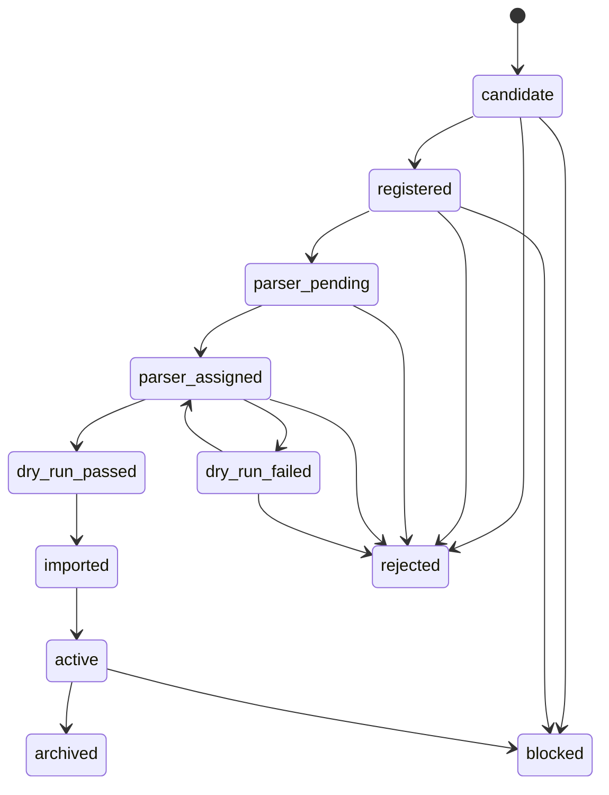
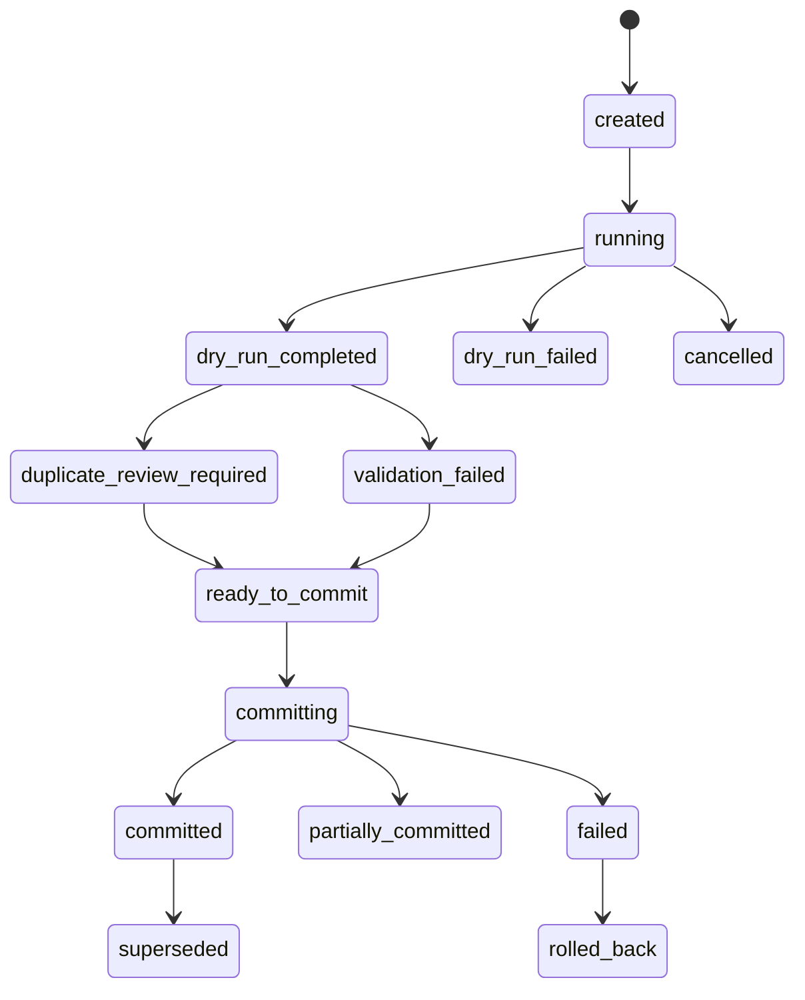
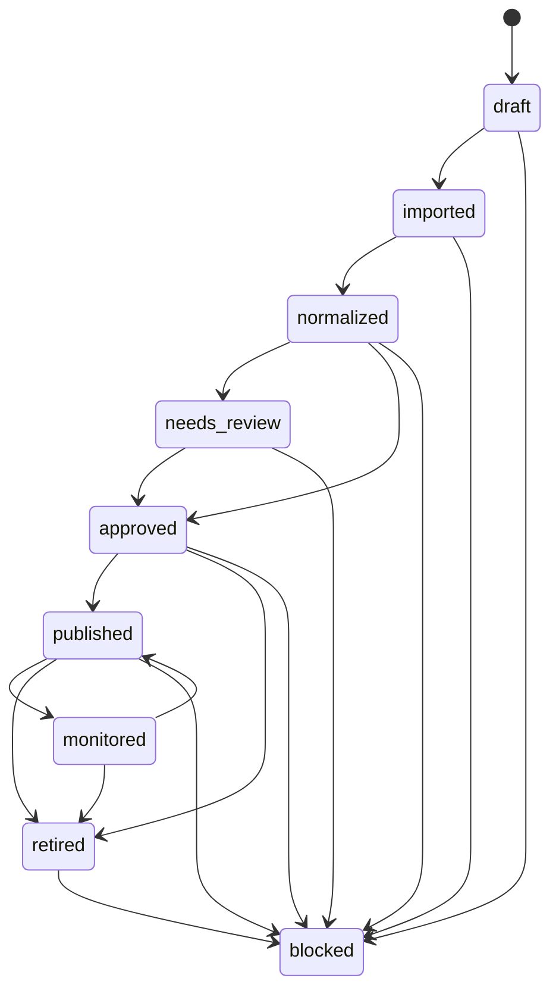
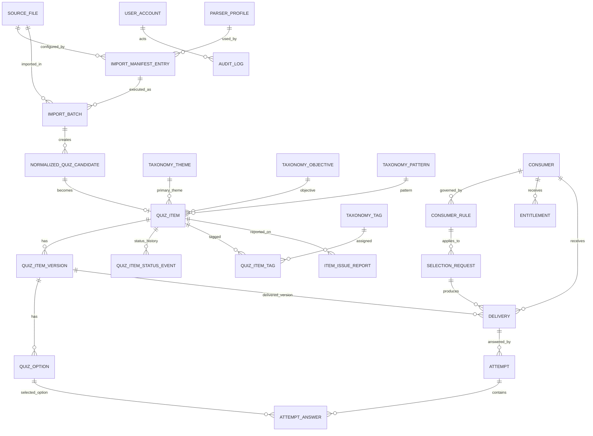

# API Quiz Bank — Domain Model

**Документ:** `docs/04_domain_model.md`  
**Назва проєкту:** API Quiz Bank  
**Внутрішня історична назва:** QuizBank / German QuizBank Platform  
**Версія:** 1.0.0  
**Статус:** foundational domain model; subordinate to `CONSTITUTION.md`; aligned with `00_vision.md`, `01_product_charter.md`, `02_requirements_srs.md`, `03_use_cases.md`  
**Дата:** 2026-04-28  
**Мова:** українська з канонічними технічними термінами англійською  
**Власник:** project owner / authorized product maintainer  
**Керівні документи:** `CONSTITUTION.md`, `docs/00_vision.md`, `docs/01_product_charter.md`, `docs/02_requirements_srs.md`, `docs/03_use_cases.md`  
**Наступні документи:** `05_architecture.md`, `06_data_standard.md`, `07_api_standard.md`, `08_security_threat_model.md`, `09_quality_assurance.md`, `10_operations.md`, `11_billing_model.md`, `12_analytics_model.md`, `13_stanford_presentation_outline.md`

---

## 0. Executive Summary

`04_domain_model.md` визначає **предметну модель API Quiz Bank**: сутності, звʼязки, статуси, інваріанти, життєві цикли, доменні межі, ідентифікатори, логічні таблиці, ключові constraint-и, projections для API/Telegram/Admin/Analytics/Billing та traceability до SRS і use cases.

Головна роль цього документа — перевести стратегічну формулу проєкту в чітку модель даних і бізнес-правил:

```text
raw / candidate quiz files
  → source registry
  → import manifest
  → parser profile
  → dry-run import
  → normalized quiz candidates
  → canonical validation
  → duplicate/conflict classification
  → import batch
  → quiz item + quiz option + taxonomy
  → status workflow
  → production database
  → selection engine
  → delivery / attempt / analytics / billing / operations
```

Цей документ НЕ є SQL migration, НЕ є повним фізичним database schema і НЕ є API contract. Він визначає **канонічний домен**, від якого повинні походити:

```text
database migrations
canonical JSON Schema
OpenAPI schemas
admin UI screens
Telegram adapter payloads
selection engine inputs/outputs
analytics reports
billing entitlement checks
import pipeline objects
QA tests
Stanford-style demo evidence
```

Найважливіша доменна теза:

```text
Every delivered quiz item must be explainable as a traceable chain:
source file → import batch → canonical item/version → taxonomy/status → selection rule → consumer entitlement → delivery record → attempt/analytics outcome.
```

Поточний operational baseline, який має підтримати доменна модель:

```text
115 active bank files
30,974 active rows/items
CEFR levels: A1, A2, B1, B2, C1, C2
18 canonical themes
all active items currently in draft operational status
local constitution check: violations=0 for 30,974 rows
```

Цей baseline є стартовим активом, але не межею. Доменна модель повинна підтримувати майбутнє правило:

```text
New quiz files are onboarded, not dropped.
```

---

## 1. Role of This Document

### 1.1. Мета документа

`04_domain_model.md` фіксує спільну мову між product, engineering, data, API, Telegram, admin, billing, analytics, QA and operations.

Документ відповідає на питання:

```text
Які обʼєкти існують у системі?
Які поля в них є критичними?
Як обʼєкти повʼязані між собою?
Які статуси й переходи дозволені?
Які інваріанти ніколи не можна порушувати?
Що таке quiz item, source file, import batch, consumer, entitlement, delivery, attempt?
Як майбутні файли стають частиною production corpus?
Які дані потрібні для API, Telegram, billing, analytics and operations?
Що має потрапити в SQL schema, JSON Schema, OpenAPI and tests?
```

### 1.2. Місце в документаційній ієрархії

```text
CONSTITUTION.md
  ↓
docs/00_vision.md
  ↓
docs/01_product_charter.md
  ↓
docs/02_requirements_srs.md
  ↓
docs/03_use_cases.md
  ↓
docs/04_domain_model.md
  ↓
docs/05_architecture.md
  ↓
docs/06_data_standard.md
  ↓
docs/07_api_standard.md
  ↓
database/migrations + data/schemas + services + tests
```

### 1.3. Що цей документ робить

Цей документ:

- визначає domain vocabulary;
- визначає bounded contexts;
- визначає entity catalog;
- описує logical data model;
- описує mandatory status lifecycles;
- визначає relationship cardinalities;
- визначає domain invariants;
- задає ID conventions;
- визначає projections для API, Telegram, Admin, Analytics, Billing;
- задає basis для `quiz_item.schema.json` і database migrations;
- звʼязує модель із SRS і use cases.

### 1.4. Що цей документ не робить

Цей документ НЕ:

- проводить повторний аудит правильності вікторин;
- замінює `06_data_standard.md`;
- описує всі API endpoints — це робить `07_api_standard.md`;
- визначає повну cloud/infrastructure architecture — це робить `05_architecture.md`;
- є фінальною PostgreSQL migration;
- є UI specification;
- є billing provider integration guide;
- дозволяє delivery напряму з CSV.

---

## 2. Domain Modeling Discipline

### 2.1. Stanford-style discipline

Доменна модель повинна бути достатньо точною, щоб кожна сутність, статус, relationship and rule могли бути трасовані до:

```text
vision objective
product goal
SRS requirement
use case
acceptance criterion
test case
demo evidence
```

Доменна модель не повинна бути “архітектурним малюнком для краси”. Вона має бути робочою основою для implementation, validation, migration, QA and presentation.

### 2.2. Normative language

У цьому документі:

- **MUST / SHALL / ОБОВʼЯЗКОВО** — правило, яке має бути реалізоване або явно відкладене з documented waiver.
- **MUST NOT / ЗАБОРОНЕНО** — дія, що порушує доменну модель.
- **SHOULD / РЕКОМЕНДОВАНО** — правило за замовчуванням.
- **MAY / ДОЗВОЛЕНО** — опція, яка не порушує core model.

### 2.3. Domain-first rule

Implementation MAY vary, але доменна семантика не повинна ламатися.

Наприклад:

```text
source_file може бути таблицею, JSON record або ORM model,
але system MUST preserve source_id, checksum, state, parser assignment and auditability.
```

### 2.4. No hidden domain rule

Жодне критичне правило не має бути “зашите” тільки в UI, Telegram worker або ручну інструкцію.

Якщо правило впливає на:

```text
publication
selection
delivery
billing
access
source onboarding
quality control
security
analytics
```

то воно MUST be represented in the domain model, SRS, tests or documented policy.

---

## 3. Core Domain Thesis

API Quiz Bank має чотири центральні доменні твердження.

### 3.1. Content is not a file

CSV-файл — це джерело імпорту. Він не є production object.

```text
raw source file ≠ canonical quiz item ≠ published delivery object
```

### 3.2. Quiz item is a governed entity

Quiz item має:

```text
stable identity
source traceability
canonical content
options and correct answer references
taxonomy
status
version
quality metadata
consumer compatibility
publication eligibility
analytics history
```

### 3.3. Consumer is a first-class entity

Telegram channel, API client, school, web app, teacher account and demo client — це не “просто endpoints”. Це consumers із rules, status, quotas, entitlements, schedules and delivery history.

### 3.4. Delivery is an auditable event

Кожна реальна видача питання MUST create a delivery record або equivalent traceable record.

Delivery is not just “question returned”. Delivery is a domain event:

```text
who received what, when, why it was eligible, under which entitlement, through which channel, with which outcome.
```

---

## 4. Bounded Contexts

API Quiz Bank має такі bounded contexts.

| Context | Purpose | Primary entities | MVP priority |
|---|---|---|---|
| Source Governance | Керує raw/candidate файлами, source identity, inventory, state | `source_file`, `source_inventory_record`, `source_file_version` | P0 |
| Source Onboarding | Додає майбутні quiz-файли через gates | `source_onboarding_run`, `import_manifest_entry`, `parser_profile` | P0 |
| Import & Normalization | Перетворює source rows у canonical candidates | `import_batch`, `normalized_quiz_candidate`, `validation_result` | P0 |
| Duplicate & Conflict Control | Виявляє дублікати, near-duplicates, conflicts | `duplicate_case`, `duplicate_case_item`, `conflict_resolution` | P1 |
| Canonical Content | Зберігає production quiz item model | `quiz_item`, `quiz_item_version`, `quiz_option` | P0 |
| Taxonomy & Coverage | Керує CEFR, themes, objectives, patterns, tags | `cefr_level`, `taxonomy_theme`, `taxonomy_objective`, `taxonomy_pattern`, `taxonomy_tag`, `coverage_cell` | P0 |
| Status & Review | Керує approve/publish/retire/block lifecycle | `quiz_item_status_event`, `review_decision` | P0 |
| Consumer & Rules | Керує API/Telegram/web/school consumers | `consumer`, `consumer_rule`, `delivery_schedule`, `repeat_policy` | P0 |
| Selection | Вибирає eligible item based on rules | `selection_request`, `selection_result`, `item_reservation` | P0 |
| Delivery | Записує delivery attempts and outcomes | `delivery`, `delivery_result`, `telegram_delivery_payload` | P0 |
| Attempts & Learning Events | Записує answers, correctness, response data | `attempt`, `attempt_answer` | P1 |
| Billing & Entitlements | Керує access rights, quotas, plans | `plan`, `entitlement`, `quota_usage`, `billing_event` | P1 |
| Analytics & Reporting | Формує corpus/usage/quality reports | `analytics_report`, `coverage_report`, `generated_report` | P1 |
| Security & Admin | Керує users, roles, credentials, audit logs | `user_account`, `role`, `api_credential`, `audit_log` | P0 |
| Operations | Керує backups, incidents, health checks | `backup_artifact`, `restore_run`, `incident_record`, `operation_check` | P1 |
| Demo Evidence | Підтримує repeatable Stanford-style demo | `demo_script`, `demo_run`, `demo_evidence` | P1 |

---

## 5. Domain Vocabulary

| Term | Definition |
|---|---|
| `source_file` | Raw або candidate file, з якого може бути імпортований quiz content. |
| `source_id` | Stable identifier source file; не змінюється при перейменуванні файлу. |
| `source_checksum` | Hash вмісту source file для integrity and duplicate detection. |
| `import_manifest_entry` | Structured record that maps source file to parser, defaults, flags and onboarding rules. |
| `parser_profile` | Опис parser logic and field mappings for a source format. |
| `import_batch` | Reproducible import run with status, counts, errors and resulting candidates/items. |
| `normalized_quiz_candidate` | Candidate item after parsing and normalization, before production approval. |
| `quiz_item` | Canonical question entity with identity, status, taxonomy and traceability. |
| `quiz_item_version` | Versioned content snapshot of a quiz item. |
| `quiz_option` | Answer option belonging to a quiz item version. |
| `correct_answer_reference` | Reference to one or more `quiz_option` records that are correct. |
| `cefr_level` | Canonical CEFR value: `A1`, `A2`, `B1`, `B2`, `C1`, `C2`. |
| `theme` | One of 18 canonical themes, identified by stable IDs such as `T01`–`T18`. |
| `objective` | Learning objective code, such as `O01`, `O02`, etc. |
| `pattern` | Item/question pattern code, such as `P01`, `P02`, etc. |
| `status` | Operational publication state of quiz item. |
| `consumer` | API client, Telegram channel, Telegram bot, web app, school account, teacher tool or demo client. |
| `consumer_rule` | Allowed levels, themes, quotas, schedule, repeat policy and selection constraints for a consumer. |
| `entitlement` | Internal access right that grants feature, quota, level/theme pack or delivery permission. |
| `delivery` | Traceable event that a quiz item was served, sent, returned, reserved, failed or skipped. |
| `attempt` | User or consumer answer event after a quiz item was delivered. |
| `analytics_report` | Generated report based on corpus, delivery, attempts, usage, quality or billing data. |
| `audit_log` | Immutable record of critical admin/system actions. |

---

## 6. Identifier Strategy

### 6.1. Identifier principles

All stable entities MUST have identifiers that are:

```text
unique
stable
not dependent on filename alone
safe for logs
traceable
not reusable after deletion/retirement
```

### 6.2. Internal ID vs public ID

| ID type | Purpose | Exposure | Example |
|---|---|---|---|
| Internal database ID | Joins, storage, migrations | Internal only | UUID / bigint / ULID |
| Public ID | API-safe reference | External | `qi_01J...` |
| Source ID | Stable source file identity | Internal + admin reports | `src_000001` |
| Batch ID | Import run identity | Internal + admin reports | `ib_20260428_0001` |
| Version ID | Content snapshot identity | Internal/API optional | `qiv_01J...` |
| Consumer ID | Consumer identity | API/admin | `cons_01J...` |
| Delivery ID | Delivery trace | API/admin | `deliv_01J...` |

### 6.3. Required ID prefixes

Recommended prefixes:

```text
src_      source file
pp_       parser profile
ime_      import manifest entry
ib_       import batch
nqc_      normalized quiz candidate
qi_       quiz item public id
qiv_      quiz item version
qopt_     quiz option
th_       theme, if public alias is needed; canonical theme IDs remain T01–T18
obj_      objective, if public alias is needed; canonical objective IDs remain Oxx
pat_      pattern, if public alias is needed; canonical pattern IDs remain Pxx
cons_     consumer
cr_       consumer rule
ent_      entitlement
deliv_    delivery
att_      attempt
rep_      report
aud_      audit log
```

### 6.4. Filename independence

A filename MAY change. A `source_id` MUST NOT change.

Bad:

```text
quiz item identified only by Administrative_Documents_Bank_A2__expanded_v01_100.csv:row17
```

Good:

```text
source_id=src_000002
source_locator={row_number:17, raw_row_hash:"..."}
quiz_item_id=qi_...
import_batch_id=ib_...
```

### 6.5. Content hash

`content_hash` MUST represent normalized semantic content, not file path alone.

Recommended input for quiz item content hash:

```text
normalized stem text
normalized option texts
correct answer references after normalized ordering
canonical CEFR level when part of item semantics
canonical theme/objective/pattern when part of item semantics
language mode
item type
```

`source_checksum` and `content_hash` are different:

```text
source_checksum = hash of source file content
content_hash = hash of normalized quiz item content
```

---

## 7. Entity Catalog

| Entity | Table candidate | Context | Phase | Critical? |
|---|---|---|---|---|
| `source_file` | `source_files` | Source Governance | P0 | Yes |
| `source_inventory_record` | generated or `source_inventory_records` | Source Governance | P0 | Yes |
| `source_file_version` | `source_file_versions` | Source Governance | P1 | Recommended |
| `parser_profile` | `parser_profiles` | Source Onboarding | P0 | Yes |
| `import_manifest_entry` | `import_manifest_entries` | Source Onboarding | P0 | Yes |
| `source_onboarding_run` | `source_onboarding_runs` | Source Onboarding | P1 | Recommended |
| `import_batch` | `import_batches` | Import | P0 | Yes |
| `import_report` | `import_reports` | Import | P0 | Yes |
| `normalized_quiz_candidate` | `normalized_quiz_candidates` | Import | P0 | Yes |
| `validation_result` | `validation_results` | Import | P0 | Yes |
| `duplicate_case` | `duplicate_cases` | Duplicate Control | P1 | Recommended |
| `quiz_item` | `quiz_items` | Canonical Content | P0 | Yes |
| `quiz_item_version` | `quiz_item_versions` | Canonical Content | P0 | Yes |
| `quiz_option` | `quiz_options` | Canonical Content | P0 | Yes |
| `quiz_item_status_event` | `quiz_item_status_events` | Status & Review | P0 | Yes |
| `cefr_level` | `cefr_levels` | Taxonomy | P0 | Yes |
| `taxonomy_theme` | `taxonomy_themes` | Taxonomy | P0 | Yes |
| `taxonomy_objective` | `taxonomy_objectives` | Taxonomy | P0 | Yes |
| `taxonomy_pattern` | `taxonomy_patterns` | Taxonomy | P0 | Yes |
| `taxonomy_tag` | `taxonomy_tags` | Taxonomy | P1 | Recommended |
| `quiz_item_tag` | `quiz_item_tags` | Taxonomy | P1 | Recommended |
| `coverage_cell` | generated view / `coverage_cells` | Taxonomy & Analytics | P1 | Recommended |
| `consumer` | `consumers` | Consumer | P0 | Yes |
| `consumer_rule` | `consumer_rules` | Consumer | P0 | Yes |
| `delivery_schedule` | `delivery_schedules` | Consumer/Telegram | P1 | Recommended |
| `repeat_policy` | `repeat_policies` | Consumer/Selection | P0/P1 | Yes for delivery |
| `api_credential` | `api_credentials` | Security | P0 | Yes |
| `plan` | `plans` | Billing | P1 | Recommended |
| `entitlement` | `entitlements` | Billing | P0/P1 | Yes for gated access |
| `quota_usage` | `quota_usage` | Billing | P0/P1 | Yes for quotas |
| `billing_event` | `billing_events` | Billing | P1 | Recommended |
| `quiz_session` | `quiz_sessions` | Delivery/Learning | P1 | Recommended |
| `selection_request` | `selection_requests` | Selection | P1 | Recommended |
| `item_reservation` | `item_reservations` | Selection | P1 | Recommended for concurrency |
| `delivery` | `deliveries` | Delivery | P0 | Yes |
| `attempt` | `attempts` | Attempts | P1 | Recommended |
| `attempt_answer` | `attempt_answers` | Attempts | P1 | Recommended |
| `item_issue_report` | `item_issue_reports` | Quality Feedback | P1 | Recommended |
| `analytics_report` | `analytics_reports` | Analytics | P1 | Recommended |
| `generated_report` | `generated_reports` | Reporting | P1 | Recommended |
| `user_account` | `user_accounts` | Security/Admin | P0/P1 | Yes for admin |
| `role` | `roles` | Security/Admin | P0/P1 | Yes for admin |
| `audit_log` | `audit_logs` | Security/Admin | P0 | Yes |
| `backup_artifact` | `backup_artifacts` | Operations | P1 | Recommended |
| `restore_run` | `restore_runs` | Operations | P1 | Recommended |
| `incident_record` | `incident_records` | Operations | P1 | Recommended |
| `demo_script` | `demo_scripts` | Demo | P1 | Recommended |
| `demo_run` | `demo_runs` | Demo | P1 | Recommended |

---

## 8. Source Governance Model

### 8.1. Entity: `source_file`

Represents a raw, candidate, active, archived, rejected or blocked file that contains quiz content or related source material.

Required fields:

| Field | Type | Required | Notes |
|---|---:|---:|---|
| `id` | internal ID | yes | Database primary key. |
| `source_id` | string | yes | Stable external/admin source identity. |
| `filename` | string | yes | Current filename. |
| `original_path` | string | yes | Original repository/storage path. |
| `current_path` | string | yes | Current path if moved. |
| `format` | enum/string | yes | CSV, XLSX, JSONL, etc. MVP current corpus is CSV. |
| `encoding` | string/null | recommended | Known encoding. |
| `checksum_sha256` | string | yes | Hash of file content. |
| `size_bytes` | integer | recommended | File size. |
| `row_count_detected` | integer/null | recommended | Rows/items detected by inventory tooling. |
| `source_state` | enum | yes | See lifecycle below. |
| `is_service_template` | boolean | yes | Distinguishes templates from bank files. |
| `registered_at` | datetime | yes | First registration. |
| `registered_by` | actor ID/null | recommended | Admin/system actor. |
| `archived_at` | datetime/null | conditional | If archived. |
| `rejection_reason_code` | string/null | conditional | If rejected or blocked. |
| `notes` | text/null | optional | Operational notes. |

### 8.2. Source states

Allowed `source_state` values:

```text
candidate
registered
parser_pending
parser_assigned
dry_run_failed
dry_run_passed
imported
active
archived
rejected
blocked
```

### 8.3. Source state lifecycle



### 8.4. Source invariants

- `source_id` MUST be globally unique and never reused.
- Every importable file MUST have `source_id` before dry-run import.
- Every importable file MUST have checksum before parser assignment.
- Two active source files SHOULD NOT share the same checksum unless explicitly marked as allowed duplicate source.
- `active` source does not mean all items are published. It means source is accepted into governed corpus.
- `rejected` and `blocked` sources MUST NOT produce publishable items.
- `archived` source may preserve already imported items, but it MUST NOT be used for new imports unless reactivated by change control.

### 8.5. Source inventory record

`source_inventory_record` may be generated from `source_files` and raw repository scan.

Minimum inventory fields:

```text
source_id
filename
current_path
format
encoding
checksum_sha256
row_count_detected
source_state
parser_profile_id
manifest_entry_id
is_service_template
last_seen_at
inventory_run_id
```

### 8.6. Current corpus support

The model MUST support current top-level CSV corpus:

```text
115 active bank files
1 service template
30,974 active rows/items
```

The model MUST also support future source expansion without changing the identifier strategy.

---

## 9. Source Onboarding and Import Model

### 9.1. Entity: `parser_profile`

Defines how a source file is parsed.

Required fields:

| Field | Required | Notes |
|---|---:|---|
| `parser_profile_id` | yes | Stable ID, e.g. `pp_csv_mcq_v1`. |
| `name` | yes | Human-readable name. |
| `format` | yes | CSV, XLSX, JSONL, etc. |
| `version` | yes | Parser profile version. |
| `field_mapping` | yes | Maps raw fields to canonical candidate fields. |
| `default_language` | yes | Usually `de` for stem/options. |
| `supports_levels` | yes | Whether parser reads canonical CEFR or uses default. |
| `supports_theme_ids` | yes | Whether parser reads theme IDs or uses default. |
| `supports_objective_ids` | yes | Whether parser reads objective metadata. |
| `supports_pattern_ids` | yes | Whether parser reads pattern metadata. |
| `validation_profile_id` | recommended | Which validation rules to run. |
| `is_active` | yes | Parser can be used for new imports. |

### 9.2. Parser field mapping rule

Parser profile MUST allow compatibility mappings.

Example:

```yaml
field_mapping:
  sublevel: cefr_level
  question: stem_de
  answer_a: option_1_text_de
  answer_b: option_2_text_de
  answer_c: option_3_text_de
  correct: correct_answer_raw
```

This is important because current CSV field names may be compatibility names, while canonical domain fields must use canonical names.

### 9.3. Entity: `import_manifest_entry`

Represents one source fileʼs import configuration.

Required fields:

| Field | Required | Notes |
|---|---:|---|
| `manifest_entry_id` | yes | Stable ID. |
| `source_id` | yes | References `source_file`. |
| `parser_profile_id` | yes | References parser profile. |
| `default_cefr_level` | conditional | Used when source does not provide item level. |
| `default_theme_id` | conditional | Used when source does not provide theme. |
| `default_objective_id` | optional | Used when source does not provide objective. |
| `default_pattern_id` | optional | Used when source does not provide pattern. |
| `import_mode` | yes | `dry_run`, `pilot`, `full`, `reimport`. |
| `status` | yes | `draft`, `active`, `disabled`, `superseded`. |
| `created_at` | yes | Timestamp. |
| `updated_at` | yes | Timestamp. |

### 9.4. Entity: `import_batch`

Represents a specific import run.

Required fields:

| Field | Required | Notes |
|---|---:|---|
| `import_batch_id` | yes | Stable batch ID. |
| `source_id` | yes | Source imported. |
| `manifest_entry_id` | yes | Configuration used. |
| `parser_profile_id` | yes | Parser used. |
| `mode` | yes | `dry_run`, `canonical_write`, `production_write`, `reimport`. |
| `status` | yes | See lifecycle below. |
| `started_at` | yes | Start timestamp. |
| `completed_at` | conditional | Completion timestamp. |
| `input_checksum_sha256` | yes | Source checksum at import time. |
| `rows_seen` | yes | Rows seen. |
| `candidates_created` | yes | Normalized candidates. |
| `items_created` | yes | Production items created. |
| `items_updated` | yes | Existing items updated/versioned. |
| `validation_failures` | yes | Count. |
| `duplicate_candidates` | yes | Count. |
| `error_summary` | optional | Structured error summary. |
| `created_by` | recommended | Actor/system. |

### 9.5. Import batch statuses

Allowed `import_batch.status`:

```text
created
running
dry_run_completed
dry_run_failed
validation_failed
duplicate_review_required
ready_to_commit
committing
committed
partially_committed
failed
cancelled
rolled_back
superseded
```

### 9.6. Import lifecycle



### 9.7. Entity: `normalized_quiz_candidate`

Represents an imported row normalized into canonical-like structure before becoming production `quiz_item`.

Required fields:

```text
candidate_id
import_batch_id
source_id
source_locator
raw_row_hash
normalized_payload
candidate_status
validation_summary
duplicate_summary
proposed_cefr_level
proposed_theme_id
proposed_objective_id
proposed_pattern_id
content_hash
created_at
```

Candidate statuses:

```text
parsed
normalized
schema_valid
schema_invalid
duplicate_candidate
conflict_candidate
ready_for_import
imported_as_item
rejected
blocked
```

### 9.8. Entity: `validation_result`

Represents validation output for source, candidate, item, batch or delivery projection.

Fields:

```text
validation_result_id
subject_type              -- source_file, normalized_quiz_candidate, quiz_item_version, telegram_projection, api_projection
subject_id
validation_profile_id
status                    -- pass, warning, fail
rule_id
severity                  -- info, warning, error, blocker
message
path                      -- JSON pointer or field name
detected_at
resolved_at
resolved_by
resolution_note
```

### 9.9. Import invariants

- Dry-run import MUST NOT create publishable production items.
- Every production item created by import MUST reference `source_id` and `import_batch_id`.
- Import failure MUST NOT corrupt existing production data.
- Import result MUST be reproducible from source checksum + manifest entry + parser profile version.
- Import candidates MUST preserve raw source locator when available.
- Import MUST support future files through parser profiles and manifest entries, not manual one-off exceptions.

---

## 10. Duplicate and Conflict Model

### 10.1. Why this context exists

Even if the current corpus has been checked, future file onboarding can introduce:

```text
exact duplicates
near duplicates
same question with different options
same question with different correct answer
same concept with acceptable variant
badly imported row that looks like duplicate
```

The domain model must represent these cases instead of silently dropping or publishing them.

### 10.2. Entity: `duplicate_case`

Fields:

```text
duplicate_case_id
case_type                  -- exact_duplicate, near_duplicate, answer_conflict, source_duplicate, acceptable_variant, supersession_candidate
severity                   -- info, warning, blocker
status                     -- open, resolved, ignored, blocked, superseded
primary_item_id
primary_candidate_id
created_from_import_batch_id
detection_method           -- content_hash, normalized_text, similarity, manual, admin_report
similarity_score
created_at
resolved_at
resolved_by
resolution_decision
resolution_note
```

### 10.3. Entity: `duplicate_case_item`

Fields:

```text
duplicate_case_item_id
duplicate_case_id
subject_type               -- quiz_item, normalized_quiz_candidate
subject_id
role                       -- primary, duplicate, variant, conflicting, superseding
content_hash
source_id
source_locator
```

### 10.4. Conflict resolutions

Allowed `resolution_decision`:

```text
keep_existing
import_as_new_version
import_as_variant
merge_metadata
reject_candidate
block_candidate
retire_existing_and_replace
requires_human_review
```

### 10.5. Duplicate invariants

- Exact duplicate content hash SHOULD be blocked from becoming a second active published item unless explicitly allowed as version/variant.
- Answer conflict MUST NOT be auto-published.
- Near duplicate MAY be accepted as variant only with documented resolution.
- Duplicate resolution MUST create audit log.

---

## 11. Canonical Content Model

### 11.1. Entity: `quiz_item`

`quiz_item` is the stable conceptual item. It may have multiple versions.

Required fields:

| Field | Required | Notes |
|---|---:|---|
| `quiz_item_id` | yes | Internal ID. |
| `public_id` | yes | API-safe stable ID. |
| `current_version_id` | yes | Points to latest/current content version. |
| `status` | yes | Operational status. |
| `primary_theme_id` | conditional | Required for approved/published. |
| `cefr_level` | conditional | Required for approved/published. |
| `objective_id` | conditional | Required by taxonomy policy. |
| `pattern_id` | conditional | Required by taxonomy policy. |
| `source_id` | yes | Origin source. |
| `import_batch_id` | yes | Origin import batch. |
| `source_locator` | recommended | Row number, row hash, cell reference, etc. |
| `content_hash` | yes | Hash of normalized current content. |
| `status_changed_at` | yes | Last status update. |
| `approved_at` | conditional | Required if approved/published. |
| `published_at` | conditional | Required if published. |
| `retired_at` | conditional | Required if retired. |
| `blocked_at` | conditional | Required if blocked. |
| `created_at` | yes | Creation timestamp. |
| `updated_at` | yes | Update timestamp. |

### 11.2. Entity: `quiz_item_version`

Represents a versioned content snapshot.

Required fields:

| Field | Required | Notes |
|---|---:|---|
| `quiz_item_version_id` | yes | Version ID. |
| `quiz_item_id` | yes | Parent item. |
| `version_number` | yes | Monotonic per item. |
| `stem_de` | yes | German question/stem text. |
| `stem_uk` | optional | Ukrainian support text if needed. |
| `explanation_de` | optional | German explanation. |
| `explanation_uk` | optional | Ukrainian explanation. |
| `item_type` | yes | `single_choice`, `multiple_choice`, `gap_fill`, etc. |
| `language_mode` | yes | e.g. `de_only`, `de_uk_support`. |
| `content_hash` | yes | Version content hash. |
| `metadata_json` | optional | Controlled extensibility. |
| `created_at` | yes | Timestamp. |
| `created_by` | recommended | Actor/system. |
| `change_reason` | recommended | Why version was created. |

### 11.3. Entity: `quiz_option`

Represents one answer option for a quiz item version.

Required fields:

| Field | Required | Notes |
|---|---:|---|
| `quiz_option_id` | yes | Internal ID. |
| `public_option_id` | yes | API-safe option ID. |
| `quiz_item_version_id` | yes | Parent version. |
| `position` | yes | 1-based or 0-based must be standardized. |
| `option_text_de` | yes | German option text. |
| `option_text_uk` | optional | Optional support text. |
| `is_correct` | yes | Correctness flag. |
| `normalized_text_hash` | recommended | For dedupe. |
| `created_at` | yes | Timestamp. |

### 11.4. Correct answer representation

Correct answers MUST be represented by option references, not raw letter labels alone.

Bad:

```text
correct = "B"
```

Acceptable as raw import field only.

Good canonical model:

```json
{
  "correct_option_ids": ["qopt_01J..."]
}
```

### 11.5. Option invariants

- Every publishable item MUST have at least 2 options.
- Every publishable item MUST have at least 1 correct option.
- Option positions MUST be unique within item version.
- Correct option references MUST reference options from the same item version.
- No publishable item may contain an impossible correct-answer reference.
- Consumer-specific max option limits MUST be checked by compatibility validation before delivery.

### 11.6. Item type values

MVP-supported values:

```text
single_choice
multiple_choice
```

Future-supported values:

```text
gap_fill
matching
ordering
short_answer
cloze
translation_prompt
dialogue_reply
```

Current delivery through Telegram quiz/poll may only support a subset. Unsupported item types MUST be excluded from that consumer projection until adapter support exists.

### 11.7. Canonical quiz item JSON projection

Internal canonical projection:

```json
{
  "quiz_item_id": "qi_01J...",
  "version_id": "qiv_01J...",
  "status": "approved",
  "stem": {
    "de": "Welche Antwort ist richtig?",
    "uk": null
  },
  "options": [
    {
      "id": "qopt_01J_A",
      "position": 1,
      "text": {"de": "Option A", "uk": null},
      "is_correct": false
    },
    {
      "id": "qopt_01J_B",
      "position": 2,
      "text": {"de": "Option B", "uk": null},
      "is_correct": true
    }
  ],
  "explanation": {
    "de": "Kurze Erklärung.",
    "uk": null
  },
  "cefr_level": "A2",
  "taxonomy": {
    "theme_id": "T03",
    "objective_id": "O09",
    "pattern_id": "P01",
    "tags": ["artikel", "nominativ"]
  },
  "source": {
    "source_id": "src_000001",
    "import_batch_id": "ib_20260428_0001",
    "source_locator": {"row_number": 128},
    "content_hash": "sha256:..."
  },
  "compatibility": {
    "api_delivery_ready": true,
    "telegram_quiz_ready": true,
    "teacher_pack_ready": true
  }
}
```

### 11.8. External delivery projection

External consumers SHOULD NOT automatically receive `is_correct=true` unless the delivery mode requires it.

Example API learner-safe projection:

```json
{
  "id": "qi_01J...",
  "delivery_id": "deliv_01J...",
  "stem_de": "Welche Antwort ist richtig?",
  "options": [
    {"id": "qopt_01J_A", "text_de": "Option A"},
    {"id": "qopt_01J_B", "text_de": "Option B"}
  ],
  "cefr_level": "A2",
  "theme_id": "T03",
  "submit_attempt_url": "/v1/attempts"
}
```

### 11.9. Internal delivery projection

Adapters that must send quiz data with correct answer metadata, such as a controlled Telegram worker, MAY receive internal delivery projection with correct option references, but only through authorized system flow.

---

## 12. Item Status and Review Model

### 12.1. Operational item statuses

Allowed `quiz_item.status`:

```text
draft
imported
normalized
needs_review
approved
published
monitored
retired
blocked
```

### 12.2. Meaning of statuses

| Status | Meaning | Deliverable to normal consumers? |
|---|---|---:|
| `draft` | Exists as operational record but not production-released. Current verified corpus may be here before production workflow. | No |
| `imported` | Imported from source but not fully normalized/reviewed. | No |
| `normalized` | Canonical structure valid but not approved. | No |
| `needs_review` | Requires human/admin review. | No |
| `approved` | Approved for controlled delivery. | Yes |
| `published` | Published for configured production consumers. | Yes |
| `monitored` | Published but under observation due to reports/quality signals. | No for normal delivery by default |
| `retired` | No longer eligible for new delivery but historical records preserved. | No |
| `blocked` | Explicitly prohibited from delivery. | No |

### 12.3. Item status lifecycle



### 12.4. Entity: `quiz_item_status_event`

Every status change MUST be recorded.

Fields:

```text
status_event_id
quiz_item_id
from_status
to_status
reason_code
reason_note
changed_by
changed_at
source_context              -- import_batch, admin_review, issue_report, automated_rule, migration
related_entity_type
related_entity_id
```

### 12.5. Publication invariants

- Only `approved` and `published` items MAY be delivered to normal consumers.
- `draft` MUST NOT be delivered to normal consumers.
- `retired` and `blocked` MUST NOT be delivered.
- `approved` does not require public website exposure. It means eligible for controlled delivery.
- `published` means available for configured production consumers according to rules.
- Any status change to `approved` or `published` MUST be auditable.

---

## 13. Taxonomy and Coverage Model

### 13.1. Taxonomy principles

Taxonomy MUST support:

```text
CEFR level
18 canonical themes
objectives
patterns
tags
coverage matrix
future taxonomy expansion through change control
```

### 13.2. Entity: `cefr_level`

Canonical values:

```text
A1
A2
B1
B2
C1
C2
```

Fields:

```text
cefr_level
sort_order
title
short_description
is_active
```

### 13.3. Entity: `taxonomy_theme`

Represents one of 18 canonical themes.

Fields:

```text
theme_id                  -- T01 ... T18
theme_slug
title_uk
title_de
description
level_band_policy
is_active
sort_order
created_at
updated_at
```

### 13.4. Entity: `taxonomy_objective`

Fields:

```text
objective_id              -- O01 ... Oxx
objective_slug
title_uk
title_de
description
is_active
sort_order
```

### 13.5. Entity: `taxonomy_pattern`

Fields:

```text
pattern_id                -- P01 ... Pxx
pattern_slug
title_uk
title_de
description
item_type_default
is_active
sort_order
```

### 13.6. Entity: `taxonomy_tag`

Tags support flexible classification beyond single folder/category.

Fields:

```text
tag_id
tag_slug
tag_type                  -- grammar, vocabulary, skill, format, source, difficulty, delivery, custom
title_uk
title_de
description
is_active
```

### 13.7. Entity: `quiz_item_tag`

Fields:

```text
quiz_item_id
tag_id
assigned_by
assigned_at
assignment_source          -- import_default, parser, admin, classifier, migration
confidence_score
```

### 13.8. Coverage matrix

Coverage is defined as:

```text
level × theme_id × objective_id × pattern_id
```

The domain model MUST support reporting by:

```text
status
level
theme
objective
pattern
source
import batch
consumer compatibility
publication readiness
```

### 13.9. Entity: `coverage_cell`

May be a generated view or materialized table.

Fields:

```text
cefr_level
theme_id
objective_id
pattern_id
status
item_count
approved_count
published_count
draft_count
last_updated_at
coverage_gap_flag
```

### 13.10. Taxonomy invariants

- Approved/published item MUST have CEFR level.
- Approved/published item MUST have primary theme.
- Objective and pattern MUST be present when taxonomy policy requires them.
- Tags MUST NOT replace canonical theme/level.
- Taxonomy changes MUST go through change control because they affect coverage, selection and analytics.

---

## 14. Consumer and Access Model

### 14.1. Entity: `consumer`

A consumer is any system or channel that receives quiz content.

Allowed consumer types:

```text
api_client
telegram_channel
telegram_bot
web_app
school_account
teacher_tool
internal_admin
internal_demo
external_app
```

Fields:

```text
consumer_id
consumer_type
owner_account_id
name
description
status
plan_id
default_rule_id
created_at
updated_at
activated_at
suspended_at
```

### 14.2. Consumer statuses

```text
created
active
suspended
blocked
retired
test_only
```

### 14.3. Entity: `consumer_rule`

Defines selection and delivery constraints.

Fields:

```text
consumer_rule_id
consumer_id
allowed_cefr_levels          -- list or policy reference
allowed_theme_ids            -- list or policy reference
allowed_objective_ids         -- optional
allowed_pattern_ids           -- optional
allowed_item_types            -- optional
daily_delivery_limit
monthly_delivery_limit
repeat_policy_id
schedule_id
language_mode
delivery_mode                 -- quiz, practice, pack, scheduled, demo
quality_threshold
status                        -- draft, active, disabled
created_at
updated_at
```

### 14.4. Entity: `repeat_policy`

Fields:

```text
repeat_policy_id
name
scope                         -- consumer, user, channel, session, school_group
min_days_before_repeat
max_repeats_per_period
allow_repeat_after_exhaustion
exhaustion_strategy            -- fail, relax_repeat_window, expand_topic, expand_level
is_active
```

### 14.5. Entity: `delivery_schedule`

For Telegram and scheduled consumers.

Fields:

```text
schedule_id
consumer_id
timezone
posting_days
posting_window_start
posting_window_end
daily_count
cron_expression
is_active
```

### 14.6. Consumer invariants

- Every active consumer MUST have active delivery rules or safe default rules.
- Consumer rules MUST NOT allow delivery of non-publishable statuses.
- Consumer rules MUST be checked with entitlements before selection/delivery.
- Suspended/blocked consumers MUST NOT receive new production delivery.
- Internal demo consumers MAY receive controlled demo data but MUST be marked as demo/test.

---

## 15. Billing, Entitlements and Quota Model

### 15.1. Principle

Payment status alone is not the access model. Internal entitlements are the source of access truth for delivery decisions.

```text
payment provider event → internal billing event → entitlement update → quota usage check → delivery decision
```

### 15.2. Entity: `plan`

Fields:

```text
plan_id
plan_code
name
description
status
price_reference
billing_interval
created_at
updated_at
```

### 15.3. Entity: `plan_feature`

Fields:

```text
plan_feature_id
plan_id
feature_code
feature_value
limit_value
limit_period
is_enabled
```

Example feature codes:

```text
api_next_quiz
telegram_scheduled_delivery
teacher_pack_generation
school_dashboard
analytics_basic
analytics_advanced
source_onboarding_admin
```

### 15.4. Entity: `entitlement`

Fields:

```text
entitlement_id
scope_type                    -- account, consumer, user, school, demo
scope_id
feature_code
value                         -- boolean/string/number/json
limit_value
limit_period                  -- day, month, year, lifetime
valid_from
valid_until
status                        -- active, inactive, expired, revoked, pending
source                        -- plan, payment_provider, manual_override, demo, grant
created_at
updated_at
```

### 15.5. Entity: `quota_usage`

Fields:

```text
quota_usage_id
scope_type
scope_id
feature_code
period_start
period_end
used_count
limit_count
last_incremented_at
```

### 15.6. Entity: `billing_event`

Fields:

```text
billing_event_id
provider                       -- stripe, liqpay, wayforpay, manual, invoice, demo
external_event_id
account_id
consumer_id
status                         -- received, processed, ignored, failed, replayed
raw_payload_hash
received_at
processed_at
result_summary
```

### 15.7. Billing invariants

- Selection/delivery MUST check entitlement where required.
- Quota exceeded MUST deny or alter delivery according to policy.
- Billing provider webhook MUST NOT directly publish content or bypass entitlements.
- Manual entitlement override MUST be auditable.
- Entitlements MUST be scoped; global access without scope should be avoided.

---

## 16. Selection Model

### 16.1. Selection inputs

Selection engine receives:

```text
consumer_id
request_context
requested_cefr_level(s)
requested_theme_id(s)
requested_objective_id(s)
requested_pattern_id(s)
item_type constraints
consumer rules
entitlements
repeat policy
delivery history
quality constraints
availability/corpus state
```

### 16.2. Entity: `selection_request`

Fields:

```text
selection_request_id
consumer_id
requesting_actor_id
request_type                  -- next_item, pack, scheduled, demo, retry
requested_filters_json
resolved_rules_json
entitlement_check_result
status                        -- received, eligible, denied, no_candidate, completed, failed
created_at
completed_at
```

### 16.3. Entity: `selection_result`

May be persisted or logged.

Fields:

```text
selection_result_id
selection_request_id
selected_quiz_item_id
selected_version_id
reason_summary
candidate_count
excluded_by_status_count
excluded_by_repeat_count
excluded_by_entitlement_count
excluded_by_compatibility_count
selection_score
created_at
```

### 16.4. Entity: `item_reservation`

Recommended for concurrency control.

Fields:

```text
reservation_id
consumer_id
quiz_item_id
quiz_item_version_id
selection_request_id
status                        -- reserved, consumed, expired, released, failed
reserved_at
expires_at
consumed_at
```

### 16.5. Selection invariants

- Selection engine MUST filter status before returning candidates.
- Selection engine MUST respect consumer rules.
- Selection engine MUST respect entitlements and quotas.
- Selection engine MUST enforce repeat policy using delivery history.
- Selection engine MUST NOT read raw CSV files.
- Selection result SHOULD explain why item was selected or why no item was available.

### 16.6. Selection algorithm contract

Minimum conceptual algorithm:

```text
1. Load consumer.
2. Verify consumer status.
3. Load active consumer rule.
4. Verify entitlement and quota.
5. Build candidate filter: status, CEFR, theme, objective, pattern, type, compatibility.
6. Exclude recently delivered items according to repeat policy.
7. Apply quality and balancing weights.
8. Reserve or select item.
9. Create delivery or reservation record.
10. Return authorized projection.
```

---

## 17. Delivery Model

### 17.1. Entity: `delivery`

Represents serving or sending an item to a consumer.

Fields:

```text
delivery_id
consumer_id
consumer_type
quiz_item_id
quiz_item_version_id
selection_request_id
reservation_id
channel                       -- api, telegram_channel, telegram_bot, web_app, teacher_pack, school_dashboard, demo
status                        -- reserved, delivered, sent, failed, skipped, cancelled, expired
outcome_reason_code
requested_at
reserved_at
delivered_at
failed_at
external_message_id
external_payload_hash
delivery_snapshot_json
created_at
updated_at
```

### 17.2. Delivery statuses

```text
reserved
delivered
sent
failed
skipped
cancelled
expired
```

Interpretation:

| Status | Meaning |
|---|---|
| `reserved` | Item selected but not yet returned/sent. |
| `delivered` | Item returned to API/web consumer. |
| `sent` | Item successfully sent through external channel, e.g. Telegram. |
| `failed` | Delivery attempt failed. |
| `skipped` | Scheduler/worker skipped due to no eligible item, quota, entitlement or compatibility. |
| `cancelled` | Delivery intentionally cancelled before send. |
| `expired` | Reservation expired. |

### 17.3. Delivery snapshot

Delivery SHOULD preserve a snapshot of the delivered projection or at least item version reference.

Rationale:

```text
If a quiz item is edited or retired later, historical delivery and attempts must still be interpretable.
```

### 17.4. Telegram delivery payload

Telegram worker may generate a delivery-specific payload.

Fields:

```text
telegram_payload_id
delivery_id
telegram_chat_id
poll_type
question_text
option_texts
correct_option_positions
explanation_text
compatibility_validation_status
send_status
telegram_message_id
sent_at
error_code
error_message
```

### 17.5. Delivery invariants

- Delivery MUST reference `quiz_item_version_id`, not only current `quiz_item_id`.
- Failed delivery MUST be recorded with reason code.
- Delivery history MUST be preserved even if item is retired.
- Delivery MUST NOT occur for blocked consumers.
- Delivery MUST NOT occur for non-eligible item status.
- Telegram worker MUST not own core selection logic.

---

## 18. Attempts and Learning Event Model

### 18.1. Entity: `attempt`

Represents a user answer or consumer-submitted answer event.

Fields:

```text
attempt_id
delivery_id
consumer_id
user_id
quiz_item_id
quiz_item_version_id
submitted_at
is_correct
response_time_ms
attempt_source                -- api, telegram, web, teacher_pack, demo
client_context_json
created_at
```

### 18.2. Entity: `attempt_answer`

Fields:

```text
attempt_answer_id
attempt_id
quiz_option_id
selected_position
is_selected
is_correct_option
```

### 18.3. Attempt invariants

- Attempt MUST reference item version or delivery to preserve interpretation.
- Correctness MUST be computed against delivered version, not current edited version.
- Attempt SHOULD support multiple selected options.
- Attempt records SHOULD NOT contain unnecessary personal data.
- Attempts may be absent for channels where individual answer capture is not available.

---

## 19. Quality Feedback Model

### 19.1. Entity: `item_issue_report`

Represents a user/admin/system quality signal.

Fields:

```text
issue_report_id
quiz_item_id
quiz_item_version_id
delivery_id
reported_by_actor_id
report_source                 -- user, teacher, admin, automated_metric, telegram, api
issue_type                    -- wrong_answer, typo, unclear_question, bad_level, bad_topic, duplicate, offensive, technical, other
severity                      -- low, medium, high, blocker
status                        -- open, triaged, needs_review, resolved, rejected, item_retired, item_blocked
message
created_at
triaged_at
resolved_at
resolution_note
```

### 19.2. Issue impact on item status

Issue reports MAY trigger:

```text
no status change
monitored status
needs_review status
retired status
blocked status
new item version
```

### 19.3. Quality invariants

- High severity reports SHOULD be visible in admin review.
- Blocking issue MUST prevent new delivery if status becomes `blocked`.
- Issue resolution MUST be auditable.
- A retired item MUST preserve issue history.

---

## 20. Analytics and Reporting Model

### 20.1. Entity: `analytics_report`

Fields:

```text
analytics_report_id
report_type                   -- corpus, coverage, delivery, attempts, consumer_usage, quality, billing, operations, demo
scope_type                    -- global, source, consumer, theme, level, item, date_range
scope_id
parameters_json
status                        -- queued, running, completed, failed, superseded
result_summary_json
artifact_path
created_at
completed_at
created_by
```

### 20.2. Entity: `generated_report`

Represents generated files such as README snapshot, file inventory, coverage map, import report.

Fields:

```text
generated_report_id
report_name
report_type
source_inputs_json
input_hash
output_path
output_hash
generated_at
generated_by_tool
status
```

### 20.3. Required reports

The model MUST support:

```text
source inventory report
import report
validation report
coverage report
status distribution report
level distribution report
theme distribution report
consumer delivery report
quota usage report
issue report
operations health report
demo evidence report
```

### 20.4. Analytics invariants

- Reports SHOULD be reproducible or record inputs used.
- Analytics MUST distinguish draft corpus from publishable corpus.
- Delivery analytics MUST preserve consumer/channel context.
- Attempt analytics MUST use delivered item version.
- Billing analytics MUST not infer access solely from payment provider status; entitlements are canonical.

---

## 21. Security, Admin and Audit Model

### 21.1. Entity: `user_account`

Fields:

```text
user_account_id
email
name
status                        -- invited, active, suspended, blocked
created_at
last_login_at
```

### 21.2. Entity: `role`

Recommended roles:

```text
owner
admin
content_reviewer
taxonomy_owner
operations_owner
billing_admin
security_owner
demo_owner
read_only_auditor
```

### 21.3. Entity: `api_credential`

Fields:

```text
api_credential_id
consumer_id
credential_name
key_prefix
key_hash
status                        -- active, revoked, expired
scopes
created_at
expires_at
revoked_at
last_used_at
```

Raw API keys MUST NOT be stored in plaintext.

### 21.4. Entity: `audit_log`

Fields:

```text
audit_log_id
actor_type                    -- user, system, worker, webhook, migration
actor_id
action                        -- source.registered, item.approved, entitlement.granted, delivery.sent, etc.
resource_type
resource_id
before_json
after_json
reason_code
reason_note
request_id
correlation_id
ip_address_hash
created_at
```

### 21.5. Audit-required actions

Audit log MUST record:

```text
source registration
source rejection/blocking
parser assignment
import batch commit/rollback
quiz item approval/publication/retirement/blocking
manual content edit
taxonomy change
consumer status change
consumer rule change
entitlement grant/revoke/manual override
API credential creation/revocation
admin role change
backup restore
security-sensitive configuration change
```

### 21.6. Security invariants

- Object-level authorization MUST apply to consumer-scoped data.
- Admin actions MUST be authenticated and authorized.
- API credentials MUST be hashed or otherwise protected.
- Audit log SHOULD be append-only.
- Sensitive secrets MUST NOT be stored in repository.

---

## 22. Operations Model

### 22.1. Entity: `backup_artifact`

Fields:

```text
backup_artifact_id
backup_type                   -- database, object_storage, configuration, report_archive
storage_location
checksum
created_at
expires_at
status                        -- created, verified, failed, expired
created_by
```

### 22.2. Entity: `restore_run`

Fields:

```text
restore_run_id
backup_artifact_id
environment                   -- local, staging, production
status                        -- planned, running, completed, failed, cancelled
started_at
completed_at
verified_by
result_summary
```

### 22.3. Entity: `incident_record`

Fields:

```text
incident_id
incident_type                 -- api_outage, import_failure, delivery_failure, data_integrity, billing, security, other
severity                      -- sev1, sev2, sev3, sev4
status                        -- open, investigating, mitigated, resolved, closed
started_at
detected_at
resolved_at
summary
root_cause
corrective_actions
```

### 22.4. Entity: `operation_check`

Fields:

```text
operation_check_id
check_type                    -- health, readiness, backup, restore, import_validation, delivery_worker, quota, auth
status                        -- pass, warning, fail
checked_at
result_json
```

### 22.5. Operations invariants

- Backup and restore records MUST be traceable before production launch.
- Import failures MUST be recorded.
- Delivery failures MUST be recorded.
- Health/readiness checks SHOULD be represented as operation checks.
- Incidents SHOULD link to affected consumers, deliveries, imports or items where applicable.

---

## 23. Demo Evidence Model

### 23.1. Why demo entities matter

Stanford-style presentation should demonstrate not only “a quiz appears”, but also:

```text
source governance
canonical data
status filtering
API delivery
Telegram delivery
entitlement/quota denial
analytics
future source onboarding
traceability
```

### 23.2. Entity: `demo_script`

Fields:

```text
demo_script_id
name
version
scenario_list
required_data_state
expected_outputs
author
created_at
updated_at
```

### 23.3. Entity: `demo_run`

Fields:

```text
demo_run_id
demo_script_id
environment
started_at
completed_at
status
operator_id
evidence_report_id
notes
```

### 23.4. Demo invariants

- Demo MUST be reproducible from known data state.
- Demo MUST show controlled onboarding of at least one future/sample source file before acceptance.
- Demo MUST show draft item blocked from normal delivery.
- Demo MUST show source traceability for delivered item.

---

## 24. Relationship Model

### 24.1. Core relationships

| Relationship | Cardinality | Notes |
|---|---|---|
| `source_file` → `import_manifest_entry` | 1 → many | Source may have multiple manifest versions over time. |
| `source_file` → `import_batch` | 1 → many | A source may be imported multiple times. |
| `import_batch` → `normalized_quiz_candidate` | 1 → many | Each batch creates candidates. |
| `normalized_quiz_candidate` → `quiz_item` | 0/1 → 0/1 | Candidate may be rejected or imported as item. |
| `quiz_item` → `quiz_item_version` | 1 → many | Edits create versions. |
| `quiz_item_version` → `quiz_option` | 1 → many | Each version has its own options. |
| `quiz_item` → `quiz_item_status_event` | 1 → many | Every status transition recorded. |
| `quiz_item` → `taxonomy_theme` | many → 1 primary | Primary theme required for approved/published. |
| `quiz_item` → `taxonomy_tag` | many ↔ many | Flexible tags. |
| `consumer` → `consumer_rule` | 1 → many | Usually one active rule. |
| `consumer` → `entitlement` | 1 → many | Entitlements scoped to consumer/account. |
| `consumer` → `delivery` | 1 → many | Delivery history. |
| `quiz_item_version` → `delivery` | 1 → many | Historical delivery version. |
| `delivery` → `attempt` | 0/1/many | Depends on channel. |
| `attempt` → `attempt_answer` | 1 → many | Selected options. |
| `quiz_item` → `item_issue_report` | 1 → many | Quality feedback. |
| `audit_log` → any critical entity | many → 1 | Through resource_type/resource_id. |

### 24.2. Simplified ER diagram



---

## 25. Logical Database Model

This section is a logical model, not final SQL. `database/migrations` will define exact SQL.

### 25.1. Source tables

```text
source_files
source_file_versions
parser_profiles
import_manifest_entries
source_onboarding_runs
```

Minimum constraints:

```text
UNIQUE(source_id)
UNIQUE(checksum_sha256, source_state) where source_state='active' -- implementation-specific
CHECK(source_state in allowed states)
FOREIGN KEY(parser_profile_id) where assigned
```

### 25.2. Import tables

```text
import_batches
normalized_quiz_candidates
validation_results
import_reports
duplicate_cases
duplicate_case_items
```

Minimum constraints:

```text
FOREIGN KEY(import_batches.source_id → source_files.source_id)
FOREIGN KEY(import_batches.parser_profile_id → parser_profiles.parser_profile_id)
CHECK(import_batch.status in allowed statuses)
INDEX(import_batch_id)
INDEX(source_id, status)
INDEX(content_hash)
```

### 25.3. Content tables

```text
quiz_items
quiz_item_versions
quiz_options
quiz_item_status_events
item_issue_reports
```

Minimum constraints:

```text
UNIQUE(quiz_items.public_id)
UNIQUE(quiz_items.content_hash) with versioning exceptions policy
FOREIGN KEY(quiz_items.current_version_id → quiz_item_versions.quiz_item_version_id)
FOREIGN KEY(quiz_options.quiz_item_version_id → quiz_item_versions.quiz_item_version_id)
UNIQUE(quiz_item_version_id, position)
CHECK(status in allowed statuses)
CHECK(position >= 0 or position >= 1 according to chosen standard)
```

### 25.4. Taxonomy tables

```text
cefr_levels
taxonomy_themes
taxonomy_objectives
taxonomy_patterns
taxonomy_tags
quiz_item_tags
coverage_cells or coverage_view
```

Minimum constraints:

```text
CHECK(cefr_level in ('A1','A2','B1','B2','C1','C2'))
UNIQUE(theme_id)
UNIQUE(objective_id)
UNIQUE(pattern_id)
FOREIGN KEY(quiz_item_tags.quiz_item_id → quiz_items.quiz_item_id)
```

### 25.5. Consumer and delivery tables

```text
consumers
consumer_rules
repeat_policies
delivery_schedules
selection_requests
selection_results
item_reservations
deliveries
quiz_sessions
```

Minimum constraints:

```text
FOREIGN KEY(consumer_rules.consumer_id → consumers.consumer_id)
FOREIGN KEY(deliveries.consumer_id → consumers.consumer_id)
FOREIGN KEY(deliveries.quiz_item_version_id → quiz_item_versions.quiz_item_version_id)
INDEX(consumers.status)
INDEX(deliveries.consumer_id, delivered_at)
INDEX(deliveries.consumer_id, quiz_item_id, delivered_at)
```

### 25.6. Attempts and analytics tables

```text
attempts
attempt_answers
analytics_reports
generated_reports
```

Minimum constraints:

```text
FOREIGN KEY(attempts.delivery_id → deliveries.delivery_id)
FOREIGN KEY(attempt_answers.attempt_id → attempts.attempt_id)
FOREIGN KEY(attempt_answers.quiz_option_id → quiz_options.quiz_option_id)
INDEX(attempts.consumer_id, submitted_at)
INDEX(attempts.quiz_item_id)
```

### 25.7. Billing and security tables

```text
plans
plan_features
entitlements
quota_usage
billing_events
user_accounts
roles
user_roles
api_credentials
audit_logs
```

Minimum constraints:

```text
FOREIGN KEY(entitlements.scope_id) resolved by scope_type policy
UNIQUE(api_credentials.key_prefix)
NO plaintext API keys
INDEX(entitlements.scope_type, scope_id, feature_code, status)
INDEX(quota_usage.scope_type, scope_id, feature_code, period_start, period_end)
INDEX(audit_logs.resource_type, resource_id, created_at)
```

### 25.8. Operations tables

```text
backup_artifacts
restore_runs
incident_records
operation_checks
demo_scripts
demo_runs
```

Minimum constraints:

```text
backup_artifact.checksum not null
restore_run references backup_artifact
incident severity/status enums
operation check timestamps indexed
```

---

## 26. Indexing and Query Design

### 26.1. Selection-critical indexes

Recommended logical indexes:

```sql
-- Publishable candidate filter
INDEX quiz_items(status, cefr_level, primary_theme_id, objective_id, pattern_id)

-- Item source traceability
INDEX quiz_items(source_id, import_batch_id)

-- Anti-repeat lookup
INDEX deliveries(consumer_id, quiz_item_id, delivered_at)

-- Consumer delivery history
INDEX deliveries(consumer_id, delivered_at)

-- Entitlement check
INDEX entitlements(scope_type, scope_id, feature_code, status, valid_until)

-- Quota check
INDEX quota_usage(scope_type, scope_id, feature_code, period_start, period_end)

-- Content dedupe
UNIQUE/INDEX quiz_items(content_hash)

-- Source dedupe
INDEX source_files(checksum_sha256)
```

### 26.2. Search indexes

Recommended for future:

```text
full-text search over stem_de, option_text_de, explanation_de
JSON/metadata index for metadata_json where needed
tag index for quiz_item_tags
taxonomy filters
```

### 26.3. Query invariants

- Selection query MUST be able to filter by status, level, theme and delivery history efficiently.
- Delivery history lookup MUST not require scanning all deliveries.
- Source traceability MUST be queryable from item public ID.
- Admin review filters MUST support status, source, batch, level, theme, objective, pattern.

---

## 27. Domain Projections

### 27.1. API projection

API projection is not always equal to internal canonical item.

API views:

```text
QuizItemPublicView
QuizItemAdminView
QuizItemDeliveryView
QuizItemAnswerKeyView
QuizItemTraceabilityView
ConsumerRuleView
EntitlementView
DeliveryView
AttemptResultView
```

### 27.2. Telegram projection

Telegram adapter needs:

```text
question text
option texts
correct option position(s)
explanation when supported
poll/quiz type
compatibility validation
channel/chat target
schedule context
```

Telegram projection MUST be produced from canonical item version and consumer context. It MUST NOT parse raw source file.

### 27.3. Admin projection

Admin review view should include:

```text
item content
source_id
source filename
source locator
import batch
validation errors
similarity/duplicate flags
taxonomy
status
issue reports
status history
audit trail
```

### 27.4. Analytics projection

Analytics views should include:

```text
corpus by status/level/theme/objective/pattern
source contribution
delivery success/failure
consumer usage
attempt correctness
repeat rate
issue rate
coverage gaps
quota usage
```

### 27.5. Billing projection

Billing/access views should include:

```text
consumer
active entitlements
quota usage
plan features
last billing event
manual overrides
denied delivery events
```

---

## 28. Domain Events

Domain events are not necessarily message-bus events in MVP. They are meaningful business events that should be logged/audited or represented in data.

### 28.1. Source events

```text
source.registered
source.parser_assigned
source.dry_run_started
source.dry_run_passed
source.dry_run_failed
source.imported
source.activated
source.archived
source.rejected
source.blocked
```

### 28.2. Item events

```text
item.created
item.normalized
item.needs_review
item.approved
item.published
item.monitored
item.retired
item.blocked
item.version_created
item.issue_reported
item.issue_resolved
```

### 28.3. Consumer/delivery events

```text
consumer.created
consumer.activated
consumer.suspended
consumer.rule_updated
selection.requested
selection.denied
selection.no_candidate
selection.item_selected
delivery.reserved
delivery.sent
delivery.failed
delivery.skipped
attempt.submitted
```

### 28.4. Billing/security/events

```text
billing.event_received
entitlement.granted
entitlement.revoked
quota.incremented
api_key.created
api_key.revoked
admin.role_changed
audit.recorded
backup.created
restore.completed
incident.opened
incident.closed
```

---

## 29. Reason Codes

Reason codes should be stable and machine-readable.

### 29.1. Source reason codes

```text
source.invalid_format
source.duplicate_checksum
source.parser_missing
source.parser_failed
source.rejected_by_admin
source.blocked_security
source.archived_replaced
```

### 29.2. Import reason codes

```text
import.schema_validation_failed
import.correct_answer_unresolved
import.option_count_invalid
import.cefr_invalid
import.theme_invalid
import.duplicate_detected
import.answer_conflict_detected
import.batch_cancelled
import.rollback_completed
```

### 29.3. Selection/delivery reason codes

```text
selection.consumer_inactive
selection.entitlement_missing
selection.quota_exceeded
selection.no_publishable_item
selection.repeat_policy_exhausted
selection.compatibility_failed
selection.taxonomy_filter_empty
delivery.telegram_send_failed
delivery.api_returned
delivery.cancelled_by_scheduler
```

### 29.4. Status reason codes

```text
status.approved_import_batch
status.approved_manual_review
status.published_release
status.monitored_issue_signal
status.retired_quality_issue
status.retired_replaced
status.blocked_wrong_answer
status.blocked_policy
```

---

## 30. Canonical Data Invariants

These are non-negotiable.

### 30.1. Source invariants

```text
Every production quiz item has source_id.
Every source_id points to exactly one source_file record.
Every importable source has checksum.
Every future file enters candidate/registered state before import.
```

### 30.2. Item invariants

```text
Every quiz item has status.
Every approved/published item has CEFR level.
Every approved/published item has primary theme.
Every publishable item has at least 2 options.
Every publishable item has at least 1 correct option.
Every correct option belongs to the same item version.
Every content-changing edit creates a version or documented version policy action.
```

### 30.3. Publication invariants

```text
Draft is not production-released.
Imported is not production-released.
Normalized is not production-released.
Needs_review is not production-released.
Retired is not production-released.
Blocked is never production-deliverable.
Approved/published are deliverable only if consumer, entitlement, compatibility and repeat rules pass.
```

### 30.4. Consumer invariants

```text
Every active consumer has rules or safe defaults.
Every gated delivery checks entitlements.
Every quota-based delivery checks usage.
Every delivery has consumer_id.
Every delivery references quiz_item_version_id.
```

### 30.5. Historical invariants

```text
Delivery history survives item retirement.
Attempt correctness is computed against delivered version.
Audit records preserve critical admin changes.
Source records are preserved after archival/rejection.
```

---

## 31. Future Source Onboarding Domain Workflow

### 31.1. Required workflow

```text
1. Candidate file arrives.
2. Create source_file with state=candidate.
3. Compute checksum.
4. Assign stable source_id.
5. Register file in inventory.
6. Create or select parser_profile.
7. Create import_manifest_entry.
8. Run dry-run import.
9. Create normalized_quiz_candidates.
10. Run canonical validation.
11. Detect duplicates/conflicts.
12. Generate import/onboarding report.
13. Resolve blockers.
14. Commit import batch.
15. Create quiz items in non-published status.
16. Run review/status workflow.
17. Approve/publish eligible items.
18. Update generated reports and coverage.
```

### 31.2. Onboarding acceptance criteria

A new source file is accepted only when:

```text
source_id exists
checksum exists
inventory record exists
manifest entry exists
parser profile exists
dry-run report exists
validation results exist
duplicate/conflict result exists
import batch result exists
items have source traceability
items are not automatically published
reports are updated
```

### 31.3. Onboarding rejection criteria

A candidate source may be rejected/blocked when:

```text
file format cannot be parsed
checksum duplicates an existing active source without justification
source violates naming/security/storage policy
validation failures are systemic
correct answers cannot be resolved
content cannot be mapped to canonical schema
admin/product owner rejects it
```

---

## 32. Mapping to Use Cases

| Use Case | Primary domain entities |
|---|---|
| UC-001 Admin Registers a New Source File | `source_file`, `source_inventory_record`, `audit_log` |
| UC-002 Admin Runs Dry-Run Import | `import_manifest_entry`, `parser_profile`, `import_batch`, `normalized_quiz_candidate`, `validation_result` |
| UC-003 Admin Resolves Duplicate/Conflict Candidates | `duplicate_case`, `duplicate_case_item`, `normalized_quiz_candidate`, `audit_log` |
| UC-004 Admin Approves Imported Quiz Item | `quiz_item`, `quiz_item_version`, `quiz_item_status_event`, `audit_log` |
| UC-005 API Consumer Requests Next Quiz | `consumer`, `consumer_rule`, `entitlement`, `selection_request`, `delivery`, `quiz_item_version` |
| UC-006 API Consumer Submits Attempt | `delivery`, `attempt`, `attempt_answer`, `quiz_option` |
| UC-007 Telegram Channel Receives Scheduled Quiz | `consumer`, `delivery_schedule`, `selection_request`, `delivery`, `telegram_delivery_payload` |
| UC-008 Consumer Exceeds Quota | `entitlement`, `quota_usage`, `selection_request`, `delivery` |
| UC-009 Teacher Requests Quiz Pack by Level/Topic | `consumer`, `consumer_rule`, `quiz_session`, `selection_request`, `delivery` |
| UC-010 User Reports Item Issue | `item_issue_report`, `quiz_item`, `delivery`, `audit_log` |
| UC-011 Admin Retires Problematic Item | `quiz_item`, `quiz_item_status_event`, `item_issue_report`, `audit_log` |
| UC-012 Product Owner Reviews Corpus Coverage | `coverage_cell`, `analytics_report`, `taxonomy_theme`, `quiz_item` |
| UC-013 Billing Webhook Updates Entitlement | `billing_event`, `entitlement`, `quota_usage`, `audit_log` |
| UC-014 Operations Owner Restores Backup | `backup_artifact`, `restore_run`, `operation_check`, `audit_log` |
| UC-015 Demo Owner Executes Stanford-Style Demo | `demo_script`, `demo_run`, `generated_report`, `delivery`, `analytics_report` |
| UC-016 Admin Assigns Parser Profile and Manifest Defaults | `parser_profile`, `import_manifest_entry`, `source_file`, `audit_log` |
| UC-017 Admin Imports Validated Batch into Canonical Storage | `import_batch`, `normalized_quiz_candidate`, `quiz_item`, `quiz_item_version`, `quiz_option` |
| UC-018 Admin Publishes Approved Batch | `quiz_item`, `quiz_item_status_event`, `generated_report`, `audit_log` |
| UC-019 System Blocks Draft Item Delivery | `quiz_item`, `consumer`, `selection_request`, `delivery` |
| UC-020 Admin Configures Consumer Rules | `consumer`, `consumer_rule`, `repeat_policy`, `delivery_schedule`, `audit_log` |
| UC-021 Telegram Worker Handles Send Failure | `delivery`, `telegram_delivery_payload`, `operation_check` |
| UC-022 Telegram Worker Runs Simulated Delivery | `delivery`, `telegram_delivery_payload`, `demo_run` |
| UC-023 Admin Grants Manual Entitlement Override | `entitlement`, `audit_log`, `consumer` |
| UC-024 Security Owner Audits Object-Level Authorization | `api_credential`, `consumer`, `audit_log`, `user_account`, `role` |
| UC-025 Taxonomy Owner Updates Taxonomy Through Change Control | `taxonomy_theme`, `taxonomy_objective`, `taxonomy_pattern`, `audit_log`, `generated_report` |
| UC-026 Admin Rejects or Blocks Candidate Source | `source_file`, `source_onboarding_run`, `audit_log` |
| UC-027 External App Integrates Using OpenAPI Contract | `api_credential`, `consumer`, `entitlement`, `delivery`, `attempt` |
| UC-028 Learner Requests Personal Quiz by Level/Topic | `consumer`, `consumer_rule`, `selection_request`, `delivery`, `attempt` |
| UC-029 Product Owner Reviews Delivery and Usage Analytics | `analytics_report`, `delivery`, `attempt`, `consumer` |
| UC-030 Demo Owner Onboards a Sample Future Source File | `source_file`, `import_manifest_entry`, `import_batch`, `demo_run`, `generated_report` |

---

## 33. Mapping to SRS Areas

| Domain area | SRS areas covered |
|---|---|
| Source Governance | `SRS-SRC`, `SRS-ONB`, `SRS-DOC` |
| Import & Normalization | `SRS-IMP`, `SRS-DATA`, `SRS-QA` |
| Canonical Content | `SRS-DATA`, `SRS-STAT`, `SRS-DB` |
| Taxonomy & Coverage | `SRS-TAX`, `SRS-AN`, `SRS-DOC` |
| Status & Review | `SRS-STAT`, `SRS-ADM`, `NFR-QA` |
| Database Model | `SRS-DB`, `NFR-PERF`, `NFR-REL`, `NFR-ENG` |
| Selection | `SRS-SEL`, `SRS-CONS`, `SRS-BILL`, `NFR-PERF` |
| API Projections | `SRS-API`, `IF-API`, `NFR-SEC` |
| Telegram Projections | `SRS-TG`, `IF-TG`, `NFR-REL` |
| Consumer Rules | `SRS-CONS`, `SRS-SEL`, `SRS-BILL` |
| Billing & Entitlements | `SRS-BILL`, `NFR-SEC`, `NFR-REL` |
| Analytics | `SRS-AN`, `SRS-DOC`, `SRS-DEMO` |
| Security & Audit | `NFR-SEC`, `SRS-ADM`, `IF-ADM` |
| Operations | `NFR-OPS`, `NFR-REL`, `SRS-DEMO` |
| Demo Evidence | `SRS-DEMO`, `SRS-DOC`, `NFR-QA` |

---

## 34. API, JSON Schema and Database Alignment

### 34.1. Domain-to-JSON Schema

`data/schemas/quiz_item.schema.json` SHOULD be derived from:

```text
quiz_item
quiz_item_version
quiz_option
taxonomy references
source traceability fields
status fields
compatibility fields
```

### 34.2. Domain-to-OpenAPI

OpenAPI schemas SHOULD expose projections, not raw database tables.

Example:

```text
QuizItemDeliveryView
QuizItemAdminView
AttemptSubmission
AttemptResult
ProblemDetails
ConsumerRule
Entitlement
DeliveryRecord
```

### 34.3. Domain-to-SQL

Database migrations SHOULD preserve all domain invariants via:

```text
foreign keys
unique constraints
check constraints
indexes
status enums or controlled text values
not-null constraints for production-required fields
migration tests
```

### 34.4. Domain-to-Tests

Every P0 domain invariant SHOULD have at least one test category:

```text
unit test
schema validation test
import test
API integration test
selection test
security/authorization test
data-quality test
operation/demo test
```

---

## 35. Privacy and Data Minimization

API Quiz Bank is primarily a content platform, but attempts, users, consumers, billing and analytics may introduce personal or organizational data.

### 35.1. Data minimization rules

- Do not store learner personal data unless needed for feature delivery.
- Use user/account IDs instead of unnecessary personal fields in attempts.
- Store API credential hash, not raw key.
- Store billing provider IDs, not full payment details.
- Store IP addresses only if required; prefer hashed or truncated form for audit/security.
- Separate content analytics from personal learner identity where possible.

### 35.2. Personal data candidates

Potential personal data:

```text
user email
admin identity
teacher/school account data
API credential ownership
learner attempt history
billing customer references
Telegram user/channel identifiers
```

### 35.3. Privacy invariants

- Consumer-scoped data MUST be protected by authorization.
- Attempts MUST NOT expose another consumerʼs data.
- Admin access to sensitive records MUST be audited.
- Data retention policy SHOULD be defined in `10_operations.md` or security/privacy documentation.

---

## 36. MVP Domain Cut

### 36.1. P0 MVP entities

MVP MUST include:

```text
source_file
parser_profile
import_manifest_entry
import_batch
normalized_quiz_candidate
validation_result
quiz_item
quiz_item_version
quiz_option
quiz_item_status_event
cefr_level
taxonomy_theme
taxonomy_objective
taxonomy_pattern
consumer
consumer_rule
entitlement or MVP access policy
quota_usage if quotas are enforced
delivery
api_credential
audit_log
generated_report
```

### 36.2. P1 pilot entities

Pilot SHOULD include:

```text
duplicate_case
item_issue_report
attempt
attempt_answer
analytics_report
repeat_policy
delivery_schedule
billing_event
backup_artifact
restore_run
operation_check
demo_script
demo_run
```

### 36.3. P2 scale entities

Scale MAY include:

```text
advanced learner profile
adaptive learning model
item difficulty calibration
school cohort model
advanced billing contracts
webhooks for external apps
content marketplace entities
multi-language expansion
```

### 36.4. Explicitly out of MVP

MVP does not require:

```text
full adaptive learning / IRT
full LMS replacement
complex school cohort analytics
external marketplace
multi-provider billing automation for all providers
real-time recommendation personalization
manual re-audit of every already checked quiz item
```

---

## 37. Domain Risks and Controls

| Risk | Domain control |
|---|---|
| New files added chaotically | `source_file`, `source_state`, `import_manifest_entry`, onboarding workflow |
| Raw CSV served directly | API-first invariant, no consumer relation to raw file delivery |
| Draft items delivered | status filter, selection invariant, delivery tests |
| Lost source traceability | mandatory `source_id`, `import_batch_id`, `source_locator` |
| Duplicate content proliferation | `content_hash`, `duplicate_case`, conflict resolution |
| Wrong item version used in attempts | delivery references `quiz_item_version_id` |
| Billing provider bypasses access | internal `entitlement` model |
| Consumer sees another consumerʼs data | object-level authorization, scoped IDs |
| Analytics misrepresents corpus | reports distinguish status and publishability |
| Retired items delete history | historical delivery/attempt preservation invariant |
| Telegram constraints break delivery | consumer compatibility validation and Telegram projection |
| Demo is not reproducible | `demo_script`, `demo_run`, generated reports |

---

## 38. Acceptance Criteria for This Domain Model

This document is accepted when it satisfies all criteria below:

```text
DM-AC-001  It defines all data objects referenced in 03_use_cases.md.
DM-AC-002  It represents source onboarding for future quiz files.
DM-AC-003  It preserves current corpus baseline assumptions.
DM-AC-004  It separates raw sources from canonical production items.
DM-AC-005  It defines quiz item, version and option model.
DM-AC-006  It defines item statuses and publication eligibility.
DM-AC-007  It defines source states and import batch lifecycle.
DM-AC-008  It defines consumer, rules, delivery, attempts and entitlements.
DM-AC-009  It defines taxonomy model for CEFR, themes, objectives and patterns.
DM-AC-010  It defines traceability from source to delivery.
DM-AC-011  It defines audit requirements for critical actions.
DM-AC-012  It defines projections for API, Telegram, Admin, Analytics and Billing.
DM-AC-013  It maps domain entities to use cases.
DM-AC-014  It maps domain areas to SRS requirement groups.
DM-AC-015  It is ready to inform database migrations, JSON Schema and OpenAPI schemas.
```

---

## 39. Open Questions

These questions must be resolved in later documents or implementation planning.

```text
OQ-DM-001  Should internal primary keys use UUIDv7, ULID, bigint, or database-native UUID?
OQ-DM-002  Should public IDs be deterministic, random, or sequential with prefix?
OQ-DM-003  Should quiz_item.content_hash include taxonomy fields or only content fields?
OQ-DM-004  Should answer option positions be stored 0-based or 1-based internally?
OQ-DM-005  Should approved and published remain separate statuses in MVP, or should published be a flag over approved?
OQ-DM-006  How much delivered content snapshot should be stored in delivery record?
OQ-DM-007  Which item types beyond single_choice/multiple_choice are required for first Telegram MVP?
OQ-DM-008  Which billing provider is first: Stripe, LiqPay, WayForPay, manual invoices, or provider-neutral only?
OQ-DM-009  How long should attempt data be retained?
OQ-DM-010  Should coverage cells be materialized tables or generated reports only?
OQ-DM-011  Should duplicate detection use only content_hash in MVP or also similarity search?
OQ-DM-012  Should admin edits modify item version only or also create a new item when answer changes?
OQ-DM-013  Should source_file versions be stored for every file change or only when reimporting?
OQ-DM-014  What exact Telegram compatibility constraints should be encoded in `06_data_standard.md`?
OQ-DM-015  What exact OpenAPI version should `07_api_standard.md` choose based on tooling compatibility?
```

---

## 40. Reference Standards and Alignment

This domain model aligns with the project documentation and these external standards/concepts:

```text
Stanford/SLAC-style requirements discipline:
- goal → needs → features → system requirements
- use cases
- test/QA requirements
- traceability
- change control

CEFR:
- A1, A2, B1, B2, C1, C2 canonical language levels

OpenAPI:
- API schemas should represent domain projections, not raw tables
- exact OpenAPI version to be fixed in docs/07_api_standard.md

JSON Schema:
- canonical quiz item validation should be expressed as machine-checkable schema

RFC 9457 Problem Details:
- API errors should be machine-readable and stable

OWASP API Security:
- object-level authorization
- object-property authorization
- resource/flow abuse controls
- authentication and authorization discipline

PostgreSQL / relational database discipline:
- referential integrity
- indexes for selection and delivery history
- durable history for delivery, attempts and audit
```

---

## 41. Final Domain Model Rule

API Quiz Bank is not ready because questions exist in files.

API Quiz Bank becomes a production-grade platform when every important object in the system has:

```text
identity
state
source traceability
relationships
rules
history
authorization boundary
validation path
delivery path
analytics path
audit path
```

The final domain rule is:

```text
No quiz item may be treated as product content unless the system can answer:
where it came from,
how it was imported,
which canonical version it is,
what status it has,
which taxonomy it belongs to,
why it is eligible,
which consumer may receive it,
which entitlement allows it,
whether it was delivered before,
what happened after delivery,
and how future sources can repeat the same governed path.
```
