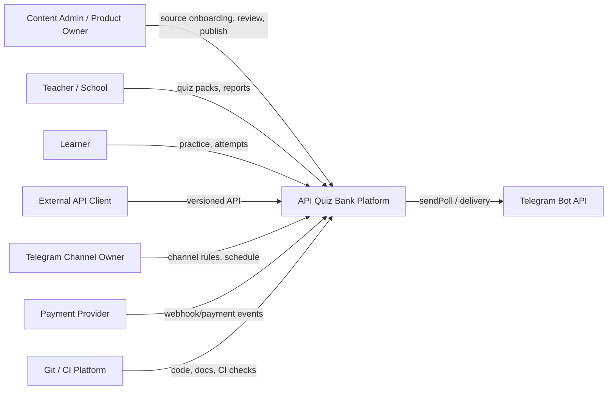
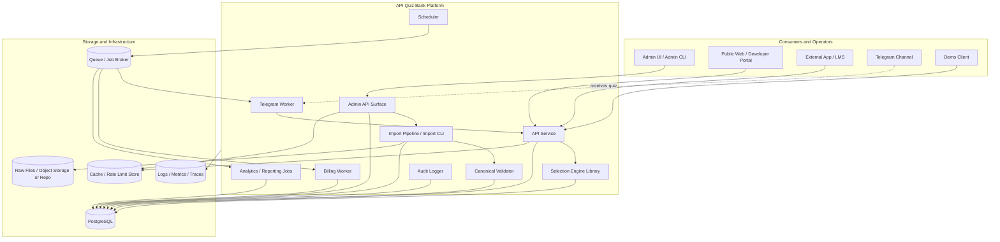
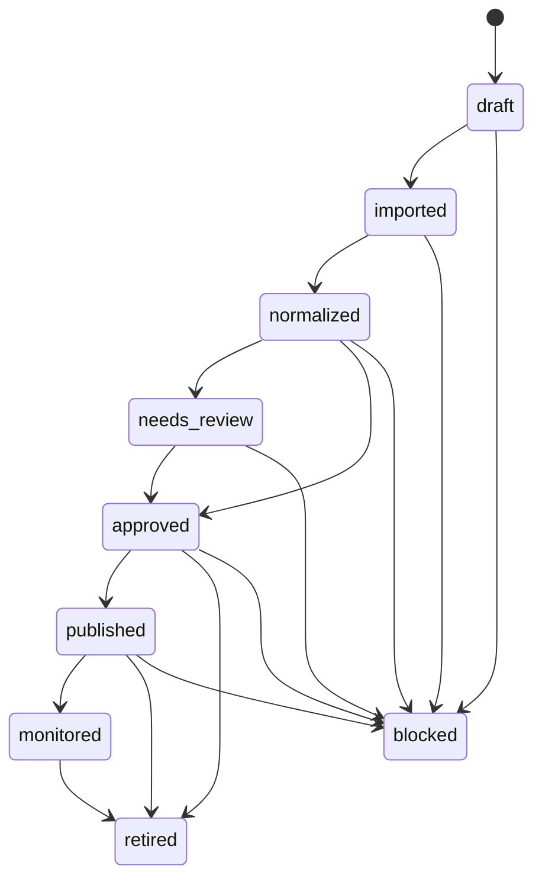
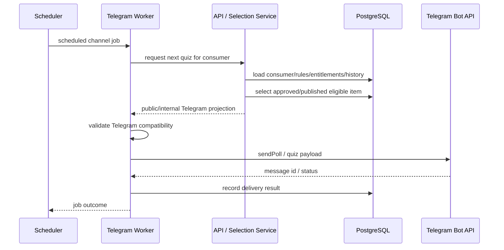
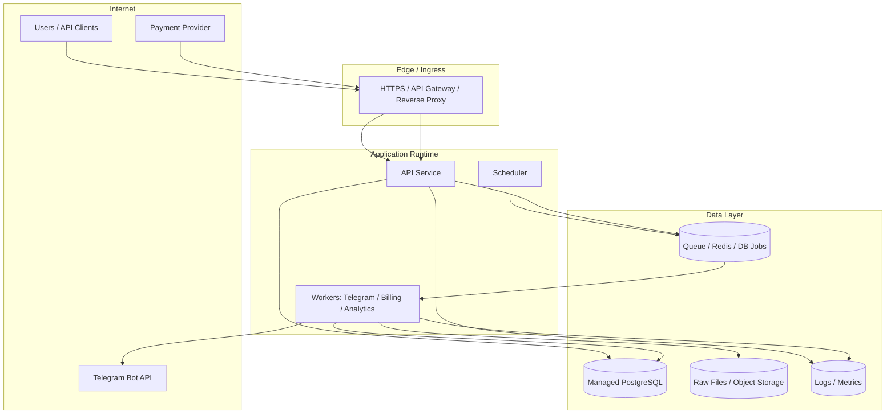
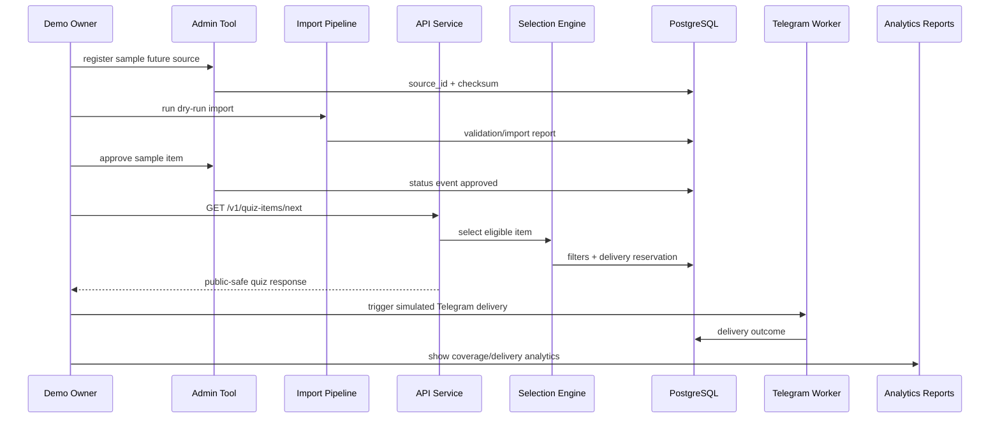

# API Quiz Bank — Architecture

**Документ:** `docs/05_architecture.md`  
**Назва проєкту:** API Quiz Bank  
**Внутрішня історична назва:** QuizBank / German QuizBank Platform  
**Версія:** 1.0.0  
**Статус:** foundational architecture specification; subordinate to `CONSTITUTION.md`; aligned with `00_vision.md`, `01_product_charter.md`, `02_requirements_srs.md`, `03_use_cases.md`, `04_domain_model.md`  
**Дата:** 2026-04-30  
**Мова:** українська з канонічними технічними термінами англійською  
**Власник:** project owner / authorized architecture maintainer  
**Керівні документи:** `CONSTITUTION.md`, `docs/00_vision.md`, `docs/01_product_charter.md`, `docs/02_requirements_srs.md`, `docs/03_use_cases.md`, `docs/04_domain_model.md`  
**Наступні документи:** `06_data_standard.md`, `07_api_standard.md`, `08_security_threat_model.md`, `09_quality_assurance.md`, `10_operations.md`, `11_billing_model.md`, `12_analytics_model.md`, `13_stanford_presentation_outline.md`

---

## 0. Executive Summary

`05_architecture.md` визначає цільову системну архітектуру **API Quiz Bank**: компоненти, шари, data flow, service boundaries, deployment boundaries, integration rules, security baseline, operations, test architecture, launch gates and Stanford-style demo evidence.

Головна архітектурна теза:

```text
API Quiz Bank is not a CSV folder, not a website and not a Telegram bot.
API Quiz Bank is a governed educational content platform with an API-first delivery surface.
```

Архітектура має перетворити перевірений German quiz corpus на production-grade platform:

```text
raw / candidate quiz files
  → source registry
  → file inventory + checksums
  → import manifest
  → parser profiles
  → dry-run import
  → canonical validation
  → duplicate/conflict detection
  → import batch
  → PostgreSQL content core
  → status workflow
  → centralized selection engine
  → versioned API
  → Telegram / web / bots / schools / external apps
  → delivery logs / attempts / analytics / billing / operations
```

Поточний operational baseline, який архітектура повинна підтримувати:

```text
115 active bank files
30,974 active rows/items
CEFR levels: A1, A2, B1, B2, C1, C2
18 canonical themes
all active items currently in draft operational status
local constitution check: violations=0 for 30,974 rows
```

Ключове правило масштабування:

```text
New quiz files are onboarded, not dropped.
```

Це означає, що майбутні quiz files не можуть напряму потрапити в production database, Telegram, API або paid products. Вони проходять controlled source onboarding, parser assignment, dry-run import, canonical validation, duplicate/conflict classification, status workflow and release gates.

Архітектурний стиль для MVP:

```text
Modular platform core first; service boundaries explicit; microservice extraction later.
```

Тобто MVP не повинен починатися з хаотичної microservices architecture. На першому етапі правильніше створити **modular monorepo / modular application architecture** з чіткими bounded contexts, окремими workers, shared libraries, database migrations, API contracts and tests. Це зменшує coordination risk і водночас не блокує майбутнє масштабування.

Фінальна мета документа:

```text
Every important architecture decision must explain:
what requirement it satisfies,
which use case it enables,
which domain entities it touches,
which tests verify it,
which risks it controls,
and how it can be demonstrated.
```

---

## 1. Role of This Document

### 1.1. Мета документа

`05_architecture.md` відповідає на питання:

```text
Які компоненти має система?
Де проходить межа між raw files, canonical data, database, API and consumers?
Як працює import pipeline?
Як future files додаються без хаосу?
Де живе selection logic?
Як Telegram отримує quiz items?
Як API захищає доступ?
Як billing перетворюється на entitlements?
Як delivery and attempts логуються?
Як analytics отримує дані?
Які deployment environments потрібні?
Які tests and launch gates підтверджують readiness?
Як це показати у Stanford-style demo?
```

### 1.2. Місце в документаційній ієрархії

```text
CONSTITUTION.md
  ↓
docs/00_vision.md
  ↓
docs/01_product_charter.md
  ↓
docs/02_requirements_srs.md
  ↓
docs/03_use_cases.md
  ↓
docs/04_domain_model.md
  ↓
docs/05_architecture.md
  ↓
docs/06_data_standard.md
  ↓
docs/07_api_standard.md
  ↓
docs/08_security_threat_model.md
  ↓
docs/09_quality_assurance.md
  ↓
docs/10_operations.md
```

`05_architecture.md` не замінює SRS або Domain Model. SRS визначає **що** система повинна робити. Domain Model визначає **які сутності та правила існують**. Architecture визначає **як компоненти системи співпрацюють, щоб реалізувати вимоги і доменну модель**.

### 1.3. Чим цей документ не є

Цей документ НЕ є:

- повним SQL schema;
- повним OpenAPI contract;
- UI mockup;
- cloud provider-specific deployment manual;
- повторним content audit;
- billing provider implementation guide;
- replacement for security threat model;
- final code-level design for every class/function.

Цей документ задає architecture contract. Деталі машинних форматів будуть у `06_data_standard.md` і `07_api_standard.md`. Threat model буде в `08_security_threat_model.md`. QA strategy буде в `09_quality_assurance.md`. Operations runbook буде в `10_operations.md`.

### 1.4. Architecture change rule

Architecture-impacting changes require:

```text
1. documented decision or amendment;
2. SRS alignment check;
3. use case impact review;
4. domain model impact review;
5. test/launch gate impact review;
6. changelog or ADR entry;
7. owner approval for production-relevant changes.
```

---

## 2. Stanford-Style Architecture Discipline

У межах API Quiz Bank “Stanford-style” означає не формальне схвалення Stanford, а engineering discipline level suitable for professional review:

```text
vision → requirements → use cases → domain model → architecture → contracts → tests → operations → demo evidence
```

Архітектура повинна бути:

| Attribute | Meaning |
|---|---|
| Traceable | Кожен critical component привʼязаний до SRS/use cases/domain entities. |
| Testable | Критичні rules мають automated test, manual checklist, inspection або demo evidence. |
| Governed | Architecture changes не відбуваються ad hoc. |
| Operational | Design враховує logs, failures, backups, monitoring, recovery. |
| Secure by design | Auth, authorization, secrets, tenant isolation and audit logs вбудовані з першого етапу. |
| Demo-ready | Claims можна показати через artifacts, diagrams, API calls, reports and logs. |
| Scale-aware | Design не переускладнює MVP, але дозволяє майбутню service extraction. |
| Content-aware | Architecture оптимізована для governed educational content, а не generic trivia API. |

Основне architecture quality rule:

```text
A system diagram is not enough.
Architecture is accepted only when component boundaries, data flow, failure modes,
security controls, tests and launch gates are clear.
```

---

## 3. Architecture Inputs and Alignment

### 3.1. Inputs from Vision

Vision establishes:

```text
API Quiz Bank is a governed API-first educational content platform.
Content becomes a product when governed, normalized, served through API, measured and controlled.
New files are onboarded, not dropped.
Stanford-ready means system-ready, not slide-ready only.
```

Architecture implication:

```text
No consumer can read raw files directly.
Every delivery path must pass through production database, selection engine, access rules and delivery logging.
```

### 3.2. Inputs from Product Charter

Product Charter establishes product modules:

```text
Source Registry
Import Manifest
Import Pipeline
Canonical Data Core
Taxonomy Core
Production Database
Status Workflow
Selection Engine
API Service
Consumer Management
Delivery Logging
Attempt Logging
Admin Workflow
Telegram Worker
Billing/Entitlements
Analytics
Operations
```

Architecture implication:

```text
Each module needs explicit ownership, inputs, outputs, dependencies and test surface.
```

### 3.3. Inputs from SRS

SRS establishes P0 requirements around:

```text
source governance
future source onboarding
import manifest
canonical data
taxonomy
status lifecycle
production database
selection engine
versioned API
consumer management
delivery logging
billing/entitlement checks
security
operations
QA and demo evidence
```

Architecture implication:

```text
P0 requirements must be visible in component architecture and launch gates.
```

### 3.4. Inputs from Use Cases

Use Cases establish concrete operational flows:

```text
UC-001 register new source
UC-002 dry-run import
UC-004 approve imported item
UC-005 request next quiz through API
UC-007 scheduled Telegram delivery
UC-008 quota exceeded
UC-012 review corpus coverage
UC-015 Stanford-style demo
UC-030 onboard a sample future source file
```

Architecture implication:

```text
The architecture must support end-to-end scenarios, not only isolated CRUD operations.
```

### 3.5. Inputs from Domain Model

Domain Model establishes bounded contexts and entities:

```text
source_file
parser_profile
import_manifest_entry
import_batch
normalized_quiz_candidate
validation_result
duplicate_case
quiz_item
quiz_item_version
quiz_option
quiz_item_status_event
taxonomy_theme / objective / pattern
consumer
consumer_rule
entitlement
quota_usage
delivery
attempt
audit_log
analytics_report
backup_artifact
incident_record
```

Architecture implication:

```text
Components must not hide these domain entities inside UI scripts, Telegram code or one-off import utilities.
```

---

## 4. Architecture Drivers

### 4.1. Product drivers

| Driver | Architecture consequence |
|---|---|
| API-first product | Versioned API service is the main product surface. |
| German quiz content | Data model supports German stems/options/explanations and CEFR. |
| Multi-consumer delivery | Consumer abstraction is first-class. |
| Telegram support | Telegram worker is adapter, not core logic owner. |
| Monetization | Entitlements and quotas are internal system truth. |
| Stanford presentation | Architecture must be explainable and evidence-backed. |

### 4.2. Data drivers

| Driver | Architecture consequence |
|---|---|
| Current CSV corpus | Source registry and import pipeline must support current top-level CSV files. |
| Future new files | Source onboarding workflow must be part of architecture. |
| Draft baseline | Status workflow prevents accidental production delivery. |
| 18 themes, CEFR, objectives, patterns | Taxonomy service/data layer must support coverage and filtering. |
| Traceability | Source IDs, checksums, import batches and content hashes are mandatory. |
| Duplicates/conflicts | Duplicate detector and review workflow required before scale. |

### 4.3. API drivers

| Driver | Architecture consequence |
|---|---|
| External clients | API has stable versioning, authentication, rate limits and docs. |
| Machine-readable errors | RFC 9457-style Problem Details used for errors. |
| Public-safe responses | API projections differ from admin/internal projections. |
| Contract testing | OpenAPI contract is tested against implementation. |

### 4.4. Security drivers

| Driver | Architecture consequence |
|---|---|
| Paid access | Entitlement checks before delivery. |
| Multi-tenant consumers | Object-level authorization for every consumer-scoped operation. |
| Admin operations | RBAC and audit logs. |
| Tokens/secrets | Secrets never committed; credentials hashed or stored securely. |
| Data leakage risk | Raw source paths and internal correct-answer data not exposed accidentally. |

### 4.5. Operations drivers

| Driver | Architecture consequence |
|---|---|
| Production reliability | Health checks, logs, metrics, backups and restore drills. |
| Telegram failures | Retry and idempotency controls. |
| Import failures | Dry-run, transactions, rollback/quarantine. |
| Demo reliability | Deterministic demo mode and fallback artifacts. |
| Scaling | Indexing, queue-based workers, read/write separation candidates. |

---

## 5. Core Architecture Principles

### Principle 1 — API-first

External consumers interact through versioned API or authorized internal workers that use the same selection/access rules.

### Principle 2 — Raw files are immutable source assets

Raw files are preserved for traceability and reproducible import. They are not delivery objects.

### Principle 3 — Production database is the operational source of truth

After controlled import, production behavior depends on canonical records in the database, not raw CSV.

### Principle 4 — New files are onboarded, not dropped

Every future source file passes through source registry, checksum, manifest, parser, dry-run, validation, duplicate/conflict classification and status workflow.

### Principle 5 — One canonical content model

All source formats converge into canonical quiz item representation before production use.

### Principle 6 — Status controls publication

Only `approved` or `published` items are eligible for normal consumers.

### Principle 7 — Selection is centralized

Selection logic lives in the selection engine, not in Telegram worker, public site or external client.

### Principle 8 — Delivery is auditable

Every real delivery or delivery attempt creates traceable delivery data.

### Principle 9 — Entitlements are internal truth

Payment provider events may update entitlements, but payment provider state alone does not grant access.

### Principle 10 — Public projections are safe projections

API responses for learners/consumers must not expose admin-only data, raw file paths, internal IDs or hidden answer data unless the interaction mode explicitly allows it.

### Principle 11 — Admin actions are logged

Source registration, imports, approvals, publishing, retirement, entitlement overrides and security-relevant changes produce audit logs.

### Principle 12 — Documentation is architecture

Architecture, data standard, API standard, security model, QA and operations documents are not decoration. They are part of the production readiness system.

### Principle 13 — MVP is modular, not fragmented

MVP may be implemented as one deployable API plus workers, but bounded contexts must remain explicit to enable future scaling.

### Principle 14 — Fail closed

When status, entitlement, quota, taxonomy or compatibility checks are uncertain, the system blocks delivery rather than guessing.

### Principle 15 — Evidence over claims

No Stanford-style claim is accepted unless backed by artifact, test, log, report, demo or clearly marked future plan.

---

## 6. Architecture Style Decision

### 6.1. Chosen style for MVP

MVP architecture SHOULD be:

```text
private monorepo
modular application core
PostgreSQL production database
versioned REST API
shared domain libraries
separate background workers
queue/scheduler for async work
OpenAPI + JSON Schema contracts
GitHub Actions or equivalent CI
Docker Compose for local reproducibility
```

This is a **modular platform architecture**, not uncontrolled monolith and not premature microservices.

### 6.2. Why not microservices first

Microservices first would introduce unnecessary early risk:

```text
service discovery
network boundaries
distributed transactions
cross-service auth
observability complexity
deployment coordination
data ownership disputes
harder demo reliability
```

API Quiz Bank first needs:

```text
source governance
canonical schema
database model
selection engine
API contract
import pipeline
delivery logging
basic operations
```

These are better proven inside a modular core with explicit boundaries.

### 6.3. Future extraction path

Components that MAY become separate services later:

```text
import-service
api-service
selection-service
telegram-worker
billing-worker
analytics-service
admin-web
scheduler
```

Extraction is allowed only when:

```text
component contract is stable;
component has tests;
data ownership is clear;
operational need exists;
monitoring exists;
security model supports service boundary;
change control approves extraction.
```

### 6.4. Architecture decision

```text
ADR-ARCH-001:
Start with modular monorepo + PostgreSQL + versioned API + workers.
Preserve service boundaries in code, data contracts and tests.
Defer microservice extraction until product-market and operational evidence justify it.
```

---

## 7. System Context Architecture

### 7.1. Context diagram



### 7.2. External actors

| Actor/System | Interaction |
|---|---|
| Content Admin | Registers sources, runs imports, approves items, reviews reports. |
| Product Owner | Controls roadmap, launch gates, demo claims. |
| Learner | Receives quiz, submits attempt, may view feedback. |
| Teacher/School | Requests packs, manages groups, reviews analytics. |
| API Client | Requests quiz content and submits attempts through API. |
| Telegram Channel Owner | Configures schedule and content rules. |
| Telegram Bot API | Receives quiz/poll send requests from Telegram worker. |
| Payment Provider | Sends payment/subscription signals; does not own entitlement truth. |
| Git/CI | Runs tests, contract checks, validation, deployments. |

### 7.3. System boundary

Inside API Quiz Bank:

```text
source registry
import manifest
parser profiles
import pipeline
canonical validation
production database
selection engine
API service
consumer management
Telegram worker
admin workflow
billing/entitlements
analytics/reporting
security/audit
operations/monitoring
```

Outside API Quiz Bank:

```text
Telegram infrastructure
payment provider infrastructure
external client apps
external LMS systems
public cloud provider
Git hosting provider
```

---

## 8. Container Architecture

### 8.1. Main containers



### 8.2. Container responsibilities

| Container | Responsibility | MVP status |
|---|---|---|
| API Service | Versioned REST API, auth, consumer endpoints, public-safe projections. | Required |
| Admin API / Admin CLI | Source onboarding, imports, status changes, reports. | Required; CLI acceptable in MVP |
| Selection Engine Library | Eligibility filtering, repeat policy, scoring, reservation. | Required |
| Import Pipeline | Parser execution, dry-run import, canonical candidates, import reports. | Required |
| Canonical Validator | JSON Schema/domain validation, Telegram compatibility checks. | Required |
| Scheduler | Timed jobs for Telegram/analytics/import/report tasks. | Pilot |
| Telegram Worker | Sends quiz/poll to Telegram via adapter; logs delivery outcome. | Pilot/demo |
| Billing Worker | Handles webhooks, entitlement updates, quota recalculation. | MVP-light/Pilot |
| Analytics Jobs | Corpus coverage, delivery, attempts, quality and usage reports. | MVP-light |
| Audit Logger | Centralized append-only audit records for critical actions. | Required |
| PostgreSQL | Operational source of truth. | Required |
| Queue/Job Broker | Async import/delivery/billing/analytics jobs. | Recommended; can be lightweight in MVP |
| Cache/Rate Limit Store | API rate limits, temporary selection locks, idempotency keys. | Recommended |
| Logs/Metrics | Operational visibility. | Required before production |

### 8.3. MVP container simplification

MVP may combine these in one codebase and one deployable app:

```text
API Service + Admin API + Selection Engine + Validator
```

But it MUST NOT combine responsibilities semantically. For example:

```text
Bad: Telegram worker contains custom selection logic.
Good: Telegram worker calls selection engine through API/internal service.
```

---

## 9. Logical Layer Architecture

```text
Layer 0 — Governance Documents
  Constitution, Vision, Charter, SRS, Use Cases, Domain Model, Architecture

Layer 1 — Source Layer
  raw files, candidate files, source registry, checksums, inventory

Layer 2 — Import Layer
  manifest, parser profiles, dry-run import, normalized candidates, import reports

Layer 3 — Validation Layer
  canonical schema, domain validation, duplicate/conflict detection, Telegram compatibility

Layer 4 — Content Core Layer
  PostgreSQL quiz items, versions, options, taxonomy, statuses, source traceability

Layer 5 — Control Layer
  consumers, consumer rules, entitlements, quotas, schedules, repeat policies

Layer 6 — Intelligence Layer
  selection engine, candidate filtering, scoring, reservation, anti-repeat logic

Layer 7 — API and Adapter Layer
  versioned API, admin API, Telegram adapter, future web/bot/LMS adapters

Layer 8 — Event and Feedback Layer
  deliveries, attempts, issue reports, billing events, audit logs

Layer 9 — Analytics and Operations Layer
  coverage reports, usage analytics, quality metrics, monitoring, backups, incident records
```

Architectural rule:

```text
Higher layers may depend on lower layers through explicit contracts.
Lower layers must not depend on Telegram, public website or billing provider implementation details.
```

---

## 10. Repository Architecture

### 10.1. Recommended repository layout

```text
api-quiz-bank/
  README.md
  CONSTITUTION.md
  CHANGELOG.md
  SECURITY.md
  CONTRIBUTING.md
  CODEOWNERS

  docs/
    00_vision.md
    01_product_charter.md
    02_requirements_srs.md
    03_use_cases.md
    04_domain_model.md
    05_architecture.md
    06_data_standard.md
    07_api_standard.md
    08_security_threat_model.md
    09_quality_assurance.md
    10_operations.md
    11_billing_model.md
    12_analytics_model.md
    13_stanford_presentation_outline.md
    adr/
      ADR-0001-modular-platform-core.md
      ADR-0002-postgresql-operational-source-of-truth.md
      ADR-0003-api-first-delivery.md

  data/
    raw/
      README.md
      current/
      candidate/
      archived/
      templates/
    manifests/
      file_inventory.csv
      import_manifest.yml
    taxonomy/
      cefr_levels.yml
      themes.yml
      objectives.yml
      patterns.yml
      tags.yml
    schemas/
      quiz_item.schema.json
      source_file.schema.json
      import_manifest.schema.json
      delivery.schema.json
    normalized/
      samples/

  services/
    api/
    admin-web/
    telegram-worker/
    scheduler/
    billing-worker/
    analytics-worker/

  libs/
    domain/
    importers/
    validator/
    quiz-selector/
    api-contracts/
    telemetry/
    authz/

  database/
    migrations/
    seeds/
    indexes.sql
    views.sql

  infra/
    docker/
    compose/
    terraform-or-provider-config/
    github-actions/

  scripts/
    inventory/
    imports/
    reports/
    demo/

  tests/
    unit/
    integration/
    contract/
    data-quality/
    security/
    e2e/
    demo/
```

### 10.2. Repository rules

```text
1. `main` is protected.
2. Production-relevant changes require PR or approved change path.
3. CI must run schema/API/import tests for relevant changes.
4. Raw source files are not manually edited without source governance update.
5. README corpus snapshot is generated, not manually curated.
6. Documentation changes are required when architecture, API, schema, security or launch gates change.
7. Secrets, tokens and payment credentials must never be committed.
```

### 10.3. Monorepo rationale

A private monorepo is appropriate at the beginning because:

```text
import pipeline, domain model, API, Telegram adapter, analytics and tests are tightly coupled;
data contracts are still evolving;
small team coordination is easier;
Stanford demo artifacts stay coherent;
service extraction can happen later after boundaries stabilize.
```

---

## 11. Data Architecture Overview

### 11.1. Data source hierarchy

```text
Raw files
  are immutable source assets.

Source registry + checksums
  prove identity and integrity.

Import manifest + parser profile
  define how source is interpreted.

Normalized candidates
  are staging objects, not production delivery objects.

Canonical quiz items
  are production content records after controlled import.

Published delivery projections
  are consumer-safe views of canonical items.

Delivery and attempt events
  are operational facts after content is served.
```

### 11.2. Source of truth rule

| Data category | Source of truth |
|---|---|
| Raw file content | Raw repository/object storage with checksum |
| Source identity | Source registry / `source_files` |
| Import rules | Versioned `import_manifest.yml` + parser profiles |
| Production quiz item | PostgreSQL canonical content tables |
| API contract | OpenAPI spec + implementation tests |
| Delivery history | `deliveries` table/event log |
| Entitlements | Internal `entitlements` and `quota_usage` records |
| Payment events | `billing_events`, not direct access truth |
| Analytics | Generated reports from canonical DB/events |

### 11.3. Data ownership

| Component | Owns |
|---|---|
| Source Registry | source files, source states, checksums |
| Import Pipeline | import batches, candidates, import reports |
| Canonical Content Core | quiz items, versions, options, status events |
| Taxonomy Core | CEFR, themes, objectives, patterns, tags |
| Consumer Management | consumers, rules, schedules, repeat policies |
| Entitlement Engine | plans, entitlements, quotas, usage |
| Delivery Core | deliveries, reservations, attempts |
| Analytics | generated reports and aggregate views |
| Security/Admin | users, roles, credentials, audit logs |
| Operations | backup artifacts, restore runs, incidents |

### 11.4. Data retention principle

Production architecture MUST preserve:

```text
source traceability;
status history;
import batch history;
delivery history;
attempt history where allowed;
audit logs for critical actions;
billing entitlement changes;
backup/restore evidence.
```

Deletion should be rare and governed. Retirement/blocking is preferred for content lifecycle.

---

## 12. Source Onboarding Architecture

### 12.1. Source onboarding flow

```mermaid
flowchart LR
    NewFile[New quiz file] --> Intake[Source intake]
    Intake --> SourceID[Assign source_id]
    SourceID --> Checksum[Compute checksum]
    Checksum --> Inventory[Update file_inventory]
    Inventory --> Manifest[Create import_manifest entry]
    Manifest --> Parser[Assign parser_profile]
    Parser --> DryRun[Dry-run import]
    DryRun --> Validate[Canonical validation]
    Validate --> Dedupe[Duplicate/conflict detection]
    Dedupe --> Report[Onboarding/import report]
    Report --> Decision{Proceed?}
    Decision -->|yes| ImportBatch[Commit import batch]
    Decision -->|needs review| Review[Admin review]
    Decision -->|no| Reject[Reject/block source]
    ImportBatch --> Status[Item status workflow]
    Status --> Approved[Approved/published items]
    Approved --> Reports[Updated coverage/generated reports]
```



### 12.2. Source onboarding components

| Component | Responsibility |
|---|---|
| Source Intake | Receives new file and metadata. |
| Source Registry | Assigns stable `source_id`, stores checksum/state. |
| Inventory Generator | Produces `file_inventory.csv` and source reports. |
| Manifest Manager | Adds/updates import manifest entries. |
| Parser Registry | Selects or defines parser profile. |
| Dry-run Importer | Parses without production writes. |
| Canonical Validator | Checks schema/domain requirements. |
| Duplicate Detector | Classifies duplicate/conflict candidates. |
| Admin Review | Resolves issues and approves import/publish decisions. |
| Report Generator | Produces evidence for onboarding decision. |

### 12.3. Source onboarding states

```text
candidate
registered
parser_pending
parser_assigned
dry_run_failed
dry_run_passed
imported
active
archived
rejected
blocked
```

Architecture rule:

```text
Only sources with acceptable state can produce production candidates.
Even active sources do not automatically publish items.
Items still require item-level status workflow.
```

### 12.4. Onboarding failure modes

| Failure | Required behavior |
|---|---|
| Duplicate checksum | Flag source; require admin decision. |
| Unknown format | Mark `parser_pending`; no import. |
| Parser failure | Mark `dry_run_failed`; generate report. |
| Invalid canonical fields | Quarantine rows/candidates. |
| Unknown taxonomy | Block or route to review; no silent coercion. |
| Answer conflict | Open duplicate/conflict case; no publication. |
| Rights/use issue | Reject/block source with audit reason. |

---

## 13. Import Pipeline Architecture

### 13.1. Import pipeline stages

```text
1. Load source registry record.
2. Verify source checksum matches manifest expectation.
3. Load import manifest entry.
4. Load parser profile.
5. Parse raw rows/blocks.
6. Normalize row into canonical-like candidate.
7. Compute raw_row_hash and content_hash.
8. Apply manifest defaults where allowed.
9. Validate canonical candidate.
10. Validate taxonomy references.
11. Validate delivery compatibility where applicable.
12. Detect duplicates/conflicts.
13. Produce import report.
14. Commit candidates/items only in approved import mode.
15. Create import batch and audit records.
```

### 13.2. Dry-run vs commit

| Mode | Writes production items? | Purpose |
|---|---:|---|
| `dry_run` | No | Inspect parsing/validation/deduplication safely. |
| `canonical_write` | No public delivery | Store candidates/staging records for review. |
| `production_write` | Creates canonical items with non-public status by default | Controlled import into DB. |
| `reimport` | Updates/versioning only under change control | Correct or replace source-derived records. |

### 13.3. Import transaction rule

Import commits SHOULD be transactional by batch:

```text
Either the batch produces consistent records and report,
or it fails/rolls back without corrupting existing content.
```

Partial commits are allowed only if explicitly recorded as `partially_committed` with row-level outcomes.

### 13.4. Import artifacts

Every import run produces:

```text
import_batch_id
source_id
manifest_entry_id
parser_profile_id
input checksum
run mode
status
rows seen
rows parsed
candidates created
validation failures
duplicate/conflict candidates
items created/updated
error summary
sample normalized payloads where configured
audit event
```

### 13.5. Parser profile architecture

Parser profiles are declarative where possible:

```yaml
parser_profile_id: pp_csv_mcq_v1
format: csv
version: 1.0.0
required_columns:
  - question
  - option_a
  - option_b
  - correct
field_mapping:
  question: stem_de
  option_a: options[0].text_de
  option_b: options[1].text_de
  correct: correct_answer_raw
normalization:
  trim_whitespace: true
  normalize_unicode: NFC
  collapse_internal_spaces: true
validation_profile: quiz_item_v1
```

Custom parser code is allowed only when declarative mapping is insufficient, and must include test fixtures.

---

## 14. Canonical Validation Architecture

### 14.1. Validation layers

```text
Layer A — File/source validation
  checksum, format, encoding, existence, source state

Layer B — Parser validation
  required columns, row parseability, raw answer mapping

Layer C — Canonical schema validation
  required fields, option count, correct answer references, field types

Layer D — Domain validation
  CEFR allowed values, theme/objective/pattern existence, status rules

Layer E — Delivery compatibility validation
  Telegram constraints, API projection safety, consumer compatibility

Layer F — Production eligibility validation
  status, source traceability, content hash, approval requirements
```

### 14.2. Validation outputs

Validation writes structured `validation_result` records:

```text
subject_type
subject_id
validation_profile_id
rule_id
status
severity
message
path
resolution state
```

### 14.3. Validation severity

| Severity | Meaning | Delivery effect |
|---|---|---|
| `info` | Informational | No block |
| `warning` | Needs attention | No automatic block unless policy says so |
| `error` | Invalid for target operation | Blocks affected operation |
| `blocker` | Unsafe/ambiguous | Blocks import/publication/delivery |

### 14.4. Canonical validation rule

```text
A quiz item can exist as candidate with warnings/errors,
but it cannot become approved/published while blocker-level validation failures remain.
```

### 14.5. Telegram compatibility validation

Before Telegram delivery, adapter must validate at least:

```text
question/stem length acceptable for Telegram poll;
option count compatible with Telegram poll;
option text length compatible;
quiz mode supports correct option representation;
explanation length/format compatible;
item type can be projected to Telegram quiz/poll;
no internal-only content is exposed accidentally.
```

---

## 15. Duplicate and Conflict Architecture

### 15.1. Detection methods

Duplicate detector SHOULD support:

```text
content_hash exact match
normalized stem + options match
normalized stem match with answer mismatch
near-duplicate text similarity
same source locator reimport detection
source checksum duplicate detection
manual duplicate reports
```

### 15.2. Duplicate classification

```text
exact_duplicate_existing
near_duplicate_review_required
answer_conflict
metadata_conflict
acceptable_variant
source_version_update
blocked_until_resolved
```

### 15.3. Conflict handling rule

```text
Exact duplicates should not create multiple active published items.
Answer conflicts must never be auto-published.
Acceptable variants require explicit reason and audit trail.
```

### 15.4. Architecture placement

Duplicate detection is part of import/validation pipeline and admin review workflow. It is NOT a Telegram responsibility and NOT an external API client responsibility.

---

## 16. Production Database Architecture

### 16.1. Database choice

MVP production database SHOULD be PostgreSQL.

Rationale:

```text
strong relational constraints;
transaction support;
JSONB for controlled metadata extension;
GIN indexes for JSONB/search workloads;
full-text search support;
migration tooling compatibility;
wide hosting availability;
strong analytics query foundation.
```

### 16.2. Database schemas / domains

Recommended logical schema grouping:

```text
source.*
  source_files, parser_profiles, import_manifest_entries, import_batches, import_reports

content.*
  quiz_items, quiz_item_versions, quiz_options, status_events, validation_results, duplicate_cases

taxonomy.*
  cefr_levels, themes, objectives, patterns, tags, item_tags

consumer.*
  consumers, consumer_rules, repeat_policies, schedules, api_credentials

delivery.*
  item_reservations, deliveries, attempts, attempt_answers, issue_reports

billing.*
  plans, entitlements, quota_usage, billing_events, entitlement_events

analytics.*
  generated_reports, analytics_reports, coverage_snapshots, usage_snapshots

security.*
  user_accounts, roles, permissions, audit_logs

ops.*
  backup_artifacts, restore_runs, incident_records, health_check_results
```

Physical implementation may use one PostgreSQL schema with prefixed table names in MVP, but domain ownership must remain clear.

### 16.3. Minimal required tables for MVP

```text
source_files
parser_profiles
import_manifest_entries
import_batches
import_reports
normalized_quiz_candidates
validation_results
quiz_items
quiz_item_versions
quiz_options
quiz_item_status_events
taxonomy_themes
taxonomy_objectives
taxonomy_patterns
consumers
consumer_rules
entitlements
quota_usage
deliveries
attempts
audit_logs
generated_reports
```

### 16.4. Database invariants

```text
source_id unique and never reused;
content_hash present for canonical item/version;
approved/published item has CEFR and primary theme;
quiz option belongs to exactly one quiz item version;
correct answer reference points to existing option;
status changes are recorded;
deliveries reference consumer and item/version;
consumer-scoped records enforce authorization boundaries;
entitlement changes are auditable;
retired items preserve historical delivery/attempt records.
```

### 16.5. Suggested indexes

```sql
CREATE INDEX idx_quiz_items_status_level_theme
ON quiz_items (status, cefr_level, primary_theme_id);

CREATE INDEX idx_quiz_items_source
ON quiz_items (source_id, import_batch_id);

CREATE UNIQUE INDEX idx_quiz_item_versions_content_hash
ON quiz_item_versions (content_hash);

CREATE INDEX idx_deliveries_consumer_item_time
ON deliveries (consumer_id, quiz_item_id, delivered_at DESC);

CREATE INDEX idx_attempts_consumer_item_time
ON attempts (consumer_id, quiz_item_id, created_at DESC);

CREATE INDEX idx_entitlements_consumer_feature
ON entitlements (consumer_id, feature, status, valid_until);

CREATE INDEX idx_quota_usage_consumer_period
ON quota_usage (consumer_id, quota_key, period_start, period_end);

CREATE INDEX idx_audit_logs_actor_time
ON audit_logs (actor_id, created_at DESC);

CREATE INDEX idx_quiz_items_metadata_gin
ON quiz_items USING GIN (metadata_json);

CREATE INDEX idx_quiz_item_versions_search_gin
ON quiz_item_versions USING GIN (search_vector);
```

Indexes must be confirmed by real query plans once workload exists.

### 16.6. Migration architecture

Database migrations MUST be versioned and reversible where feasible.

Migration categories:

```text
schema migration
data migration
taxonomy seed migration
index migration
permission/role seed migration
backfill migration
report view migration
```

Production-impacting migrations require:

```text
backup or rollback plan;
CI migration test;
compatibility check with API contract;
release note;
operations owner awareness.
```

---

## 17. Status Workflow Architecture

### 17.1. Item statuses

Canonical item status values:

```text
draft
imported
normalized
needs_review
approved
published
monitored
retired
blocked
```

### 17.2. Status transition model



### 17.3. Delivery eligibility rule

```text
Normal production consumers may receive only:
  approved
  published

Internal demo override may expose non-production items only when:
  consumer is demo/internal;
  response is clearly labeled;
  no real learner/channel receives it;
  audit/demo evidence records the override.
```

### 17.4. Status events

Every status change records:

```text
quiz_item_id
previous_status
new_status
actor_type
actor_id
reason_code
note
created_at
source/import context if relevant
```

---

## 18. Selection Engine Architecture

### 18.1. Role

Selection Engine chooses the next eligible quiz item for a consumer. It is the product intelligence layer.

It must answer:

```text
Which items are eligible?
Which items are excluded?
Why was this item selected?
Which rules were applied?
Was repeat policy respected?
Was entitlement/quota respected?
Was delivery logged or reserved?
```

### 18.2. Inputs

```text
consumer_id
request context
requested level/theme/objective/pattern filters
consumer rules
entitlements
quota usage
repeat policy
delivery history
item status
taxonomy constraints
quality flags
compatibility constraints
current time
idempotency key / request ID
```

### 18.3. Output

```text
selection_result_id
quiz_item_id
quiz_item_version_id
consumer_id
eligibility_reason
applied_filters
excluded_counts_by_reason
reservation_id if used
public-safe projection candidate
problem detail if no eligible item
```

### 18.4. Selection pipeline

```text
1. Authenticate and authorize request context.
2. Load active consumer.
3. Load consumer rules.
4. Check entitlement and quota.
5. Build candidate pool: status approved/published.
6. Filter by CEFR/theme/objective/pattern.
7. Filter by item type and consumer compatibility.
8. Filter by quality/block flags.
9. Apply repeat policy using delivery history.
10. Apply optional request filters as intersection, not override.
11. Apply scoring/weighting.
12. Reserve selected item if concurrency risk exists.
13. Return selection result.
14. Create delivery/reservation according to delivery mode.
```

### 18.5. Eligibility filters

| Filter | Required in MVP? | Notes |
|---|---:|---|
| Status filter | Yes | Only approved/published. |
| Consumer active status | Yes | Inactive consumers denied. |
| CEFR filter | Yes | A1–C2 canonical values. |
| Theme filter | Yes | Primary theme; secondary tags later. |
| Entitlement check | Yes | Can be MVP-light but must exist. |
| Quota check | Yes | Required before paid/limited access. |
| Repeat policy | Yes | Minimum consumer-level anti-repeat. |
| Telegram compatibility | For Telegram | Validate before send. |
| Quality flags | Recommended | Block flagged items. |
| Difficulty calibration | Future | Requires attempt data. |

### 18.6. Scoring model MVP

MVP scoring can be simple:

```text
eligible candidates
  → exclude recent repeats
  → prefer underrepresented theme/level where configured
  → prefer not recently delivered globally
  → random tie-breaker with deterministic seed in demo mode
```

Future scoring may include:

```text
quality_score
correctness rate
difficulty calibration
learner history
teacher goals
spaced repetition
adaptive practice
```

### 18.7. No eligible item behavior

The engine returns machine-readable reason:

```text
NO_APPROVED_ITEMS
NO_ITEMS_FOR_LEVEL
NO_ITEMS_FOR_THEME
REPEAT_POLICY_EXHAUSTED
QUOTA_EXCEEDED
ENTITLEMENT_MISSING
CONSUMER_INACTIVE
TELEGRAM_INCOMPATIBLE
```

API converts this to Problem Details response.

---

## 19. API Architecture

### 19.1. API role

The API is the main product surface.

It must support:

```text
consumer-facing quiz delivery;
attempt submission;
consumer configuration where allowed;
admin operations;
source onboarding operations;
analytics/report access;
billing/entitlement operations;
health/readiness endpoints;
OpenAPI contract generation.
```

### 19.2. API versioning

Initial public API namespace:

```text
/v1
```

Versioning rules:

```text
Breaking changes require new API version or explicit migration path.
Non-breaking additions can occur within same version.
OpenAPI spec must match implementation.
Deprecated endpoints require deprecation notice and removal policy.
```

### 19.3. Endpoint groups

```text
/v1/topics
/v1/levels
/v1/quiz-items/next
/v1/quiz-items/{id}
/v1/quiz-sessions
/v1/attempts
/v1/consumers
/v1/consumer-rules
/v1/deliveries
/v1/analytics/coverage
/v1/analytics/usage
/v1/billing/entitlements
/v1/billing/webhooks
/v1/admin/sources
/v1/admin/imports
/v1/admin/reviews
/v1/admin/reports
/v1/health
/v1/readiness
```

### 19.4. Public-safe projection

Public consumer response SHOULD include:

```text
public quiz item id
stem/question text
options with public option ids
cefr_level
theme_id or public theme slug
item_type
delivery_id or session_id
interaction mode
optional explanation only when allowed
```

Public consumer response SHOULD NOT include by default:

```text
raw source path
internal database id
source checksum
admin notes
unpublished status history
hidden correct answer when interaction mode should hide it
full import batch internals
other consumer data
```

### 19.5. Correct-answer exposure modes

Architecture MUST support different answer exposure policies:

| Mode | Correct answer exposure |
|---|---|
| `practice_reveal` | May reveal after attempt or immediately if configured. |
| `quiz_poll` | Adapter needs correct options to send Telegram quiz, but public API may not expose them directly. |
| `assessment_hidden` | Correct answer hidden until grading/authorized review. |
| `admin_full` | Admin can view correct answer and source data. |
| `demo_controlled` | May expose for demo, clearly labeled. |

### 19.6. API errors

Errors SHOULD use RFC 9457-style Problem Details:

```json
{
  "type": "https://api.quizbank.example/problems/quota-exceeded",
  "title": "Quota exceeded",
  "status": 429,
  "detail": "This consumer has reached the configured delivery quota.",
  "instance": "/v1/quiz-items/next",
  "reason_code": "QUOTA_EXCEEDED",
  "consumer_id": "cons_..."
}
```

### 19.7. API authentication options

MVP may support:

```text
admin session/JWT for admin operations;
API keys for external API consumers;
internal service tokens for workers;
webhook signature verification for payment events.
```

Future support may include:

```text
OAuth/OIDC;
school SSO;
scoped partner tokens;
short-lived signed delivery tokens.
```

### 19.8. Object-level authorization

Every consumer-scoped request MUST verify:

```text
caller identity;
requested consumer_id;
caller permission over that consumer;
allowed resource scope;
operation type;
entitlement/quota where relevant.
```

---

## 20. Consumer Architecture

### 20.1. Consumer types

```text
api_client
telegram_channel
telegram_bot
web_app
school_account
teacher_account
learner_account
demo_client
internal_worker
```

### 20.2. Consumer record

Every consumer has:

```text
consumer_id
consumer_type
owner/account link
status
allowed levels/themes/objectives/patterns
quota rules
repeat policy
schedule if applicable
entitlements
delivery preferences
created_at / updated_at
```

### 20.3. Consumer status

```text
active
paused
suspended
trial
internal_demo
archived
blocked
```

Only active/trial/internal_demo consumers may receive content according to policy.

### 20.4. Consumer rule architecture

`consumer_rules` define:

```text
allowed_cefr_levels
allowed_theme_ids
allowed_objective_ids
allowed_pattern_ids
item_types
max_daily_deliveries
repeat_window_days
delivery_channel
schedule
language_mode
correct_answer_exposure_mode
```

Request filters cannot expand beyond consumer rules.

---

## 21. Telegram Architecture

### 21.1. Telegram is adapter, not core

Telegram worker MUST NOT:

```text
read raw CSV directly;
select random quiz independently;
make billing decisions independently;
publish draft items;
ignore repeat policy;
silently skip delivery logging;
embed hidden product logic not represented in SRS/domain/tests.
```

Telegram worker MAY:

```text
load scheduled channel jobs;
call API/internal selection service;
project item into Telegram payload;
validate Telegram compatibility;
send Telegram quiz/poll;
record delivery result;
handle retry/idempotency;
report failures.
```

### 21.2. Telegram delivery flow



### 21.3. Telegram compatibility projection

Telegram adapter receives internal projection including:

```text
stem/question
options
correct_option_ids for Telegram quiz mode
explanation if allowed and compatible
open/close period if configured
consumer/channel ID
idempotency key
```

This projection is not necessarily the same as public API response.

### 21.4. Telegram failure handling

| Failure | Required behavior |
|---|---|
| No eligible item | Log `NO_ELIGIBLE_ITEM`; do not post ungoverned fallback. |
| Telegram API error | Record failure, retry according to policy. |
| Duplicate idempotency key | Do not send duplicate poll. |
| Compatibility failure | Block send; create validation/delivery failure record. |
| Entitlement revoked | Do not send; record denial. |
| Channel unreachable | Mark delivery failed; notify/admin report where configured. |

---

## 22. Admin Architecture

### 22.1. MVP admin modes

MVP may use:

```text
admin CLI
admin API
minimal admin web
manual review files generated from reports
```

But every admin action must be traceable.

### 22.2. Admin capabilities

Required capabilities:

```text
source registration
checksum generation
inventory report generation
manifest editing/validation
parser profile assignment
dry-run import
import report review
duplicate/conflict review
item status changes
batch approval/publish/retire where safe
consumer rule configuration
manual entitlement override
generated coverage report review
audit log review
```

### 22.3. Admin authorization

Admin roles:

```text
owner
product_admin
content_admin
taxonomy_admin
billing_admin
ops_admin
security_admin
demo_admin
read_only_reviewer
```

Role permissions must be explicit. High-risk actions require stricter permissions and audit logs.

### 22.4. Admin audit actions

Must log:

```text
source registration/update/rejection/blocking
manifest changes
parser profile changes
import start/commit/rollback
status changes
batch approvals
consumer rule changes
entitlement overrides
billing webhook processing exceptions
security role changes
API credential creation/revocation
backup/restore actions
```

---

## 23. Billing and Entitlements Architecture

### 23.1. Core principle

```text
Payment provider state is an input.
Internal entitlement state is access truth.
```

### 23.2. Billing components

| Component | Responsibility |
|---|---|
| Plan Catalog | Defines product plans/features. |
| Entitlement Engine | Grants access to features, levels, themes, quotas. |
| Quota Manager | Tracks usage and limits. |
| Billing Worker | Processes provider webhooks. |
| Manual Override Workflow | Supports admin grants/revocations with audit. |
| Billing Events Store | Records payment/subscription events. |

### 23.3. Entitlement examples

```text
feature: api.quiz.next
feature: telegram.scheduled_delivery
feature: levels.A1_A2
feature: levels.B1_B2
feature: themes.T01_T05
feature: quota.daily_deliveries.100
feature: analytics.basic
feature: admin.teacher_pack_export
```

### 23.4. Quota enforcement flow

```text
1. API request received.
2. Caller/consumer authorized.
3. Entitlement engine checks feature access.
4. Quota manager checks period usage.
5. If allowed, selection proceeds.
6. Delivery/reservation consumes quota according to policy.
7. If denied, API returns Problem Details with `QUOTA_EXCEEDED` or `ENTITLEMENT_MISSING`.
```

### 23.5. Payment provider neutrality

The architecture must support:

```text
stripe
liqpay
wayforpay
manual invoice
school contract
free/demo plans
```

Payment provider-specific details stay in adapter/worker. Core entitlement model remains provider-neutral.

---

## 24. Analytics and Reporting Architecture

### 24.1. Analytics goals

Analytics must answer:

```text
How many sources/items exist?
How many items are approved/published/draft?
What is coverage by level × theme × objective × pattern?
What was delivered to which consumer?
What repeats were avoided?
Which consumers are active?
What quotas were used?
Which items get wrong-answer reports?
How reliable is Telegram delivery?
What evidence supports Stanford demo claims?
```

### 24.2. Analytics data sources

```text
source registry
import reports
quiz item statuses
taxonomy tables
delivery records
attempt records
quota usage
billing events
issue reports
operation logs
```

### 24.3. Generated reports

Required report types:

```text
file_inventory report
import report
coverage report
status distribution report
delivery report
attempt/correctness report
quota usage report
Telegram delivery report
source onboarding report
Stanford demo evidence report
```

### 24.4. Analytics architecture style

MVP can use database views and scheduled report generation.

Future scale may add:

```text
event stream
analytics warehouse
materialized views
BI dashboard
separate analytics service
learner progress models
item difficulty calibration
```

### 24.5. Analytics trust rule

Analytics must derive from canonical database/events, not manual screenshots or unverified counts.

---

## 25. Security Architecture

### 25.1. Security principles

```text
least privilege;
defense in depth;
object-level authorization;
secure secrets;
public-safe projections;
audit logging;
rate limiting;
fail closed;
no raw file exposure;
no direct DB access for external consumers;
```

### 25.2. Authentication architecture

| Actor | Authentication |
|---|---|
| Admin | Session/JWT/OIDC where available; MFA recommended for production. |
| API client | API key or OAuth-style token; keys stored hashed. |
| Internal worker | Scoped service token or internal trusted network identity. |
| Billing webhook | Provider signature verification. |
| Public learner | Session/JWT or anonymous session depending product mode. |
| Demo client | Explicit internal/demo credentials. |

### 25.3. Authorization architecture

Authorization checks include:

```text
role-based admin permissions;
consumer ownership;
object-level access;
feature entitlement;
quota state;
source/item operation permissions;
status transition permissions;
```

### 25.4. API key rules

```text
API keys are created by admin or self-service flow.
Only hashed key material is stored.
Keys have scopes and consumer binding.
Keys can be revoked.
Key usage is logged.
Keys are never printed in logs after creation.
```

### 25.5. Sensitive data controls

Sensitive data includes:

```text
API keys
auth tokens
payment provider secrets
Telegram bot token
internal source paths if private
admin identities
billing events
learner identifiers
school/group data
```

Controls:

```text
secret manager or environment variables;
no secrets in Git;
redacted logs;
limited admin views;
privacy-conscious analytics;
backup encryption where feasible;
access review before public beta.
```

### 25.6. Threat-control mapping

| Threat | Architecture control |
|---|---|
| Broken object-level authorization | Per-request consumer/resource authorization. |
| Draft item exposure | Status filter in selection/API plus tests. |
| Paid access bypass | Entitlement/quota check before selection. |
| Raw data exposure | No raw file access in public API; safe projections. |
| Token leak | Secret handling, hashed credentials, redacted logs. |
| Telegram duplicate posting | Idempotency keys, delivery reservations, retry controls. |
| Fake payment webhook | Signature verification and provider adapter. |
| Admin mistake | RBAC, validation, dry-run, audit logs. |
| Data loss | Backups, restore drills, migrations with rollback. |

---

## 26. Privacy and Data Minimization Architecture

### 26.1. Data minimization

System SHOULD collect only data needed for:

```text
delivery;
attempt feedback;
quota enforcement;
security/audit;
analytics;
billing;
operations;
```

### 26.2. Learner data

Learner attempt data should be scoped to:

```text
learner/session identity where needed;
consumer context;
quiz item;
selected options;
correctness;
timestamp;
response time if collected;
```

Avoid storing unnecessary personal data in delivery/attempt tables.

### 26.3. Public analytics rule

Analytics exposed to teachers/schools/API clients must not leak other consumersʼ data.

### 26.4. Future privacy document

`08_security_threat_model.md` and `10_operations.md` must define:

```text
data retention;
data export;
data deletion/anonymization;
incident response;
privacy notices for public beta;
```

---

## 27. Operations and Observability Architecture

### 27.1. Operational capabilities

Before public production, system must have:

```text
health endpoint;
readiness endpoint;
structured logs;
error logs;
import job logs;
delivery job logs;
Telegram failure logs;
security audit logs;
billing webhook logs;
backup schedule;
restore procedure;
incident record path;
CI checks;
runbook.
```

### 27.2. Health and readiness

```text
/health
  basic process alive check

/readiness
  database reachable
  migrations current
  queue reachable if required
  cache reachable if required
  required config present
  no blocking maintenance mode
```

### 27.3. Metrics

Recommended MVP metrics:

```text
api_requests_total
api_request_duration_ms
api_errors_total by reason_code
quiz_next_success_total
quiz_next_no_eligible_total
deliveries_total by channel/status
telegram_send_failures_total
import_runs_total by status
validation_failures_total by rule_id
quota_denials_total
unauthorized_requests_total
active_consumers_count
approved_items_count
published_items_count
backup_success_timestamp
```

### 27.4. Logging rules

Logs must include:

```text
request_id
consumer_id where relevant
actor_id where relevant
operation
reason_code
status/outcome
timestamp
```

Logs must not include:

```text
raw API keys
auth tokens
payment secrets
full private payloads when unnecessary
sensitive learner data beyond allowed policy
```

### 27.5. Incident architecture

Incident records should include:

```text
incident_id
severity
start/end timestamps
affected components
affected consumers
root cause summary
actions taken
follow-up tasks
status
owner
```

---

## 28. Backup, Restore and Disaster Recovery Architecture

### 28.1. Backup targets

Back up:

```text
PostgreSQL database
import manifests
source inventory
raw source files or object storage metadata
OpenAPI/data schemas
critical generated reports
audit logs
configuration excluding secrets where managed separately
```

### 28.2. Backup schedule

MVP/Pilot:

```text
daily database backup for active environments;
backup before risky migrations/imports;
manual backup before demo/public launch;
```

Production:

```text
automated daily backups;
point-in-time recovery where feasible;
regular restore drills;
backup retention policy;
backup integrity checks;
```

### 28.3. Restore drill flow

```text
1. Select backup artifact.
2. Restore to isolated environment.
3. Run migration/current schema compatibility check.
4. Run corpus consistency check.
5. Run API readiness check.
6. Run selection smoke test.
7. Verify delivery history presence.
8. Record restore_run result.
```

### 28.4. Disaster recovery rule

No production launch without documented restore procedure and at least one successful restore drill or equivalent controlled evidence.

---

## 29. Environment Architecture

### 29.1. Required environments

| Environment | Purpose | Data policy |
|---|---|---|
| Local Dev | Development and unit tests | Sample or local subset. |
| CI | Automated validation | Fixtures and generated test data only. |
| Internal Prototype | Validate import/API | Controlled subset; no paid users. |
| Demo | Stanford-style presentation | Reproducible demo data or sanitized subset. |
| Closed Pilot | Limited real consumers | Approved/published items only; monitored. |
| Public Beta | Broader but controlled use | Production-like security/ops. |
| Production | Supported service | Full operational controls. |

### 29.2. Environment promotion

```text
local → CI → prototype → demo/closed pilot → beta → production
```

Promotion gates:

```text
migrations pass;
contracts pass;
data validation pass;
security checks pass;
backup/restore path exists;
launch checklist accepted;
known limitations documented.
```

### 29.3. Demo environment

Demo environment must be:

```text
deterministic where possible;
free of secrets on screen;
able to show source onboarding;
able to call next quiz API;
able to show delivery log;
able to simulate or execute Telegram delivery;
able to show generated reports;
able to fall back to artifacts if live network fails.
```

---

## 30. Deployment Architecture

### 30.1. MVP deployment

MVP deployment MAY use:

```text
single API container
single PostgreSQL database
one worker process for imports/Telegram/scheduled jobs
simple queue or database-backed job queue
Docker Compose for local/demo
managed hosting for pilot if available
```

### 30.2. Pilot deployment

Pilot should separate:

```text
API service
worker service
scheduler
PostgreSQL
cache/queue
logging/monitoring
```

### 30.3. Production deployment

Production should support:

```text
separate API and workers;
managed PostgreSQL with backups;
queue/job broker;
rate limiting;
secret management;
monitoring/alerting;
zero-downtime or controlled deployments;
rollback plan;
```

### 30.4. Deployment diagram



### 30.5. Deployment anti-patterns

Forbidden for production:

```text
public API reading raw CSV directly;
Telegram worker running from a personal laptop for production;
no migrations;
no backups;
secrets in repository;
manual database edits without audit;
paid access controlled only by Telegram channel membership;
no delivery logs;
no status filter;
```

---

## 31. Interface Architecture

### 31.1. Internal interfaces

| Interface | Contract |
|---|---|
| Importer → Validator | normalized candidate payload + validation profile. |
| Importer → DB | import batch, candidates, item/version/options writes. |
| API → Selection Engine | selection request, consumer context, filters. |
| Selection Engine → DB | candidate query, history query, reservation/delivery write. |
| API → Entitlement Engine | consumer, feature, quota request. |
| Telegram Worker → API/Selection | next quiz request for Telegram consumer. |
| Billing Worker → Entitlement Engine | provider event → internal entitlement update. |
| Analytics Jobs → DB | read canonical facts, write generated reports. |

### 31.2. External interfaces

| Interface | Standard/Contract |
|---|---|
| Public API | OpenAPI specification. |
| API errors | Problem Details-style JSON. |
| Canonical data | JSON Schema 2020-12. |
| Telegram | Telegram Bot API sendPoll/quiz constraints. |
| Payment webhook | Provider-specific signature + internal billing event. |
| Repository/CI | Git branch protection, status checks, CI pipelines. |

### 31.3. Projection architecture

Same domain item may have multiple projections:

```text
admin_full_projection
api_public_quiz_projection
api_attempt_result_projection
telegram_quiz_projection
teacher_pack_projection
analytics_item_projection
billing_usage_projection
```

Projection rule:

```text
Do not expose canonical/internal object blindly.
Every external response uses explicit projection.
```

---

## 32. Event, Audit and Logging Architecture

### 32.1. Domain events

Important events:

```text
SourceRegistered
SourceChecksumComputed
ManifestEntryCreated
ParserProfileAssigned
DryRunImportStarted
DryRunImportCompleted
ImportBatchCommitted
ValidationFailed
DuplicateCaseOpened
DuplicateCaseResolved
QuizItemApproved
QuizItemPublished
QuizItemRetired
ConsumerCreated
ConsumerRuleUpdated
EntitlementGranted
EntitlementRevoked
QuotaConsumed
QuizSelected
DeliveryReserved
DeliverySucceeded
DeliveryFailed
AttemptRecorded
IssueReported
BackupCreated
RestoreCompleted
IncidentOpened
```

### 32.2. Audit vs event

| Record type | Purpose |
|---|---|
| Domain event | Business/system fact. |
| Audit log | Who changed what, when, and why. |
| Operational log | Runtime troubleshooting and metrics. |
| Analytics event/report | Aggregated insight and product metrics. |

### 32.3. Audit immutability

Audit logs SHOULD be append-only. Corrections should be additional records, not mutation of historical audit entries.

### 32.4. Correlation IDs

Every request/job should carry:

```text
request_id
job_id or import_batch_id where relevant
consumer_id where relevant
actor_id where relevant
```

---

## 33. Concurrency, Idempotency and Reservation Architecture

### 33.1. Why needed

The system may receive concurrent requests:

```text
same API consumer requests multiple quizzes;
Telegram worker retries delivery;
scheduler runs overlapping jobs;
billing webhook arrives twice;
admin imports same source twice;
```

### 33.2. Idempotency keys

Use idempotency keys for:

```text
delivery requests;
Telegram send operations;
billing webhooks;
import commit operations;
manual admin batch actions;
```

### 33.3. Item reservations

Selection may create `item_reservation` before delivery:

```text
reservation_id
consumer_id
quiz_item_id
quiz_item_version_id
expires_at
status: reserved / delivered / expired / cancelled
idempotency_key
```

This prevents duplicate delivery under concurrent requests.

### 33.4. Billing webhook idempotency

Provider event IDs must be stored. Repeated webhook should not duplicate entitlement grants or quota resets.

### 33.5. Import idempotency

Import batch identity should include:

```text
source_id
source_checksum
manifest_entry_id
parser_profile_version
mode
```

Re-running same dry-run should produce reproducible report or explain differences.

---

## 34. Error and Reason Code Architecture

### 34.1. Reason code categories

```text
AUTH_*
AUTHZ_*
SOURCE_*
IMPORT_*
VALIDATION_*
DUPLICATE_*
STATUS_*
TAXONOMY_*
SELECTION_*
ENTITLEMENT_*
QUOTA_*
DELIVERY_*
TELEGRAM_*
BILLING_*
OPS_*
```

### 34.2. Examples

```text
AUTH_INVALID_API_KEY
AUTHZ_CONSUMER_ACCESS_DENIED
SOURCE_CHECKSUM_MISMATCH
IMPORT_MANIFEST_MISSING
VALIDATION_INVALID_CEFR
DUPLICATE_ANSWER_CONFLICT
STATUS_NOT_DELIVERABLE
SELECTION_NO_ELIGIBLE_ITEM
ENTITLEMENT_MISSING_FEATURE
QUOTA_EXCEEDED
TELEGRAM_COMPATIBILITY_FAILED
BILLING_WEBHOOK_SIGNATURE_INVALID
OPS_DATABASE_UNAVAILABLE
```

### 34.3. Problem Details mapping

| Reason | HTTP status |
|---|---:|
| `AUTH_INVALID_API_KEY` | 401 |
| `AUTHZ_CONSUMER_ACCESS_DENIED` | 403 |
| `SOURCE_NOT_FOUND` | 404 |
| `VALIDATION_INVALID_PAYLOAD` | 422 |
| `QUOTA_EXCEEDED` | 429 |
| `SELECTION_NO_ELIGIBLE_ITEM` | 404 or 409 depending endpoint semantics |
| `OPS_SERVICE_UNAVAILABLE` | 503 |

### 34.4. Error rule

Errors must be stable enough for clients and tests. Human messages may change; reason codes should not change without versioning/change control.

---

## 35. Performance and Scaling Architecture

### 35.1. MVP performance goal

MVP should support:

```text
fast next-quiz selection for approved subset;
imports over current corpus in controlled jobs;
coverage report generation without blocking API;
Telegram pilot delivery on schedule;
API response time suitable for demo/pilot;
```

Exact SLOs will be set in `10_operations.md`.

### 35.2. Scaling levers

| Pressure | Scaling lever |
|---|---|
| More quiz items | Indexes, partitioning if needed, optimized candidate queries. |
| More consumers | API rate limits, queue workers, consumer-scoped caching. |
| More Telegram channels | Scheduler sharding, worker concurrency, idempotency. |
| Heavy analytics | Materialized views, scheduled aggregation, analytics warehouse later. |
| Heavy imports | Async import jobs, staging tables, batch processing. |
| High API traffic | API horizontal scaling, cache/rate-limit store. |

### 35.3. Selection query performance

Selection should avoid scanning full corpus per request.

Candidate query should use:

```text
status index;
level/theme indexes;
consumer delivery history index;
quality/block flags;
repeat policy window filtering;
optional materialized eligible pools if needed later.
```

### 35.4. Avoid premature optimization

Do not implement complex adaptive learning or IRT before attempts data exists. Architecture should collect attempts first and allow future difficulty calibration.

---

## 36. Configuration and Feature Flag Architecture

### 36.1. Configuration categories

```text
API base URL
allowed origins
database URL
queue/cache URL
Telegram bot token
payment provider keys
import paths
source storage path
rate limit settings
quota periods
default repeat windows
demo mode settings
feature flags
```

### 36.2. Feature flags

Recommended flags:

```text
feature.telegram_delivery_enabled
feature.billing_webhooks_enabled
feature.public_api_enabled
feature.admin_batch_publish_enabled
feature.demo_deterministic_selection
feature.future_source_onboarding_enabled
feature.answer_reveal_modes_enabled
feature.analytics_reports_enabled
```

### 36.3. Configuration rule

Runtime configuration must not require code changes for environment-specific settings. Secrets must not be stored in docs or repository.

---

## 37. Technology Stack Recommendation

### 37.1. Architecture-level stance

This architecture is framework-neutral, but MVP should pick a practical stack quickly to reduce ambiguity.

### 37.2. Recommended MVP stack option

Given existing Python tooling and import/report needs, a strong MVP reference stack is:

```text
Language: Python 3.12+
API: FastAPI or equivalent ASGI framework
Data validation: Pydantic + JSON Schema generation/validation where appropriate
Database: PostgreSQL
Migrations: Alembic or equivalent
ORM/query: SQLAlchemy or SQLModel / explicit SQL for critical queries
Async jobs: Celery/RQ/Arq or lightweight DB-backed jobs in prototype
Cache/rate limit: Redis where needed
Docs/contracts: OpenAPI + JSON Schema 2020-12
Tests: pytest + contract/data-quality tests
Local dev: Docker Compose
CI: GitHub Actions or equivalent
```

### 37.3. Acceptable alternative stack

A TypeScript stack is also viable:

```text
Node.js / TypeScript
NestJS or Fastify
Zod / JSON Schema tooling
PostgreSQL
Prisma/Drizzle/Kysely
BullMQ / Redis
OpenAPI tooling
Jest/Vitest
```

### 37.4. Stack decision rule

Framework choice is less important than these invariants:

```text
canonical schema exists;
OpenAPI contract exists;
PostgreSQL migrations exist;
selection engine is testable;
import pipeline is reproducible;
workers are idempotent;
security and audit are implemented;
CI validates contracts and data rules.
```

---

## 38. Testing Architecture

### 38.1. Test pyramid

```text
Unit tests
  domain rules, validators, parsers, selection filters

Integration tests
  database migrations, import pipeline, API + DB, worker + queue

Contract tests
  OpenAPI response/request schemas, Problem Details errors

Data-quality tests
  canonical schema, taxonomy values, status delivery eligibility, import fixtures

Security tests
  auth, object-level authorization, token leakage, webhook signatures

End-to-end tests
  source onboarding → import → approve → next quiz → delivery → attempt → analytics

Demo tests
  deterministic Stanford demo script and fallback artifacts
```

### 38.2. Required P0 tests

```text
raw files cannot be served directly;
draft items are not delivered;
approved item can be selected;
consumer rules are respected;
quota exceeded returns machine-readable error;
unauthorized consumer access is denied;
dry-run import creates no production items;
source has source_id/checksum before import;
canonical validation catches invalid answer references;
Telegram incompatible item is blocked;
delivery is logged;
status changes are audited;
```

### 38.3. Test fixtures

Fixtures should include:

```text
valid CSV source;
invalid CSV source;
unknown CEFR item;
duplicate item;
answer conflict item;
approved item;
draft item;
consumer with quota;
consumer without entitlement;
Telegram-compatible item;
Telegram-incompatible item;
demo source file for future onboarding;
```

### 38.4. CI checks

CI should run:

```text
documentation lint where feasible;
JSON Schema validation;
import fixture tests;
unit tests;
database migration tests;
API contract tests;
security smoke tests;
no-secrets scan;
OpenAPI generation/validation;
```

---

## 39. Launch Gates Architecture

### 39.1. MVP gate

MVP is architecture-ready when:

```text
architecture document accepted;
source registry pattern exists;
file inventory exists or generation path exists;
import manifest exists;
canonical schema draft exists;
PostgreSQL schema/migrations exist;
selection engine MVP exists;
API next quiz endpoint exists;
draft items blocked from normal delivery;
delivery logging exists;
basic admin approval path exists;
future source onboarding demo exists;
```

### 39.2. Closed pilot gate

Closed pilot requires:

```text
approved/published item subset;
consumer rules;
entitlement/quota checks;
repeat policy;
Telegram dry-run or controlled real channel;
monitoring/logging;
backup and restore path;
issue reporting;
security review for API keys/admin;
```

### 39.3. Public beta gate

Public beta requires:

```text
stable API contract;
rate limits;
security threat model;
privacy/legal basics;
billing/entitlement model;
operations runbook;
backup restore drill;
incident response path;
documented known limitations;
```

### 39.4. Production gate

Production requires:

```text
all public delivery uses approved/published items;
full audit logging for critical actions;
monitoring and alerts;
reliable backups;
restore drill evidence;
security controls;
billing entitlement correctness;
support process;
changelog/release process;
```

### 39.5. Stanford-ready gate

Stanford-ready requires:

```text
architecture diagram;
source onboarding demo;
canonical data/schema demo;
API next quiz demo;
selection/repeat explanation;
Telegram or simulated delivery demo;
delivery log;
attempt/analytics demo;
entitlement/quota denial demo;
operations/security summary;
risk register;
roadmap;
known limitations clearly stated;
```

---

## 40. Stanford-Style Demo Architecture

### 40.1. Demo story

```text
Problem: German quiz content is valuable but fragmented.
Asset: API Quiz Bank starts with a large verified corpus.
Architecture: governed sources become canonical data and API-delivered items.
Proof: a source file is registered, imported, approved, selected, delivered, logged and analyzed.
Scale: future files use the same onboarding path.
Trust: status, entitlements, security, operations and audits prevent chaos.
```

### 40.2. Demo components

```text
Demo source file
Source registry/inventory record
Import manifest entry
Dry-run import report
Canonical item sample
Database record
Approved/published status event
API `/v1/quiz-items/next` call
Delivery record
Attempt record
Coverage/analytics report
Quota denial example
Telegram dry-run or controlled send
Architecture diagram
```

### 40.3. Demo sequence



### 40.4. Demo fallback

If live demo fails, fallback artifacts must include:

```text
screenshots or generated reports;
recorded API request/response;
pre-generated import report;
pre-generated delivery log;
architecture diagram;
known limitation note;
```

Fallback is acceptable only if claims are honest and not represented as live functionality.

---

## 41. Architecture Decision Records Seed

### ADR-0001 — Modular platform core first

```text
Decision: Start with modular monorepo/platform core, not distributed microservices.
Reason: Lower coordination risk, easier demo, clearer data contracts, faster MVP.
Future: Extract services after boundaries and operational needs are proven.
```

### ADR-0002 — PostgreSQL as operational source of truth

```text
Decision: Use PostgreSQL for canonical production records.
Reason: relational constraints, transactions, indexes, JSONB, search, migrations.
Boundary: raw files remain source assets; PostgreSQL is operational truth after import.
```

### ADR-0003 — API-first delivery

```text
Decision: All external consumers use versioned API or controlled workers.
Reason: One product contract, scalable consumers, security and analytics.
Forbidden: public site/Telegram/external clients reading raw CSV directly.
```

### ADR-0004 — Internal entitlement truth

```text
Decision: Entitlements control access, not payment provider state alone.
Reason: provider neutrality, auditability, manual overrides, quota enforcement.
```

### ADR-0005 — Source onboarding required for future files

```text
Decision: New quiz files are registered, checksummed, manifested, dry-run imported and validated before production use.
Reason: prevents chaos, duplicate/conflict issues, traceability loss and unsafe delivery.
```

### ADR-0006 — Explicit projection architecture

```text
Decision: Do not expose canonical/internal records directly through public API.
Reason: public safety, correct-answer policy, source privacy, admin separation.
```

### ADR-0007 — Delivery logging is mandatory

```text
Decision: Every production delivery or delivery attempt records a delivery event.
Reason: anti-repeat, analytics, billing, debugging and Stanford evidence.
```

---

## 42. Risk Register and Architecture Controls

| Risk | Architecture control |
|---|---|
| File chaos after adding new files | Source onboarding pipeline, inventory, manifest, parser profiles. |
| Draft items accidentally delivered | Status filter in selection/API, tests, launch gates. |
| Telegram becomes hidden product core | Telegram worker uses API/selection, no raw file access. |
| Duplicate/conflict content degrades quality | Content hash, duplicate detector, admin conflict resolution. |
| API consumer accesses another consumerʼs data | Object-level authorization and scoped credentials. |
| Paid access bypass | Internal entitlements and quota manager. |
| Payment provider lock-in | Provider adapter and internal billing events. |
| Data loss | Backups, restore drills, migration controls. |
| Demo overclaims readiness | Demo evidence, known limitations, deterministic demo mode. |
| Scope creep | Architecture phases and launch gates. |
| Operational blind spots | Logs, metrics, health/readiness, incident records. |
| Source traceability loss | Mandatory source_id, checksum, import_batch_id, content_hash. |
| Public API leaks internal data | Explicit projections and response schemas. |
| Worker duplicate posts | Idempotency and reservations. |
| Security tokens leak | Secret management and no-secrets CI scans. |

---

## 43. Traceability Matrix

### 43.1. Component to SRS areas

| Component | SRS areas |
|---|---|
| Source Registry | SRC, ONB, DOC, QA |
| Import Manifest | IMP, SRC, ONB, DOC |
| Parser Registry | IMP, DATA, QA |
| Import Pipeline | IMP, DATA, DB, QA |
| Canonical Validator | DATA, TAX, TG, QA |
| Duplicate Detector | IMP, DATA, ADM, QA |
| Content Core DB | DB, DATA, STAT, TAX |
| Status Workflow | STAT, ADM, QA |
| Selection Engine | SEL, CONS, BILL, AN |
| API Service | API, CONS, SEC, PERF |
| Telegram Worker | TG, SEL, AN, OPS |
| Admin Workflow | ADM, SRC, IMP, STAT, BILL |
| Entitlement Engine | BILL, CONS, API, SEC |
| Analytics Jobs | AN, TAX, DOC, DEMO |
| Operations Layer | OPS, REL, ENG, DEMO |
| CI/CD | ENG, QA, SEC, DOC |

### 43.2. Component to use cases

| Component | Use Cases |
|---|---|
| Source Registry | UC-001, UC-026, UC-030 |
| Import Pipeline | UC-002, UC-016, UC-017, UC-030 |
| Duplicate Detector | UC-003 |
| Status Workflow | UC-004, UC-011, UC-018, UC-019 |
| Selection Engine | UC-005, UC-007, UC-008, UC-009, UC-028 |
| API Service | UC-005, UC-006, UC-008, UC-027, UC-028 |
| Telegram Worker | UC-007, UC-021, UC-022 |
| Admin Workflow | UC-001, UC-004, UC-011, UC-020, UC-023, UC-025 |
| Entitlement Engine | UC-008, UC-013, UC-023 |
| Analytics | UC-012, UC-029, UC-015 |
| Operations | UC-014, UC-015 |
| Security Layer | UC-024, UC-005, UC-006, UC-013 |
| Demo Architecture | UC-015, UC-030 |

---

## 44. MVP / Pilot / Beta / Production Architecture Cut

### 44.1. MVP architecture cut

MVP MUST include:

```text
source registry basics
file inventory path
import manifest
parser profile for current/source sample
canonical schema draft
dry-run import
PostgreSQL schema baseline
approved/published status filtering
selection engine MVP
API next quiz endpoint
delivery logging
basic consumer rules
quota/entitlement placeholder or MVP-light implementation
admin CLI/API for source/import/status
coverage report
Stanford demo path
```

### 44.2. Pilot architecture cut

Pilot adds:

```text
Telegram worker real or controlled channel
scheduler
repeat policy by consumer
attempt logging
issue reporting
manual entitlement override
basic analytics dashboard/report
backup/restore drill
security review
```

### 44.3. Public beta architecture cut

Beta adds:

```text
stable OpenAPI contract
rate limiting
billing provider integration if used
public-safe developer docs
privacy/legal baseline
monitoring/alerts
support path
stronger admin UI
contract tests
```

### 44.4. Production architecture cut

Production adds:

```text
robust backups/PITR where feasible
incident management
scaling plan
security hardening
admin roles/MFA where possible
observability dashboards
load/performance validation
release process
customer support path
```

---

## 45. Architecture Acceptance Criteria

This architecture document is accepted when:

```text
AC-ARCH-001: It clearly states API Quiz Bank is API-first platform, not CSV folder/site/bot.
AC-ARCH-002: It defines components for source onboarding, import, validation, database, selection, API, Telegram, billing, analytics and operations.
AC-ARCH-003: It preserves rule: new quiz files are onboarded, not dropped.
AC-ARCH-004: It prevents raw files from becoming production delivery layer.
AC-ARCH-005: It defines PostgreSQL as operational source of truth after controlled import.
AC-ARCH-006: It defines selection engine as centralized product intelligence.
AC-ARCH-007: It defines status-based delivery eligibility.
AC-ARCH-008: It defines public-safe API projections.
AC-ARCH-009: It defines Telegram as adapter, not core logic owner.
AC-ARCH-010: It defines entitlements as access truth.
AC-ARCH-011: It defines audit, logging, backup and restore expectations.
AC-ARCH-012: It maps architecture components to SRS and use cases.
AC-ARCH-013: It includes MVP, pilot, beta and production architecture cuts.
AC-ARCH-014: It includes Stanford-style demo architecture and evidence path.
AC-ARCH-015: It identifies risks and controls.
```

---

## 46. Open Architecture Questions

These questions require future decisions but do not block adoption of this architecture:

```text
1. Which backend stack will be selected first: Python/FastAPI or TypeScript/NestJS/Fastify?
2. Which job/queue technology will be used in MVP?
3. Which hosting provider will run demo/pilot?
4. Which payment provider will be integrated first?
5. Will admin MVP be CLI-first, API-first or minimal web-first?
6. How large is the first approved/published pilot subset?
7. What exact repeat window is used for Telegram channels?
8. Which analytics dashboard/report format launches first?
9. What exact API key/OAuth model is needed for public beta?
10. How will learner privacy and data retention be formalized?
11. What exact source formats beyond CSV will be first-class?
12. What exact SLOs apply to API and Telegram delivery?
13. What cloud storage path will store raw/candidate/archive source files?
14. What exact status transition permissions are used by roles?
15. Which demo environment will be used for Stanford-style presentation?
```

Open questions must be resolved through ADRs, SRS updates, API/Data Standards, Security Threat Model or Operations docs. They must not be resolved through hidden implementation choices.

---

## 47. Reference Standards and Alignment

API Quiz Bank architecture aligns with:

```text
Stanford/SLAC-style requirements discipline
  goal → features → requirements → use cases → traceability → test/QA → change control

CEFR
  canonical A1, A2, B1, B2, C1, C2 levels for language learning alignment

OpenAPI Specification
  formal contract for HTTP APIs

JSON Schema 2020-12
  canonical quiz item and source/import validation schemas

RFC 9110
  HTTP semantics

RFC 9457
  Problem Details for machine-readable API errors

OWASP API Security Top 10
  object-level authorization, authentication, excessive exposure and API abuse controls

Telegram Bot API
  quiz/poll delivery adapter constraints

PostgreSQL documentation
  relational integrity, JSONB, GIN/full-text indexing where useful

GitHub/Git CI discipline
  protected branches, required status checks, code owners and CI validation
```

Reference URLs should be maintained in documentation and updated when standards change:

```text
https://www-group.slac.stanford.edu/cdsoft/nlc_arch/nlc_requirements/RequirementsMethod.pdf
https://www.coe.int/en/web/common-european-framework-reference-languages/level-descriptions
https://spec.openapis.org/oas/
https://json-schema.org/draft/2020-12
https://www.rfc-editor.org/rfc/rfc9110
https://www.rfc-editor.org/rfc/rfc9457
https://owasp.org/API-Security/editions/2023/en/0x11-t10/
https://core.telegram.org/bots/api
https://www.postgresql.org/docs/current/
https://docs.github.com/repositories/configuring-branches-and-merges-in-your-repository/managing-protected-branches/about-protected-branches
```

---

## 48. Final Architecture Rule

```text
API Quiz Bank is architecture-ready only when the system can explain and demonstrate:

where a quiz item came from,
how its source was registered,
how it was parsed,
how it was validated,
which canonical version exists,
which status makes it eligible,
which consumer requested it,
which entitlement allowed it,
which selection rules applied,
whether repeat policy was respected,
where delivery was logged,
what happened after delivery,
how analytics saw it,
how operations can recover it,
and how the next new source file would follow the same governed path.
```

Anything less is not a platform. It is only a collection of files or scripts.

The architecture of API Quiz Bank must protect the corpus, expose it through a contract, measure its use, control its access, support future file onboarding, and produce evidence strong enough for professional technical review.
