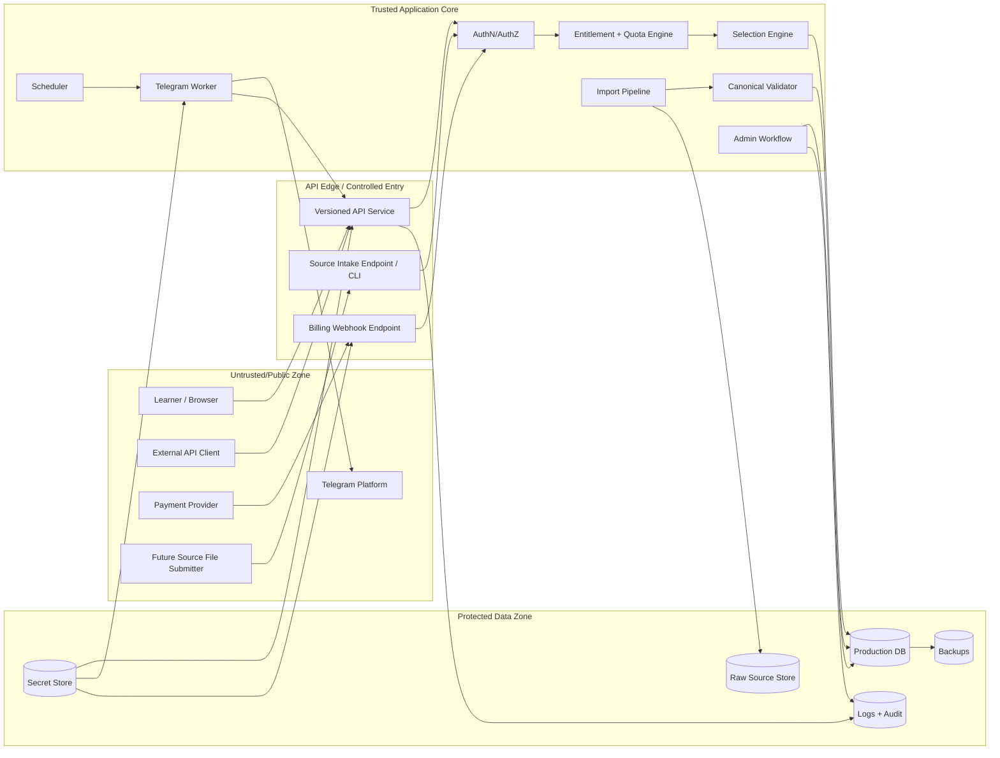

# API Quiz Bank — Security Threat Model

**Документ:** `docs/08_security_threat_model.md`  
**Назва проєкту:** API Quiz Bank  
**Внутрішня історична назва:** QuizBank / German QuizBank Platform  
**Версія:** 1.0.0  
**Статус:** foundational security threat model; subordinate to `CONSTITUTION.md`; aligned with `00_vision.md`, `01_product_charter.md`, `02_requirements_srs.md`, `03_use_cases.md`, `04_domain_model.md`, `05_architecture.md`, `06_data_standard.md`, `07_api_standard.md`  
**Дата:** 2026-04-30  
**Мова:** українська з канонічними технічними термінами англійською  
**Власник:** project owner / authorized security maintainer  
**Керівні документи:** `CONSTITUTION.md`, `docs/00_vision.md`, `docs/01_product_charter.md`, `docs/02_requirements_srs.md`, `docs/03_use_cases.md`, `docs/04_domain_model.md`, `docs/05_architecture.md`, `docs/06_data_standard.md`, `docs/07_api_standard.md`  
**Наступні документи:** `09_quality_assurance.md`, `10_operations.md`, `11_billing_model.md`, `12_analytics_model.md`, `13_stanford_presentation_outline.md`  
**Повʼязані майбутні артефакти:** `SECURITY.md`, `docs/security/incident_playbook.md`, `docs/security/access_control_matrix.md`, `tests/security/`, `api/openapi.yaml`, `infra/` security configuration

---

## 0. Executive Summary

`08_security_threat_model.md` визначає security model, threat catalog, risk register, mandatory controls, verification strategy and launch gates для **API Quiz Bank**.

API Quiz Bank не є просто CSV-каталогом, сайтом або Telegram-ботом. Це API-first освітня content platform, яка має захищати:

```text
source files
  → source onboarding
  → import manifest
  → canonical quiz items
  → production database
  → selection engine
  → versioned API
  → Telegram / web / bots / apps / schools / external clients
  → delivery logs / attempts / analytics / entitlements / operations
```

Головна security-теза:

```text
Security is not a feature after launch.
Security is the trust layer that makes governed quiz delivery possible.
```

Цей документ перетворює попередні product, SRS, use case, domain, architecture, data and API decisions у конкретну threat model. Security має довести, що система може:

```text
1. не видати draft/blocked item normal consumer;
2. не видати premium content без entitlement;
3. не дати consumer доступ до чужих deliveries, attempts, reports або rules;
4. не expose correct answers before allowed interaction mode;
5. не expose raw source paths, checksums, internal metadata або secrets normal users;
6. не дозволити Telegram worker, public site або external client читати raw CSV напряму;
7. не приймати new quiz files без source onboarding gates;
8. не дозволити spoofed billing webhook обійти entitlement model;
9. не втратити audit trail privileged дій;
10. не зробити Stanford-style demo claims без evidence.
```

Поточний operational baseline, який threat model враховує:

```text
115 active bank files
30,974 active rows/items
top-level corpus format: CSV
CEFR levels: A1, A2, B1, B2, C1, C2
18 canonical themes
objective and pattern dimensions
all active items currently in draft operational status
local constitution check: violations=0 for 30,974 rows
```

Цей baseline є стартовим активом, а не security boundary. Security model має працювати і для поточного corpus, і для майбутнього розширення через правило:

```text
New quiz files are onboarded, not dropped.
```

Цей документ НЕ є повним compliance/legal документом, НЕ є production incident playbook, НЕ є cloud hardening manual і НЕ є заміною `09_quality_assurance.md` або `10_operations.md`. Він визначає threats, controls and verification gates, які ці наступні документи мають реалізувати й перевірити.

Фінальне правило threat model:

```text
No external or internal consumer may receive, change, publish, analyze or monetize quiz content unless identity, authorization, status, entitlement, projection safety, auditability and operational recovery have been considered and controlled.
```

---

## 1. Role of This Document

### 1.1. Мета документа

`08_security_threat_model.md` відповідає на питання:

```text
Що саме треба захистити?
Хто може атакувати або помилково зламати систему?
Де проходять trust boundaries?
Які attack surfaces існують у source onboarding, import, API, Telegram, admin, billing, analytics and operations?
Які threats мають P0 priority?
Які controls required before MVP, pilot, beta and production?
Як security requirements трасуються до SRS/use cases/domain/API?
Які tests, inspections, drills and demo evidence потрібні?
Що означає Stanford-style security readiness?
```

### 1.2. Місце в документаційній ієрархії

```text
CONSTITUTION.md
  ↓
docs/00_vision.md
  ↓
docs/01_product_charter.md
  ↓
docs/02_requirements_srs.md
  ↓
docs/03_use_cases.md
  ↓
docs/04_domain_model.md
  ↓
docs/05_architecture.md
  ↓
docs/06_data_standard.md
  ↓
docs/07_api_standard.md
  ↓
docs/08_security_threat_model.md
  ↓
docs/09_quality_assurance.md
  ↓
docs/10_operations.md
```

### 1.3. Що цей документ робить

Цей документ:

- визначає security objectives;
- класифікує assets and data;
- визначає actors, misuse actors and attacker capabilities;
- описує trust boundaries;
- описує attack surfaces;
- застосовує STRIDE-style threat thinking;
- мапить ризики на OWASP API Security Top 10;
- задає risk scoring and risk register;
- визначає mandatory controls;
- створює security requirements із ID;
- визначає security acceptance criteria;
- задає security launch gates;
- задає test and verification strategy;
- формує основу для `09_quality_assurance.md`, `10_operations.md`, `SECURITY.md` and implementation.

### 1.4. Що цей документ не робить

Цей документ НЕ:

- гарантує відповідність GDPR, SOC 2, ISO 27001 або іншому формальному compliance без окремого review;
- замінює privacy policy, terms of service або DPA;
- визначає конкретний cloud provider;
- визначає конкретний authentication framework;
- є повним penetration test report;
- є повним incident response runbook;
- є повним secrets management implementation guide;
- проводить повторний аудит правильності всіх quiz answers.

### 1.5. Security by design rule

Security controls must be designed before public delivery, not retrofitted after launch.

```text
Source governance without security → source poisoning risk.
API without authorization → data and premium content leakage.
Telegram automation without idempotency → duplicated or wrong-channel delivery.
Billing without webhook verification → entitlement fraud.
Analytics without privacy boundaries → user/consumer data exposure.
Admin workflow without audit → untraceable production changes.
```

---

## 2. Stanford-Style Security Discipline

### 2.1. Meaning of Stanford-style in this threat model

У цьому проєкті **Stanford-style** означає не формальне схвалення Stanford. Це означає інженерну дисципліну:

```text
goal
  → requirements
  → use cases
  → architecture
  → data/API contracts
  → threat model
  → controls
  → tests
  → operations
  → demo evidence
  → change control
```

Threat model має бути:

| Attribute | Meaning |
|---|---|
| Traceable | кожен critical risk має звʼязок із requirement/use case/component/control/test |
| Testable | controls мають verification method |
| Risk-ranked | P0/P1/P2/P3, likelihood, impact, residual risk |
| Operational | враховує real delivery, workers, imports, billing, logs, backup |
| Evidence-based | claims підтримуються tests, logs, reports, diagrams or drills |
| Change-controlled | threat model оновлюється при змінах architecture/API/data/billing |

### 2.2. Method stack

Цей документ використовує комбіновану методологію:

```text
STRIDE-style thinking:
  Spoofing
  Tampering
  Repudiation
  Information disclosure
  Denial of service
  Elevation of privilege

OWASP API Security Top 10:
  API1 Broken Object Level Authorization
  API2 Broken Authentication
  API3 Broken Object Property Level Authorization
  API4 Unrestricted Resource Consumption
  API5 Broken Function Level Authorization
  API6 Unrestricted Access to Sensitive Business Flows
  API7 Server Side Request Forgery
  API8 Security Misconfiguration
  API9 Improper Inventory Management
  API10 Unsafe Consumption of APIs

NIST-style risk thinking:
  threat source
  vulnerability / predisposing condition
  likelihood
  impact
  risk response
  residual risk

ASVS-style verification thinking:
  controls must be verifiable, not merely declared

SSDF-style secure development thinking:
  security must be built into requirements, design, implementation, tests and release gates
```

### 2.3. Threat model update triggers

Threat model MUST be updated when any of the following changes:

```text
API endpoint added/changed
OpenAPI contract changed
canonical schema changed
source onboarding policy changed
new file format added
admin role model changed
billing provider integrated
Telegram worker behavior changed
new consumer type added
attempt/user identity model changed
analytics exposure changed
hosting/deployment model changed
secrets management changed
incident or near-miss occurs
production launch gate changes
```

---

## 3. Scope

### 3.1. In scope

This threat model covers:

```text
source files and source onboarding
file inventory and checksums
import manifest and parser profiles
import pipeline and dry-run reports
canonical validation
duplicate/conflict detection
production database and migrations
quiz item status workflow
selection engine
versioned API
consumer management
API keys/tokens
admin endpoints and admin workflow
Telegram worker and scheduler
billing webhooks and entitlements
quota and usage tracking
delivery and attempt logging
analytics and reports
logs, audit logs and monitoring
backup/restore and incident readiness
repository, CI/CD and dependency security
Stanford-style demo mode
```

### 3.2. Out of scope for MVP but not ignored

These areas may not be fully implemented in MVP, but must not be blocked architecturally:

```text
enterprise SSO
formal SOC 2 / ISO 27001 program
advanced fraud engine
advanced DLP
real-time adaptive learning privacy model
LMS integration security
multi-tenant school hierarchy with complex permissions
public contributor marketplace
multi-region disaster recovery
full penetration test
formal GDPR legal review
```

### 3.3. Explicit non-goals

The system MUST NOT:

```text
serve raw CSV to public consumers;
make Telegram worker the source of security logic;
use payment status alone as entitlement truth;
expose correct answers to learner-facing clients before allowed interaction mode;
allow admin actions without audit trail;
allow unregistered source files into production import;
use demo credentials in production;
claim production security without implemented gates;
store API keys or Telegram tokens in repository;
log secrets or full sensitive payloads.
```

---

## 4. Security Objectives

### 4.1. Primary security objectives

| ID | Objective | Meaning |
|---|---|---|
| SO-001 | Protect governed corpus | Source files, canonical data and item versions must not be corrupted, lost or bypassed. |
| SO-002 | Protect delivery eligibility | Only approved/published eligible items may reach normal consumers. |
| SO-003 | Protect consumer boundaries | A caller must not access another consumerʼs rules, deliveries, attempts, analytics or entitlements. |
| SO-004 | Protect premium access | Entitlements and quotas must be enforced before protected delivery. |
| SO-005 | Protect correct answers | Correct answers and answer keys must be exposed only in allowed modes and roles. |
| SO-006 | Protect admin power | Source/import/status/billing/admin actions must require role-based authorization and audit. |
| SO-007 | Protect secrets | API keys, Telegram tokens, webhook secrets and credentials must not leak. |
| SO-008 | Protect operations | Backups, logs, monitoring, rollback and incident handling must exist before production claim. |
| SO-009 | Protect analytics/privacy | Attempts, usage and billing data must not leak or be over-collected. |
| SO-010 | Protect presentation integrity | Demo claims must be honest, scoped and evidence-backed. |

### 4.2. Non-security objectives that security must preserve

Security must not destroy product usefulness. Controls should preserve:

```text
API usability;
reasonable Telegram delivery reliability;
admin productivity;
future source onboarding;
analytics value;
monetization;
reproducible demo path;
traceability;
operational recovery.
```

### 4.3. Trust commitments

API Quiz Bank should be able to credibly state:

```text
We know where each item came from.
We know who can access each consumer context.
We know which item was delivered, why it was eligible and who received it.
We can block a source, item, consumer, token, entitlement or channel.
We do not expose raw source files or internal metadata to normal consumers.
We do not let payment webhooks bypass internal access rules.
We can investigate security-relevant actions.
We can recover from operational failure.
```

---

## 5. Security Invariants

These invariants are binding unless the Constitution is amended.

### 5.1. Platform invariants

```text
SEC-INV-001: API Quiz Bank is API-first; external consumers do not read raw files or database directly.
SEC-INV-002: Raw files are source assets, not delivery layer.
SEC-INV-003: Production database after controlled import is the operational source of truth.
SEC-INV-004: Selection is centralized; Telegram/web/API clients do not implement independent core selection.
SEC-INV-005: Every production delivery is logged or otherwise traceable.
```

### 5.2. Content invariants

```text
SEC-INV-006: Draft/imported/normalized/needs_review/retired/blocked items are not delivered to normal consumers.
SEC-INV-007: Unknown item status is treated as not deliverable.
SEC-INV-008: Unknown source state is treated as not production-eligible.
SEC-INV-009: New files are onboarded, not dropped.
SEC-INV-010: No unregistered source can become production content.
SEC-INV-011: Every production item has source_id, import_batch_id, content_hash and status history.
```

### 5.3. Access invariants

```text
SEC-INV-012: Authentication is required for non-public endpoints.
SEC-INV-013: Object-level authorization is required for consumer-specific data.
SEC-INV-014: Object-property authorization controls source metadata, correct answers, admin fields and analytics detail.
SEC-INV-015: Entitlements, not payment status alone, control paid/protected access.
SEC-INV-016: Missing or ambiguous entitlement means deny.
SEC-INV-017: Admin credentials are separate from public API client credentials.
```

### 5.4. Secret and audit invariants

```text
SEC-INV-018: API keys, Telegram tokens, webhook secrets and admin credentials are never stored in repository.
SEC-INV-019: Stored API keys are hashed or otherwise protected.
SEC-INV-020: Secrets are not logged.
SEC-INV-021: Security-relevant admin actions are audited.
SEC-INV-022: Audit logs must be tamper-resistant enough for MVP and strengthened for production.
```

### 5.5. Fail-closed invariants

The system MUST fail closed when:

```text
auth state is unknown;
entitlement state is unknown;
consumer status is unknown;
item status is unknown;
source state is unknown;
correct answer reference is ambiguous;
Telegram compatibility is unknown;
billing webhook signature is invalid;
admin role is missing;
rate limit/quota state cannot be verified for protected delivery.
```

---

## 6. Protected Assets

### 6.1. Asset catalog

| Asset ID | Asset | Classification | Security need |
|---|---|---|---|
| ASSET-001 | Raw source files | Restricted | Integrity, traceability, no public direct access |
| ASSET-002 | Source registry / inventory | Restricted | Integrity, auditability |
| ASSET-003 | Import manifest | Restricted | Integrity, change control |
| ASSET-004 | Parser profiles | Restricted | Integrity, versioning, tests |
| ASSET-005 | Import reports | Internal/Restricted | Integrity, safe redaction |
| ASSET-006 | Canonical quiz items | Restricted/Product | Integrity, access by status/entitlement |
| ASSET-007 | Correct answers / answer keys | Restricted | Exposure control by role/mode |
| ASSET-008 | Quiz item status history | Restricted | Integrity, auditability |
| ASSET-009 | Taxonomy data | Internal/Public-safe subset | Integrity, versioning |
| ASSET-010 | Consumer records | Confidential | Object-level authorization |
| ASSET-011 | Consumer rules | Confidential | Object-level authorization, integrity |
| ASSET-012 | Entitlements and quotas | Confidential/Business critical | Integrity, anti-fraud |
| ASSET-013 | Delivery logs | Confidential/Operational | Integrity, privacy, analytics |
| ASSET-014 | Attempts / learner events | Confidential / potentially personal | Privacy, authorization |
| ASSET-015 | Analytics reports | Internal/Confidential | Aggregation controls |
| ASSET-016 | Admin user accounts | Confidential | Authentication, role protection |
| ASSET-017 | API keys / service tokens | Secret | No leakage, hashing, rotation |
| ASSET-018 | Telegram bot token | Secret | No leakage, rotation, least privilege |
| ASSET-019 | Billing webhook secrets | Secret | Signature verification, rotation |
| ASSET-020 | Database credentials | Secret | Vault/secret manager, no repo leakage |
| ASSET-021 | Audit logs | Security critical | Integrity, retention |
| ASSET-022 | Backups | Confidential/Security critical | Encryption, restore testing |
| ASSET-023 | OpenAPI contract | Public/Internal depending stage | Integrity, versioning |
| ASSET-024 | Demo credentials and artifacts | Internal | Scope limits, no production secrets |
| ASSET-025 | Repository and CI/CD | Security critical | Branch protection, secret scanning, least privilege |

### 6.2. Crown jewels

Crown jewels are assets whose compromise would materially damage product trust:

```text
API keys / admin credentials / Telegram tokens / webhook secrets;
production database;
entitlement and quota records;
correct answer keys;
source registry + import manifest;
status workflow and audit logs;
backups;
CI/CD deployment credentials.
```

---

## 7. Data Classification

### 7.1. Classification levels

| Level | Name | Examples | Default exposure |
|---|---|---|---|
| D0 | Public | public landing copy, public docs, taxonomy if approved for public | Public |
| D1 | Public-safe delivery | quiz stem/options without answer key, public CEFR/theme metadata | Authorized delivery only |
| D2 | Internal product data | source_id, content_hash, import batch, validation summaries | Admin/internal only |
| D3 | Confidential business data | consumer rules, quota usage, deliveries, attempts, billing IDs | Authorized role/consumer only |
| D4 | Secret | API keys, Telegram token, webhook secrets, DB credentials | Never exposed; protected storage only |
| D5 | Security evidence | audit logs, incident records, backup metadata | Security/ops only |

### 7.2. Data exposure matrix

| Data | Learner | Teacher | Consumer owner | API client | Telegram worker | Content admin | Billing admin | Security/Ops |
|---|---:|---:|---:|---:|---:|---:|---:|---:|
| Stem/options | yes if delivered | yes if entitled | yes if entitled | yes if entitled | yes for send | yes | limited | limited |
| Correct answers before submission | no by default | optional entitlement | optional entitlement | no by default | yes for Telegram quiz payload | yes | no | limited |
| Source filename/path | no | no | no | no | no | yes | no | yes |
| Source checksum/content_hash | no | no | no | no | no | yes | no | yes |
| Delivery history | own only | group/consumer if entitled | own consumer | own consumer | service scope | admin scope | billing scope | ops/security scope |
| Attempt data | own only | group if entitled | own consumer if allowed | own consumer if allowed | minimal | limited | no | security/ops if needed |
| Entitlements/quota | own/consumer relevant | group relevant | own consumer | own client | service decision only | limited | yes | yes |
| Audit logs | no | no | no | no | no | limited | limited | yes |
| Secrets | no | no | no | no plaintext | no plaintext | no plaintext | no plaintext | no plaintext |

### 7.3. Correct-answer exposure policy

Correct answers are restricted product data. They may be exposed only when:

```text
interaction mode requires it after attempt;
Telegram quiz payload requires correct_option_ids through authorized worker;
teacher/admin entitlement permits answer-key view;
content admin review requires answer visibility;
internal validation/test requires controlled answer access.
```

Correct answers MUST NOT appear in:

```text
public learner-safe projection before attempt;
unauthorized API responses;
logs;
public analytics;
OpenAPI examples that reveal real premium content;
error messages;
frontend source bundled for unauthorized clients.
```

---

## 8. Trust Boundaries

### 8.1. Trust boundary diagram



### 8.2. Boundary list

| Boundary | From | To | Main risks |
|---|---|---|---|
| TB-001 Public → API | learners/external clients | API service | auth bypass, BOLA, rate abuse, injection |
| TB-002 API → DB | API service | production DB | overbroad queries, data leakage, SQL injection |
| TB-003 Admin → Core | admin users | admin workflow | privilege escalation, unlogged changes |
| TB-004 Source intake → Import | new files | importer/parser | malicious file, parser abuse, source poisoning |
| TB-005 Import → Production | staging/candidates | DB/status workflow | invalid publish, duplicate/conflict bypass |
| TB-006 Telegram Worker → Telegram | worker | external Telegram API | token leak, wrong chat, send failure, replay |
| TB-007 Payment Provider → Webhook | external provider | billing endpoint | spoofing, replay, false entitlement |
| TB-008 CI/CD → Production | repository/CI | deploy/runtime | supply chain, secrets leakage, malicious dependency |
| TB-009 Logs/Analytics → Users | internal records | reports/API | privacy leakage, overexposure |
| TB-010 Backup/Restore → Production | backup store | DB | stale restore, data loss, unauthorized backup access |

### 8.3. Boundary rule

Every trust boundary MUST have at least:

```text
authentication or source verification where applicable;
input validation;
authorization or scope check;
logging/audit for sensitive actions;
rate/size/replay controls where applicable;
safe failure behavior;
security test or inspection evidence.
```

---

## 9. Actors and Attacker Model

### 9.1. Legitimate actors

```text
Learner
Teacher
Telegram channel owner
API consumer owner
External API client
Content admin
Taxonomy admin
Billing admin
Security admin
Operations admin
Project owner
Demo owner
Telegram worker
Billing provider
CI/CD system
```

### 9.2. Misuse actors

| Actor | Capability | Motivation |
|---|---|---|
| Anonymous internet caller | sends requests without valid auth | scrape content, test endpoints |
| Malicious API client | has valid token for own consumer | access other consumers, bypass quota, scrape premium content |
| Compromised API key holder | has leaked token | unauthorized delivery/API abuse |
| Curious learner | uses frontend/API to inspect answer keys | cheat or scrape answers |
| Malicious source submitter | submits crafted files | poison corpus, DoS importer, exploit parser |
| Compromised admin | has admin access | change content/status/entitlements, leak data |
| Careless admin | makes mistakes | publish wrong items, wrong parser/defaults |
| Payment spoofing attacker | sends fake/replayed webhook | grant entitlement without payment |
| Telegram token attacker | steals bot token | post to channels or scrape metadata |
| Dependency/supply-chain attacker | affects package/build | code execution, credential theft |
| Infrastructure attacker | targets DB, backups, logs | data theft, deletion, ransomware |
| Demo overclaimer | presents planned features as live | loss of credibility |

### 9.3. Attacker capability assumptions

Assume attackers can:

```text
call public endpoints repeatedly;
modify request IDs and object IDs;
try other consumer IDs;
replay requests;
submit large or malformed files if intake exists;
inspect client-side code;
observe public Telegram posts;
try leaked/stale API keys;
trigger worker retries via failures;
replay webhook payloads if signatures are weak;
search repository history for secrets;
exploit dependency vulnerabilities;
use prompt/content injection style attacks if AI-assisted tooling is later added.
```

Assume attackers cannot by default:

```text
read server memory;
break strong cryptography;
access secret manager;
access production DB without credential compromise;
modify protected branch without permission;
control Telegram or payment provider infrastructure.
```

---

## 10. Attack Surface Catalog

### 10.1. Public/API surfaces

```text
/versioned API endpoints
health/readiness endpoints
OpenAPI document endpoint
quiz delivery endpoint
attempt submission endpoint
taxonomy endpoints
consumer/rules endpoints
admin endpoints if internet-exposed
analytics endpoints
error responses
pagination/filtering/sorting parameters
request metadata headers
```

### 10.2. Source and import surfaces

```text
new file submission/intake
raw file storage
file_inventory.csv generation
import_manifest.yml changes
parser profile changes
dry-run import
canonical validation
normalized JSONL/sample exports
duplicate/conflict review
bulk status changes
```

### 10.3. Internal worker surfaces

```text
scheduler
selection engine worker calls
Telegram worker
billing worker
analytics/report generation
backup/restore jobs
migration jobs
```

### 10.4. External integration surfaces

```text
Telegram Bot API
payment provider webhooks
external API consumers
future LMS/app integrations
future email/support systems
future analytics exports
```

### 10.5. Repository and CI/CD surfaces

```text
Git repository
branch protection
pull requests
GitHub Actions or equivalent CI
build artifacts
container images
dependency updates
secrets configured in CI
OpenAPI generated artifacts
schema generated artifacts
```

### 10.6. Human/operational surfaces

```text
admin console
manual CLI operations
demo scripts
support workflows
manual entitlement overrides
manual source approvals
incident response
backup restore operations
```

---

## 11. STRIDE Threat Matrix by Component

### 11.1. API service

| STRIDE | Threat | Example | Required controls |
|---|---|---|---|
| Spoofing | API caller impersonates another consumer | forged `consumer_id` | bearer auth, consumer-bound tokens, object-level authorization |
| Tampering | Request modifies filters to access unauthorized levels/topics | wider `theme_id` or `level` | entitlement/rule intersection, server-side validation |
| Repudiation | Client denies a delivery request | no request ID or delivery log | request IDs, delivery records, audit/security logs |
| Information disclosure | API returns correct answers/source metadata | learner-safe endpoint leaks admin projection | projection control, object-property authorization, tests |
| DoS | Excessive calls to next quiz or attempts | bot loops delivery requests | rate limits, quotas, throttling, circuit breakers |
| Elevation | Normal API token uses admin endpoint | missing role check | function-level authorization, route guards |

### 11.2. Source onboarding and import

| STRIDE | Threat | Example | Required controls |
|---|---|---|---|
| Spoofing | Attacker claims file is trusted source | fake source pack | admin authorization, source owner metadata, intake approval |
| Tampering | Manifest/parser altered to wrong defaults | C1 content marked A1 | PR/change control, audit, dry-run report review |
| Repudiation | No one knows who imported file | missing actor | import batch actor, audit logs |
| Information disclosure | Import report exposes raw content/paths publicly | generated report published | report classification, redaction, access control |
| DoS | Large/malformed file exhausts importer | huge CSV, encoding bomb | size limits, parsing timeouts, quarantine |
| Elevation | Parser executes untrusted code/config | malicious formula/script | safe parser design, no eval, sandboxing where needed |

### 11.3. Production database

| STRIDE | Threat | Example | Required controls |
|---|---|---|---|
| Spoofing | App connects with wrong credential | leaked DB password | secret manager, least-privilege DB users |
| Tampering | Unauthorized status update publishes items | direct DB access | migrations/roles, admin workflow, audit events |
| Repudiation | Status change lacks actor | direct update | status event table, admin action logging |
| Information disclosure | Queries expose cross-consumer data | missing tenant/consumer filter | object-level authorization, query constraints, tests |
| DoS | Unindexed selection scans deliveries | high load | indexes, query budgets, performance tests |
| Elevation | SQL injection | unsafe query construction | parameterized queries, ORM validation, tests |

### 11.4. Selection engine

| STRIDE | Threat | Example | Required controls |
|---|---|---|---|
| Spoofing | Request pretends to be another consumer | forged context | server-resolved consumer identity |
| Tampering | Caller forces excluded item | requested item ID bypasses status | server-side status/entitlement checks |
| Repudiation | No evidence why item was selected | no selection metadata | decision logging / selection reason codes |
| Information disclosure | No eligible error reveals inventory too precisely | “C2 T18 premium exists” leak | safe Problem Details, limited detail by role |
| DoS | expensive selection constraints | broad scans | indexed filters, rate limits, query timeout |
| Elevation | Worker bypasses entitlement checks | direct selector call | selector requires validated context, internal auth |

### 11.5. Telegram worker

| STRIDE | Threat | Example | Required controls |
|---|---|---|---|
| Spoofing | Fake worker calls internal API | stolen service token | service auth, token rotation, scopes |
| Tampering | Worker sends modified quiz | wrong correct answer payload | projection from canonical version, payload validation |
| Repudiation | No proof of what was posted | missing message ID | delivery log with Telegram result |
| Information disclosure | Correct answer leaked in logs | logging full payload | log redaction, restricted payload logs |
| DoS | Retry loop spams channel | repeated sendPoll failure | idempotency, retry limits, delivery reservations |
| Elevation | Worker reads admin/source data | overbroad token | least-privilege worker scopes |

### 11.6. Billing and entitlements

| STRIDE | Threat | Example | Required controls |
|---|---|---|---|
| Spoofing | Fake webhook grants access | unsigned payload | signature verification, provider event validation |
| Tampering | Plan/quota modified without audit | manual DB change | admin roles, audit logs, change control |
| Repudiation | User disputes quota/billing action | no usage log | quota usage events, billing event history |
| Information disclosure | Billing payload logged | full payment data in logs | payload minimization and redaction |
| DoS | Webhook floods billing endpoint | repeated events | idempotency, rate limiting, event dedupe |
| Elevation | `paid=true` bypasses entitlements | direct boolean check | internal entitlement engine only |

### 11.7. Admin workflow

| STRIDE | Threat | Example | Required controls |
|---|---|---|---|
| Spoofing | Non-admin accesses admin action | missing auth | admin authentication, MFA recommended for production |
| Tampering | Mass publish wrong items | bulk operation misuse | role checks, previews, dry-run, audit, rollback |
| Repudiation | Admin denies action | no status event | immutable audit logs |
| Information disclosure | Admin UI leaks secrets | token shown repeatedly | one-time display, redaction |
| DoS | Admin starts huge import | no resource limits | job queues, limits, approval for large jobs |
| Elevation | Content admin changes billing | broad role | least privilege, permission matrix |

### 11.8. Repository and CI/CD

| STRIDE | Threat | Example | Required controls |
|---|---|---|---|
| Spoofing | Unauthorized contributor merges code | weak branch rules | protected branches, reviews, CODEOWNERS |
| Tampering | Dependency update introduces malware | malicious package | dependency scanning, lockfiles, review |
| Repudiation | No trace of change | direct push to main | PR history, signed commits optional, audit |
| Information disclosure | Secrets committed | leaked token in repo | secret scanning, pre-commit hooks, rotation playbook |
| DoS | Broken migration deploys | no CI tests | migration tests, rollback plan |
| Elevation | CI token overprivileged | broad deploy credentials | least-privilege CI secrets, environment protection |

---

## 12. OWASP API Security Top 10 Mapping

| OWASP API risk | API Quiz Bank relevance | Controls |
|---|---|---|
| API1 Broken Object Level Authorization | Consumer may try another `consumer_id`, `delivery_id`, `attempt_id`, `report_id`, `source_id` | object-level authorization on every object ID; consumer-bound tokens; tests |
| API2 Broken Authentication | Leaked API key, weak admin session, stale service token | hashed/sealed keys, rotation, token scopes, admin auth, no secrets in repo |
| API3 Broken Object Property Level Authorization | Learner may receive correct answer, source path, admin fields | role/projection model, property-level checks, learner-safe views |
| API4 Unrestricted Resource Consumption | API scraping, expensive selection, large imports | rate limits, quotas, size limits, query timeouts, worker limits |
| API5 Broken Function Level Authorization | API token invokes admin import/status endpoints | route-level role/scope enforcement, admin-only endpoints |
| API6 Unrestricted Access to Sensitive Business Flows | free/demo consumer drains premium quiz delivery | entitlements, quota, anti-automation, usage logging |
| API7 Server Side Request Forgery | future URL-based source imports or webhook callbacks | do not fetch arbitrary URLs in MVP; allowlist if added; block metadata IPs |
| API8 Security Misconfiguration | debug endpoints, verbose errors, insecure CORS, open admin | secure defaults, environment config checks, safe Problem Details |
| API9 Improper Inventory Management | undocumented endpoints/versions, stale demo routes | OpenAPI inventory, route contract checks, deprecation policy |
| API10 Unsafe Consumption of APIs | Telegram/payment provider responses trusted blindly | webhook signatures, Telegram result validation, retries, idempotency |

---

## 13. Risk Scoring Model

### 13.1. Likelihood scale

| Score | Label | Meaning |
|---:|---|---|
| 1 | Rare | unlikely without special access |
| 2 | Unlikely | possible but requires unusual conditions |
| 3 | Possible | plausible during MVP/pilot |
| 4 | Likely | likely if no control exists |
| 5 | Very likely | expected under normal internet exposure |

### 13.2. Impact scale

| Score | Label | Meaning |
|---:|---|---|
| 1 | Low | minor inconvenience, no sensitive exposure |
| 2 | Moderate | limited user/consumer impact |
| 3 | Significant | product trust or pilot impacted |
| 4 | High | paid/public launch blocked or serious data issue |
| 5 | Critical | major breach, data loss, entitlement fraud, platform trust collapse |

### 13.3. Risk priority

```text
Risk score = likelihood × impact

1–4    Low / P3
5–9    Medium / P2
10–15  High / P1
16–25  Critical / P0
```

### 13.4. Treatment options

```text
Prevent     reduce likelihood before event
Detect      find event quickly
Respond     contain and recover
Transfer    external provider or contractual control where appropriate
Accept      documented residual risk only
Avoid       remove feature/path until safe
```

P0 risks MUST have preventive and detective controls before public/paid launch.

---

## 14. Security Risk Register

### 14.1. P0 and P1 risk register

| ID | Risk | Likelihood | Impact | Priority | Main controls | Verification |
|---|---|---:|---:|---:|---|---|
| RISK-SEC-001 | Broken object-level authorization exposes another consumerʼs deliveries/attempts/rules | 4 | 5 | P0 | object-level auth, consumer-bound tokens, API auth tests | automated API authorization tests |
| RISK-SEC-002 | Learner-facing API exposes correct answers before allowed mode | 4 | 4 | P0 | projection model, property-level authorization, response schema tests | contract tests, negative tests |
| RISK-SEC-003 | Draft/blocked item delivered to public/paid consumer | 3 | 5 | P0 | status filter in selection/API, fail closed, delivery tests | selection/API tests |
| RISK-SEC-004 | Payment webhook spoofing grants entitlement | 3 | 5 | P0 | signature verification, event ID dedupe, internal entitlement update only | webhook tests |
| RISK-SEC-005 | API key or Telegram token committed to repository | 3 | 5 | P0 | secret scanning, no plaintext secrets, rotation playbook | CI scan, inspection |
| RISK-SEC-006 | API key stored plaintext and leaked from DB/log | 3 | 5 | P0 | hashed/sealed keys, redaction, limited display | inspection/test |
| RISK-SEC-007 | Admin action publishes/blocks/mass-updates items without audit trail | 3 | 4 | P0/P1 | admin auth, role checks, audit logs, status events | admin workflow tests |
| RISK-SEC-008 | New source file bypasses onboarding and enters production | 3 | 5 | P0 | source registry, checksum, manifest, import gate, status workflow | import/source tests |
| RISK-SEC-009 | Raw CSV served directly by public site/API/worker | 3 | 5 | P0 | architecture boundary, no raw file routes, API-first tests | inspection + route tests |
| RISK-SEC-010 | Entitlement bypass through `paid=true` or client-controlled plan | 4 | 4 | P0 | internal entitlements, server-side quota, no client trust | billing/API tests |
| RISK-SEC-011 | Telegram worker posts to wrong channel or duplicate-spams channel | 3 | 4 | P1 | channel binding, idempotency, reservation, retry limits | worker tests |
| RISK-SEC-012 | Telegram bot token leaked | 3 | 5 | P0 | secret store, rotation, least-privilege, redacted logs | secret scan, ops drill |
| RISK-SEC-013 | Import parser accepts malicious/malformed file causing DoS or corruption | 3 | 4 | P1 | file size limits, safe parser, dry-run, quarantine | importer tests |
| RISK-SEC-014 | SQL injection or unsafe query in API/admin/import | 2 | 5 | P1 | parameterized queries, input validation, code review | security tests/review |
| RISK-SEC-015 | Cross-consumer analytics data exposure | 3 | 4 | P1 | aggregate defaults, object-level auth, report scopes | analytics auth tests |
| RISK-SEC-016 | Unrestricted API resource consumption drains content or availability | 4 | 4 | P0/P1 | rate limits, quotas, throttling, monitoring | load/rate tests |
| RISK-SEC-017 | Source metadata/path/checksum leaked to normal consumers | 3 | 3 | P1 | projection separation, admin-only fields | contract tests |
| RISK-SEC-018 | Billing manual override abused | 2 | 4 | P1 | role checks, audit logs, expiry, dual-control for production | admin/billing tests |
| RISK-SEC-019 | Admin role overbroad; content admin can change billing/security | 3 | 4 | P1 | RBAC matrix, least privilege, role tests | access matrix tests |
| RISK-SEC-020 | CI/CD compromise deploys malicious code | 2 | 5 | P1 | protected branches, reviews, least-privilege deploy, dependency scanning | repo/security inspection |
| RISK-SEC-021 | Secrets leak through operational logs | 3 | 4 | P1 | redaction, logging policy, log tests | log inspection tests |
| RISK-SEC-022 | Backup contains sensitive data and is not protected | 2 | 5 | P1 | encrypted backups, access control, restore procedure | ops drill |
| RISK-SEC-023 | No incident path after public/pilot security issue | 3 | 4 | P1 | incident playbook, owner, support path | ops inspection/drill |
| RISK-SEC-024 | Demo uses production secrets or misrepresents security readiness | 3 | 4 | P1 | demo credentials, scoped dataset, limitation notes | demo checklist |
| RISK-SEC-025 | Unsafe consumption of Telegram/payment provider APIs | 3 | 4 | P1 | response validation, signatures, idempotency, retries | integration tests |
| RISK-SEC-026 | Dependency vulnerability exploited | 3 | 4 | P1 | dependency scanning, lockfiles, updates, SBOM optional | CI scan |
| RISK-SEC-027 | Import report or normalized sample leaks restricted content publicly | 2 | 4 | P1 | report classification, redaction, access control | docs/report review |
| RISK-SEC-028 | Attempt/user data retained indefinitely without policy | 3 | 3 | P1/P2 | retention policy, minimization, privacy review | operations/privacy doc |
| RISK-SEC-029 | Correct answer appears in OpenAPI/examples or frontend bundle | 3 | 3 | P1 | sanitized examples, contract review, frontend scan | inspection |
| RISK-SEC-030 | Authorization fails open during service dependency outage | 2 | 5 | P1 | fail-closed policy, explicit deny, tests | chaos/negative tests |

### 14.2. Additional P2/P3 risks

| ID | Risk | Priority | Notes |
|---|---|---:|---|
| RISK-SEC-031 | CORS misconfiguration exposes APIs to browser abuse | P2 | configure allowed origins; avoid wildcard for credentialed endpoints |
| RISK-SEC-032 | No cache control on consumer-specific responses | P2 | use `Cache-Control: no-store` for protected responses |
| RISK-SEC-033 | IDs reveal sequential internal DB structure | P2 | use public IDs for external references |
| RISK-SEC-034 | Error details reveal internal source states or inventory | P2 | safe Problem Details, role-based detail |
| RISK-SEC-035 | CSV formula injection if exports opened in spreadsheets | P2 | sanitize exported fields, prefix dangerous cells |
| RISK-SEC-036 | Parser profile change untested | P2 | parser fixtures, CI tests, change control |
| RISK-SEC-037 | Duplicate detector manipulated by crafted content | P2 | validation, review conflicts, no auto-publish conflicts |
| RISK-SEC-038 | Replay of idempotent delivery requests | P2 | idempotency keys/reservations, expiry |
| RISK-SEC-039 | Weak password/admin session policy | P2 | strong auth, MFA recommended for production |
| RISK-SEC-040 | Public OpenAPI exposes internal admin endpoints | P2 | split public/internal OpenAPI or mark internal |
| RISK-SEC-041 | Learner impersonation in attempts | P2 | session/token integrity, optional anonymous boundaries |
| RISK-SEC-042 | School/teacher hierarchy authorization becomes complex | P2 | explicit tenant/group model before B2B scale |
| RISK-SEC-043 | Rate limits too low/high causing product or abuse issues | P3 | tune with analytics |
| RISK-SEC-044 | Security scan false positives slow delivery | P3 | triage policy |
| RISK-SEC-045 | Support workflow leaks user data | P2 | support role boundaries, redaction |
| RISK-SEC-046 | Public demo data mistaken for production data | P3 | clearly label demo environment |
| RISK-SEC-047 | Analytics aggregates allow re-identification in small groups | P2 | minimum group sizes, aggregation thresholds |
| RISK-SEC-048 | AI-assisted future metadata tooling introduces prompt/content injection | P2 future | isolate AI suggestions from production approval |
| RISK-SEC-049 | LMS/webhook future integrations expand attack surface | P2 future | integration threat model before enabling |
| RISK-SEC-050 | Multi-provider billing inconsistency | P2 future | provider-neutral entitlement source of truth |

---

## 15. Security Requirements

Security requirements use the prefix:

```text
SEC-REQ-<AREA>-<NUMBER>
```

### 15.1. Authentication requirements

| ID | Requirement | Priority | Verification |
|---|---|---:|---|
| SEC-REQ-AUTHN-001 | Non-public API endpoints MUST require authentication. | P0 | API tests |
| SEC-REQ-AUTHN-002 | Admin endpoints MUST require authenticated admin identity. | P0 | admin tests |
| SEC-REQ-AUTHN-003 | API keys/tokens MUST be revocable and scoped to owner/consumer/service. | P0 | inspection + tests |
| SEC-REQ-AUTHN-004 | Stored API keys MUST be hashed/sealed/protected, not stored as retrievable plaintext. | P0 | inspection |
| SEC-REQ-AUTHN-005 | API keys/tokens MUST NOT be logged in plaintext. | P0 | log tests |
| SEC-REQ-AUTHN-006 | Demo credentials MUST be scoped, labelled and non-production. | P1 | demo checklist |
| SEC-REQ-AUTHN-007 | Admin credentials MUST NOT be reused as public API credentials. | P1 | inspection |
| SEC-REQ-AUTHN-008 | Production admin access SHOULD use MFA or equivalent strong authentication. | P1/P2 | inspection |

### 15.2. Authorization requirements

| ID | Requirement | Priority | Verification |
|---|---|---:|---|
| SEC-REQ-AUTHZ-001 | Every endpoint accepting object IDs MUST enforce object-level authorization. | P0 | negative API tests |
| SEC-REQ-AUTHZ-002 | API responses MUST enforce object-property authorization by projection. | P0 | contract tests |
| SEC-REQ-AUTHZ-003 | Admin actions MUST be authorized by role/permission. | P0 | admin tests |
| SEC-REQ-AUTHZ-004 | Consumer-specific data MUST be accessible only to authorized consumer owner, service or admin role. | P0 | authorization tests |
| SEC-REQ-AUTHZ-005 | Correct answers MUST be hidden from learner-safe projections unless allowed interaction mode permits exposure. | P0 | response tests |
| SEC-REQ-AUTHZ-006 | Entitlement/quota checks MUST occur before protected quiz delivery. | P0 | API/billing tests |
| SEC-REQ-AUTHZ-007 | If authorization or entitlement status is ambiguous, system MUST deny. | P0 | fail-closed tests |
| SEC-REQ-AUTHZ-008 | Internal service tokens MUST use least-privilege scopes. | P1 | inspection |

### 15.3. Source onboarding and import security requirements

| ID | Requirement | Priority | Verification |
|---|---|---:|---|
| SEC-REQ-SRC-001 | New source files MUST start as non-production source candidates. | P0 | source workflow tests |
| SEC-REQ-SRC-002 | Every source candidate MUST receive source_id and checksum before import. | P0 | import tests |
| SEC-REQ-SRC-003 | No source may become production-active without manifest entry, parser profile and dry-run report. | P0 | source gate tests |
| SEC-REQ-SRC-004 | Import pipeline MUST validate file size, encoding, required columns and schema before commit. | P0/P1 | importer tests |
| SEC-REQ-SRC-005 | Dry-run import MUST NOT write publishable production items. | P0 | dry-run tests |
| SEC-REQ-SRC-006 | Parser profiles MUST avoid unsafe execution patterns such as `eval` on source content. | P1 | code review |
| SEC-REQ-SRC-007 | Duplicate/conflict candidates MUST NOT be auto-published. | P0/P1 | duplicate tests |
| SEC-REQ-SRC-008 | Import reports MUST be classified and not publicly exposed by default. | P1 | report inspection |

### 15.4. API security requirements

| ID | Requirement | Priority | Verification |
|---|---|---:|---|
| SEC-REQ-API-001 | API MUST expose only versioned supported endpoints. | P0 | OpenAPI/route tests |
| SEC-REQ-API-002 | API MUST use safe Problem Details responses without leaking secrets/internal state to normal callers. | P0 | error tests |
| SEC-REQ-API-003 | API MUST implement rate limiting or usage controls before public beta. | P1 | rate tests |
| SEC-REQ-API-004 | API MUST validate request body, path parameters, query parameters and headers. | P0 | validation tests |
| SEC-REQ-API-005 | Consumer-specific responses SHOULD use `Cache-Control: no-store`. | P2 | header tests |
| SEC-REQ-API-006 | Public OpenAPI contract MUST not expose internal-only endpoints as public. | P1 | OpenAPI review |
| SEC-REQ-API-007 | Delivery-producing request MUST create or reference delivery/reservation traceability. | P0 | API tests |
| SEC-REQ-API-008 | API MUST not expose internal source file paths to normal consumers. | P0 | response tests |

### 15.5. Telegram security requirements

| ID | Requirement | Priority | Verification |
|---|---|---:|---|
| SEC-REQ-TG-001 | Telegram worker MUST use API/selection engine or authorized internal service, not raw CSV. | P0 | architecture/test |
| SEC-REQ-TG-002 | Telegram worker MUST use least-privilege service credentials. | P1 | inspection |
| SEC-REQ-TG-003 | Telegram bot token MUST be stored as secret and never committed or logged. | P0 | secret scan/log tests |
| SEC-REQ-TG-004 | Telegram payload MUST be generated from canonical item version and compatibility validation. | P0/P1 | worker tests |
| SEC-REQ-TG-005 | Telegram delivery MUST be idempotent or protected against duplicate send on retry. | P1 | retry tests |
| SEC-REQ-TG-006 | Telegram delivery logs MUST store outcome and message ID when available without leaking secrets. | P1 | integration tests |
| SEC-REQ-TG-007 | Wrong-channel delivery MUST be prevented through channel binding and environment separation. | P1 | config tests |

### 15.6. Billing and entitlement security requirements

| ID | Requirement | Priority | Verification |
|---|---|---:|---|
| SEC-REQ-BILL-001 | Payment provider webhook MUST be verified by signature or provider-equivalent verification. | P1/P0 for billing launch | webhook tests |
| SEC-REQ-BILL-002 | Webhook events MUST be idempotent and deduplicated by provider event ID. | P1 | webhook tests |
| SEC-REQ-BILL-003 | Webhooks MUST update internal entitlements, not bypass entitlement engine. | P0/P1 | billing tests |
| SEC-REQ-BILL-004 | Manual entitlement override MUST require authorized billing/admin role and audit trail. | P1 | admin tests |
| SEC-REQ-BILL-005 | Quota usage MUST be logged sufficiently for dispute analysis before paid scale. | P2 | analytics tests |
| SEC-REQ-BILL-006 | Full sensitive payment data MUST NOT be stored unless explicitly required and reviewed. | P1 | inspection |

### 15.7. Privacy and analytics requirements

| ID | Requirement | Priority | Verification |
|---|---|---:|---|
| SEC-REQ-PRIV-001 | System MUST minimize learner personal data in MVP. | P1 | privacy review |
| SEC-REQ-PRIV-002 | Attempts MUST not expose another consumerʼs or learnerʼs data. | P0 | authorization tests |
| SEC-REQ-PRIV-003 | Analytics endpoints MUST default to aggregate data unless detailed access is authorized. | P1 | analytics tests |
| SEC-REQ-PRIV-004 | Logs MUST avoid unnecessary personal data and secrets. | P0/P1 | log inspection |
| SEC-REQ-PRIV-005 | Retention policy for attempts, logs and billing events SHOULD be defined before production. | P1/P2 | operations doc |
| SEC-REQ-PRIV-006 | Deployment involving EU learners/schools SHOULD complete privacy/legal review appropriate to context before public production. | P1/P2 | review evidence |

### 15.8. Admin and audit requirements

| ID | Requirement | Priority | Verification |
|---|---|---:|---|
| SEC-REQ-ADM-001 | Admin actions for source, import, status, entitlement and user roles MUST be audited. | P0 | audit tests |
| SEC-REQ-ADM-002 | Audit event MUST include actor, action, subject, timestamp, result and reason where available. | P0/P1 | audit tests |
| SEC-REQ-ADM-003 | Bulk actions MUST have preview/dry-run or explicit confirmation where risk is high. | P1 | admin tests |
| SEC-REQ-ADM-004 | Retire/block/publish actions MUST preserve history. | P0/P1 | status tests |
| SEC-REQ-ADM-005 | Admin roles MUST be least privilege; content admin should not automatically be billing/security admin. | P1 | access matrix review |
| SEC-REQ-ADM-006 | Audit logs SHOULD be tamper-resistant and access-restricted. | P1/P2 | ops/security review |

### 15.9. Operations, secrets and recovery requirements

| ID | Requirement | Priority | Verification |
|---|---|---:|---|
| SEC-REQ-OPS-001 | Secrets MUST be stored outside repository and runtime logs. | P0 | CI scan/inspection |
| SEC-REQ-OPS-002 | Secret rotation procedure MUST exist for API keys, Telegram token and webhook secrets before public/paid launch. | P1 | ops doc/drill |
| SEC-REQ-OPS-003 | Production backups MUST be protected and restore procedure tested before production claim. | P1 | restore drill |
| SEC-REQ-OPS-004 | Security-relevant events MUST be monitored or reportable. | P1 | monitoring inspection |
| SEC-REQ-OPS-005 | Incident response path MUST exist before public beta/production. | P1 | incident playbook |
| SEC-REQ-OPS-006 | Deployment pipeline MUST use controlled releases and rollback path. | P1 | release checklist |
| SEC-REQ-OPS-007 | Branch protection and required checks SHOULD exist before production work. | P1 | repository inspection |
| SEC-REQ-OPS-008 | Dependencies SHOULD be scanned and pinned/locked where practical. | P1/P2 | CI scan |

---

## 16. Access Control Model

### 16.1. Role model

Suggested roles:

```text
anonymous
learner
teacher
consumer_owner
api_client
telegram_worker
content_admin
taxonomy_admin
billing_admin
security_admin
operations_admin
project_owner
internal_demo
```

### 16.2. Permission groups

```text
quiz:read_public_safe
quiz:deliver
quiz:read_answer_key
quiz:read_admin
quiz:write_status
source:register
source:read_admin
source:write_manifest
import:run_dry
import:commit
consumer:read_own
consumer:write_own
consumer:admin
attempt:create
attempt:read_own
attempt:read_group
analytics:read_aggregate
analytics:read_detailed
entitlement:read
entitlement:write
billing:webhook_receive
audit:read
security:manage_credentials
ops:run_backup
ops:run_restore
```

### 16.3. Minimum access matrix

| Role | Main allowed actions | Must not do by default |
|---|---|---|
| anonymous | read explicitly public docs/metadata | delivery, attempts, admin, consumer data |
| learner | receive allowed quiz, submit own attempt | read answer key early, read other users |
| teacher | read entitled packs/group analytics | admin source/import, billing changes |
| consumer_owner | manage own consumer rules, view own usage | access other consumers, admin imports |
| api_client | deliver within own scopes | admin endpoints, cross-consumer data |
| telegram_worker | get delivery payload for configured channels | source/admin/billing data |
| content_admin | source/import/review/status actions | billing/security role changes |
| taxonomy_admin | taxonomy changes via change control | billing/security secrets |
| billing_admin | entitlements, quotas, manual overrides | source import unless also role |
| security_admin | credentials, audit/security config | content publish unless also role |
| operations_admin | monitoring, backup/restore, maintenance | content/billing changes unless authorized |
| project_owner | approval/governance | should still use audited paths |
| internal_demo | limited demo flows | production secrets, unrestricted access |

### 16.4. Object-level authorization examples

```text
GET /v1/deliveries/{delivery_id}
  → caller may access only if delivery belongs to callerʼs consumer or caller has admin role.

POST /v1/quiz-items/next
  → caller may request only for consumer bound to token or explicitly delegated.

GET /v1/admin/sources/{source_id}
  → caller must be content_admin/security_admin/project_owner with source admin permission.

GET /v1/analytics/consumers/{consumer_id}
  → caller must own consumer or have analytics/admin permission.

POST /v1/admin/items/{item_id}/publish
  → caller must have content_admin permission and item must pass publication gate.
```

### 16.5. Object-property authorization examples

```text
Quiz item learner projection:
  allow: id, stem_de, options, cefr_level, theme_id, delivery_id
  deny: is_correct, source_id, content_hash, import_batch_id, admin notes

Quiz item teacher answer-key projection:
  allow only if teacher entitlement permits answer key.

Quiz item admin projection:
  allow source traceability, validation errors, status history.

Analytics projection:
  default aggregate; detailed rows require explicit permission.
```

---

## 17. Authentication and Secret Management

### 17.1. API key/token policy

API keys/tokens MUST:

```text
be generated by server;
be shown only once if using key style;
be stored hashed/sealed/protected;
have owner, consumer, scopes, creation timestamp, last_used_at;
be revocable;
be rotatable;
not be logged;
not be committed;
not be sent in URL query strings;
be bound to consumer or service context where possible.
```

### 17.2. Service tokens

Internal service tokens for Telegram worker, scheduler, billing worker and admin automation MUST:

```text
use least privilege;
be environment-specific;
be rotatable;
be unavailable to browser clients;
be stored in secret manager or equivalent;
be separately identifiable in audit logs.
```

### 17.3. Secret inventory

Minimum secret inventory:

```text
API signing/key material if used;
external API client tokens;
admin session/JWT signing secret;
Telegram bot token;
payment webhook signing secret;
database credentials;
CI/CD deployment credentials;
backup encryption keys;
monitoring/logging service credentials.
```

### 17.4. Secret rotation triggers

Rotate secrets when:

```text
secret appears in repository or logs;
admin/developer with access leaves or access changes materially;
incident or suspected compromise occurs;
provider requires rotation;
production launch occurs after demo/pilot phase;
old demo credentials are no longer needed;
regular rotation window arrives.
```

### 17.5. No secret in demo rule

Stanford-style demo must not display:

```text
real API keys;
Telegram bot token;
webhook signing secret;
admin credentials;
DB connection string;
production backup URL;
private customer/learner data.
```

---

## 18. Source Onboarding Threat Model

### 18.1. Source onboarding threats

| Threat | Example | Control |
|---|---|---|
| Source spoofing | untrusted file presented as approved bank | source owner metadata, admin approval |
| Checksum bypass | file replaced after registration | checksum recheck before import |
| Parser confusion | wrong delimiter/columns cause bad items | parser profile, dry-run, validation |
| Level/theme poisoning | source defaults mark C1 as A1 | manifest review, taxonomy validation |
| Malicious large file | huge CSV causes importer DoS | size/row/time limits |
| Encoded content bomb | unusual encoding crashes parser | encoding validation, parser timeouts |
| CSV formula injection | exported content interpreted by spreadsheet | sanitize generated CSV exports |
| Hidden duplicate/conflict | same question different answer | content_hash + duplicate/conflict review |
| Raw path leakage | report exposes private filesystem paths | report redaction/classification |
| Direct production commit | imported rows bypass status workflow | import gates, status rules |

### 18.2. Source onboarding security flow

```text
candidate file
  → authenticated/authorized intake
  → source_id assigned
  → checksum recorded
  → source state non-production
  → inventory record
  → manifest entry
  → parser profile assignment
  → dry-run import
  → validation report
  → duplicate/conflict classification
  → admin review
  → canonical import
  → item status workflow
  → approved/published delivery eligibility
```

### 18.3. Mandatory source gate

No new source can affect production delivery unless:

```text
source_id exists;
checksum exists and matches;
manifest entry exists;
parser profile exists;
dry-run report exists;
validation blockers resolved;
duplicates/conflicts classified;
items have statuses;
source state allows import;
production delivery only uses approved/published item statuses;
audit events exist for admin decisions.
```

---

## 19. Import Pipeline Threat Model

### 19.1. Import-specific threats

```text
untrusted parser config;
source row causing parser exception;
incorrect field mapping causing answer corruption;
silent coercion of invalid CEFR/theme/objective/pattern;
partial import corruption;
failed import leaving mixed state;
reimport overwriting existing versions;
missing source_locator;
missing content_hash;
validation warnings ignored;
import reports too verbose;
admin commits wrong batch;
```

### 19.2. Import controls

```text
dry-run mode;
structured import report;
canonical schema validation;
no silent taxonomy coercion;
content_hash;
source_id/import_batch_id/source_locator required;
transactional commit where possible;
quarantine invalid rows;
status defaults not deliverable;
duplicate/conflict case creation;
audit actor for import;
rollback/supersede policy;
parser test fixtures;
resource limits;
```

### 19.3. Import security acceptance

Import security is acceptable for MVP when:

```text
AC-IMP-SEC-001: dry-run cannot create deliverable production item.
AC-IMP-SEC-002: invalid correct-answer references cannot be approved.
AC-IMP-SEC-003: unknown CEFR/theme values are rejected or routed to review.
AC-IMP-SEC-004: import report includes errors without exposing secrets.
AC-IMP-SEC-005: every imported production item has source_id and import_batch_id.
AC-IMP-SEC-006: failed import does not corrupt existing production data.
```

---

## 20. API Threat Model

### 20.1. API endpoint classes

| Class | Example | Security posture |
|---|---|---|
| Public metadata | levels/themes if public | allowlist only, rate limited |
| Protected delivery | `POST /v1/quiz-items/next` | auth, entitlement, quota, status, delivery log |
| Attempt submission | `POST /v1/attempts` | auth/context, validation, idempotency |
| Consumer management | `/v1/consumers/*` | object-level authorization |
| Admin source/import | `/v1/admin/sources`, `/v1/admin/imports` | admin auth, role, audit |
| Admin item status | publish/retire/block | role, validation gate, audit |
| Analytics | reports | aggregate by default, detailed auth |
| Billing webhooks | provider callbacks | signature, dedupe, entitlement update only |
| OpenAPI | `/openapi.json` | no secrets, no internal-only leak |

### 20.2. API-specific threats

```text
BOLA/IDOR through consumer_id, delivery_id, attempt_id, source_id;
BOPLA through answer keys/source metadata;
broken auth through leaked API keys;
function-level auth bypass to admin endpoints;
quota bypass by changing consumer_id;
free/demo scraping premium content;
method confusion: GET causing state change;
replay/duplicate delivery;
validation bypass;
verbose error data leakage;
cache leakage of consumer-specific data;
undocumented endpoint exposure;
unsafe CORS;
rate-limit evasion;
```

### 20.3. API controls

```text
server-resolved consumer context;
object-level auth middleware/policy;
property-level projection model;
strict request validation;
server-side entitlement/rule intersection;
rate limiting and quotas;
Problem Details with safe detail;
OpenAPI contract tests;
negative authorization tests;
no-store headers for protected responses;
idempotency for retry-sensitive POSTs;
delivery reservation/traceability;
separate admin and public route groups;
security headers and secure CORS configuration;
```

### 20.4. API security test examples

```text
TC-SEC-API-001: API client for consumer A cannot read consumer B delivery.
TC-SEC-API-002: learner-safe next quiz response does not include correct answer.
TC-SEC-API-003: draft item is never returned by next quiz endpoint.
TC-SEC-API-004: quota exceeded returns safe Problem Details.
TC-SEC-API-005: invalid API key denied.
TC-SEC-API-006: admin endpoint denied to normal API token.
TC-SEC-API-007: source path absent from public responses.
TC-SEC-API-008: repeated delivery POST with idempotency key does not double-count unexpectedly.
```

---

## 21. Telegram Threat Model

### 21.1. Telegram-specific assets

```text
Telegram bot token;
Telegram chat/channel identifiers;
channel schedule and posting rules;
Telegram payload containing correct option IDs;
delivery logs with Telegram message IDs;
Telegram worker service token;
```

### 21.2. Telegram threats

```text
worker reads raw CSV directly;
wrong channel target;
leaked bot token;
duplicate posting through retry;
send failure not recorded;
correct answer payload logged;
Telegram compatibility failure;
channel entitlement revoked but schedule still posts;
public Telegram posts reveal too much metadata;
anonymous poll limitations misrepresented as individual analytics;
```

### 21.3. Telegram controls

```text
worker uses API/selection engine;
channel-bound consumer configuration;
least-privilege service token;
secret store for bot token;
payload validation;
idempotency/reservation for scheduled sends;
retry limit and backoff;
delivery status log;
entitlement check before scheduled post;
compatibility validation before send;
separate demo and production channel config;
```

### 21.4. Telegram delivery acceptance

```text
AC-TG-SEC-001: Telegram worker cannot access raw source files for delivery.
AC-TG-SEC-002: Telegram worker sends only approved/published selected item.
AC-TG-SEC-003: Telegram payload is generated from canonical item version.
AC-TG-SEC-004: Send failure creates delivery failure record.
AC-TG-SEC-005: Retry does not create duplicate message without trace.
AC-TG-SEC-006: Bot token is not visible in repository, logs or demo.
```

---

## 22. Billing and Entitlements Threat Model

### 22.1. Billing principle

```text
Payment provider is a signal.
Internal entitlement is the access truth.
```

Payment status MUST NOT directly unlock all content.

### 22.2. Billing threats

```text
fake webhook grants access;
replayed webhook repeatedly grants quota;
payment provider event trusted without verification;
manual override without audit;
client sends plan=pro and gets access;
expired entitlement remains active;
quota usage not recorded;
chargeback/refund not reflected;
billing payload leaks in logs;
consumer accesses premium levels/topics through broader filters;
```

### 22.3. Billing controls

```text
webhook signature verification;
provider event ID dedupe;
provider-neutral internal entitlement records;
server-side entitlement check before delivery;
quota usage events;
manual override with actor/reason/expiry;
billing admin role separate from content/security;
redacted billing logs;
clear entitlement validity period;
fail closed if entitlement state uncertain;
```

### 22.4. Billing security acceptance

```text
AC-BILL-SEC-001: unsigned/invalid webhook rejected.
AC-BILL-SEC-002: replayed webhook does not duplicate grant.
AC-BILL-SEC-003: `paid=true` alone cannot unlock content.
AC-BILL-SEC-004: quota exceeded blocks protected delivery.
AC-BILL-SEC-005: manual override is audited.
AC-BILL-SEC-006: revoked/expired entitlement denies delivery.
```

---

## 23. Admin Threat Model

### 23.1. Admin high-risk actions

```text
register source;
assign parser profile;
edit import manifest;
run/commit import;
resolve duplicate/conflict;
approve/publish/retire/block item;
bulk status change;
change taxonomy;
create/revoke API key;
change consumer rules;
grant/revoke entitlement;
manual billing override;
view audit/security logs;
run restore/rollback;
```

### 23.2. Admin threats

```text
compromised admin account;
overbroad role;
accidental mass publish;
unreviewed parser/default change;
admin deletes history;
audit log tampering;
admin views data outside need;
admin UI leaks secrets;
shared admin account;
no record of who changed status;
```

### 23.3. Admin controls

```text
individual admin accounts;
role-based permissions;
least privilege;
admin action audit;
status event records;
bulk operation preview;
confirmation for destructive/high-risk actions;
MFA recommended for production;
separation between content, billing, security and operations roles;
no shared admin credentials;
read-only audit log access by default;
```

### 23.4. Admin audit event minimum fields

```text
audit_log_id
actor_id
actor_role
action
subject_type
subject_id
previous_value_hash_or_summary
new_value_hash_or_summary
reason_code
request_id
ip_or_environment_context if appropriate
result
created_at
```

---

## 24. Database and Storage Threat Model

### 24.1. Database threats

```text
SQL injection;
overprivileged DB credentials;
direct DB edits bypassing status/audit;
wrong migration destroys data;
cross-consumer query leakage;
backup leak;
restore from stale backup;
selection query DoS;
audit log tampering;
content_hash/source_checksum collision assumptions not handled;
```

### 24.2. Database controls

```text
parameterized queries;
least-privilege DB users;
versioned migrations;
migration tests;
transactional import/commit;
separate audit/status event tables;
indexes for selection and delivery history;
backup encryption/access control;
restore drill;
no direct public DB access;
DB connection secrets outside repository;
```

### 24.3. Database acceptance

```text
AC-DB-SEC-001: public clients cannot access DB directly.
AC-DB-SEC-002: app DB credential is not stored in repository.
AC-DB-SEC-003: migration has rollback or mitigation plan.
AC-DB-SEC-004: delivery history remains after item retirement.
AC-DB-SEC-005: cross-consumer query tests pass.
```

---

## 25. Analytics and Privacy Threat Model

### 25.1. Analytics threats

```text
analytics exposes one consumerʼs usage to another;
attempt records expose learner identity unnecessarily;
small group reports reveal individual behavior;
correct-answer analytics leak answer keys;
raw logs used as analytics with secrets;
manual presentation numbers mislead audience;
retention exceeds need;
```

### 25.2. Analytics controls

```text
aggregate by default;
consumer-scoped authorization;
minimum group thresholds for sensitive cohorts;
separate content analytics from personal learner identity where possible;
redacted logs;
retention policy;
authorized detailed analytics only;
analytics derived from system records, not invented manually;
```

### 25.3. Privacy posture

MVP should minimize personal data:

```text
avoid storing learner email unless needed;
use pseudonymous IDs for attempts where possible;
store billing provider IDs, not full payment data;
store API credential hash, not raw key;
store IP addresses only if needed and with retention/redaction policy;
separate admin identity from learner identity;
```

### 25.4. Privacy acceptance

```text
AC-PRIV-SEC-001: learner attempt data is consumer/user authorized.
AC-PRIV-SEC-002: analytics response cannot expose another consumerʼs details.
AC-PRIV-SEC-003: logs do not contain API tokens or raw payment details.
AC-PRIV-SEC-004: privacy/legal review is documented before EU learner/school public production.
```

---

## 26. CI/CD and Supply Chain Threat Model

### 26.1. Repository threats

```text
secrets committed;
force-push or direct push to main;
malicious dependency;
untested migration;
OpenAPI/schema drift;
CI token overprivileged;
unreviewed security-sensitive change;
demo branch merged accidentally;
```

### 26.2. Repository controls

```text
protected main branch;
required status checks;
CODEOWNERS or ownership rules;
secret scanning;
dependency scanning;
lockfiles;
PR review for security-sensitive changes;
OpenAPI/schema contract CI;
migration tests;
least-privilege CI secrets;
separate demo/staging/production environments;
```

### 26.3. Security-sensitive file paths

Changes to these paths should require review by authorized owner:

```text
CONSTITUTION.md
docs/02_requirements_srs.md
docs/06_data_standard.md
docs/07_api_standard.md
docs/08_security_threat_model.md
api/openapi.yaml
data/schemas/
data/manifests/
services/api/auth*
services/api/admin*
services/telegram-worker/
services/billing-worker/
database/migrations/
infra/
.github/workflows/
```

---

## 27. Operations Threat Model

### 27.1. Operational threats

```text
no monitoring for unauthorized attempts;
logs unavailable during incident;
backup missing or unrestorable;
restore overwrites newer valid data;
incident owner unclear;
consumer cannot be suspended quickly;
failed Telegram delivery silently ignored;
quota counters drift;
manual hotfix bypasses change control;
production launch without rollback path;
```

### 27.2. Operational controls

```text
structured logs;
request IDs;
security event logging;
monitoring for auth failures, rate spikes, webhook failures, worker failures;
backup schedule;
restore drill;
incident playbook;
maintenance/suspension controls;
rollback plan;
owner assignment;
post-incident review;
```

### 27.3. Incident categories

| Category | Examples | Initial response |
|---|---|---|
| Credential leak | API key, Telegram token, DB credential | revoke/rotate, audit usage |
| Unauthorized data access | BOLA, analytics leak | disable affected endpoint/token, investigate logs |
| Wrong content delivery | draft/wrong item delivered | block item/source/consumer, notify if needed |
| Billing access fraud | fake webhook, entitlement bypass | suspend entitlement path, replay events, audit |
| Import poisoning | bad source/import | block source, rollback/supersede batch |
| Worker failure | duplicate Telegram posts | pause scheduler, inspect delivery records |
| Data loss | DB corruption/failed migration | stop writes if needed, restore plan |

---

## 28. Environment Security Model

### 28.1. Environment separation

Recommended environments:

```text
local
internal_dev
staging
closed_pilot
production
demo
```

### 28.2. Environment rules

| Rule | Requirement |
|---|---|
| ENV-SEC-001 | Production secrets must not be available in local/demo. |
| ENV-SEC-002 | Demo credentials must not work in production. |
| ENV-SEC-003 | Demo data must be labelled and safe. |
| ENV-SEC-004 | Staging may use subset/sanitized data unless production data access is approved. |
| ENV-SEC-005 | Production admin endpoints should not be exposed without strong auth and network/runtime controls. |
| ENV-SEC-006 | Environment variables/secrets must not be committed. |
| ENV-SEC-007 | Logs and backups from production must be access-controlled. |

### 28.3. Demo mode security

Stanford-style demo mode MAY use controlled dataset and demo credentials. It MUST:

```text
clearly mark environment as demo;
not expose production secrets;
not expose real private learner/billing data;
show limitations honestly;
not claim planned controls as implemented;
show evidence for controls that are claimed implemented.
```

---

## 29. Security Logging and Monitoring

### 29.1. Events that must be logged

```text
failed authentication;
API key creation/revocation;
admin login/logout where applicable;
admin source registration;
parser assignment;
import dry-run/commit/failure;
status approve/publish/retire/block;
manual entitlement override;
billing webhook received/accepted/rejected;
quota exceeded/denied;
object-level authorization denial;
rate limit triggers;
Telegram send success/failure;
secret rotation event;
backup/restore event;
incident opened/closed;
```

### 29.2. Log redaction rule

Logs MUST NOT contain:

```text
raw API tokens;
Telegram bot token;
webhook signing secret;
DB credentials;
full payment data;
unnecessary personal data;
private answer keys in public/log contexts;
raw source content unless explicitly classified and protected.
```

### 29.3. Monitoring signals

Minimum monitoring before public beta/production:

```text
API auth failures;
403/401 spikes;
429/quota spikes;
selection no-eligible spikes;
Telegram send failures;
webhook verification failures;
import failures;
admin high-risk actions;
error rates by endpoint;
latency of next quiz endpoint;
backup success/failure;
```

---

## 30. Security Test Strategy

### 30.1. Test categories

Security tests should include:

```text
API authorization tests;
API projection/correct-answer exposure tests;
admin role/function tests;
source onboarding gate tests;
import validation tests;
selection/status filter tests;
entitlement/quota tests;
webhook signature/replay tests;
Telegram worker retry/idempotency tests;
secrets/log redaction tests;
OpenAPI contract/security scheme checks;
rate-limit/abuse tests;
backup/restore drill;
CI secret/dependency scanning;
```

### 30.2. P0 security test rule

Every P0 security requirement must have one of:

```text
automated test;
manual verification checklist;
inspection evidence;
demo evidence;
operational drill evidence;
```

Before production, manual-only P0 checks should move toward automated or repeatable verification wherever feasible.

### 30.3. Negative test examples

```text
1. Call `/v1/deliveries/{id}` for another consumer → expect 403 or equivalent.
2. Request next quiz with wider level than entitlement allows → server narrows or denies.
3. Force draft item ID into delivery request → deny/not eligible.
4. Submit attempt for item not in consumer context → deny.
5. Send fake billing webhook → reject.
6. Replay valid webhook event → no duplicate grant.
7. Use normal API token for admin endpoint → deny.
8. Verify learner-safe response lacks `is_correct`, `source_id`, `content_hash`.
9. Force Telegram worker retry → no duplicate delivery without trace.
10. Run dry-run import → no publishable production items created.
11. Attempt import with invalid correct answer reference → validation blocker.
12. Scan logs after API calls → no raw tokens.
```

### 30.4. Security test evidence format

Each security test should record:

```text
test_id
requirement_id(s)
risk_id(s)
component
preconditions
steps
expected result
actual result
pass/fail
artifact/log reference
owner
date
```

---

## 31. Security Launch Gates

### 31.1. MVP security gate

MVP may be accepted when:

```text
SEC-GATE-MVP-001: Non-public endpoints require auth.
SEC-GATE-MVP-002: Object-level authorization exists for consumer-specific data.
SEC-GATE-MVP-003: Learner-safe projection does not expose correct answers.
SEC-GATE-MVP-004: Draft/blocked items are not delivered.
SEC-GATE-MVP-005: API keys/secrets are not in repository.
SEC-GATE-MVP-006: Source onboarding prevents direct production source drops.
SEC-GATE-MVP-007: Import dry-run cannot publish.
SEC-GATE-MVP-008: Entitlement/quota denial can be demonstrated or simulated.
SEC-GATE-MVP-009: Admin high-risk actions are logged or documented in CLI audit path.
SEC-GATE-MVP-010: Known limitations are documented honestly.
```

### 31.2. Closed pilot security gate

Closed pilot requires MVP gate plus:

```text
SEC-GATE-PILOT-001: API keys/tokens are hashed/sealed/protected.
SEC-GATE-PILOT-002: Rate limiting or usage controls exist for pilot scope.
SEC-GATE-PILOT-003: Telegram worker token is protected.
SEC-GATE-PILOT-004: Telegram retry/failure handling exists.
SEC-GATE-PILOT-005: Admin role matrix is documented.
SEC-GATE-PILOT-006: Basic monitoring/logging exists.
SEC-GATE-PILOT-007: Backup exists for pilot data.
SEC-GATE-PILOT-008: Incident contact/path exists.
```

### 31.3. Public beta security gate

Public beta requires pilot gate plus:

```text
SEC-GATE-BETA-001: Public API rate limits are documented and enforced.
SEC-GATE-BETA-002: OpenAPI security schemes match implementation.
SEC-GATE-BETA-003: Webhook verification exists if billing is active.
SEC-GATE-BETA-004: Secret rotation procedure exists.
SEC-GATE-BETA-005: Dependency/security scanning exists.
SEC-GATE-BETA-006: Privacy/legal review appropriate to public beta scope is completed.
SEC-GATE-BETA-007: Support/abuse reporting path exists.
SEC-GATE-BETA-008: Logs/analytics do not expose private data across consumers.
```

### 31.4. Production security gate

Production requires beta gate plus:

```text
SEC-GATE-PROD-001: Security baseline implemented and verified.
SEC-GATE-PROD-002: Backups and restore drill completed.
SEC-GATE-PROD-003: Incident playbook exists and owner assigned.
SEC-GATE-PROD-004: Deployment/rollback path exists.
SEC-GATE-PROD-005: Admin MFA or strong admin auth decision documented.
SEC-GATE-PROD-006: Payment/entitlement path verified end-to-end if paid launch.
SEC-GATE-PROD-007: No P0 unresolved security risks.
SEC-GATE-PROD-008: P1 residual risks accepted by product/security owner.
SEC-GATE-PROD-009: Launch approval recorded.
```

### 31.5. Stanford-style demo security gate

Demo security gate requires:

```text
SEC-GATE-DEMO-001: Demo credentials are limited and non-production.
SEC-GATE-DEMO-002: Demo does not display secrets.
SEC-GATE-DEMO-003: Demo shows security-relevant controls claimed as implemented.
SEC-GATE-DEMO-004: Demo limitations are explicit.
SEC-GATE-DEMO-005: Security risk register has no hidden P0 contradictions.
SEC-GATE-DEMO-006: Demo can show at least one negative control: draft blocked, quota denied, auth denied or webhook rejected.
```

---

## 32. Security Traceability Matrix

| Security objective | Risks | Requirements | Tests/evidence |
|---|---|---|---|
| SO-001 Protect governed corpus | RISK-SEC-008, 013, 027 | SEC-REQ-SRC-* | import/source tests, reports |
| SO-002 Protect delivery eligibility | RISK-SEC-003, 009 | SEC-REQ-AUTHZ-006, SEC-REQ-API-007 | selection/API tests |
| SO-003 Protect consumer boundaries | RISK-SEC-001, 015 | SEC-REQ-AUTHZ-001/004 | BOLA negative tests |
| SO-004 Protect premium access | RISK-SEC-004, 010, 016 | SEC-REQ-BILL-*, SEC-REQ-AUTHZ-006 | entitlement/quota tests |
| SO-005 Protect correct answers | RISK-SEC-002, 029 | SEC-REQ-AUTHZ-005, SEC-REQ-API-008 | projection tests |
| SO-006 Protect admin power | RISK-SEC-007, 018, 019 | SEC-REQ-ADM-* | admin role/audit tests |
| SO-007 Protect secrets | RISK-SEC-005, 006, 012, 021 | SEC-REQ-AUTHN-*, SEC-REQ-OPS-* | secret scans, log tests |
| SO-008 Protect operations | RISK-SEC-020, 022, 023 | SEC-REQ-OPS-* | backup/restore drill |
| SO-009 Protect analytics/privacy | RISK-SEC-015, 028, 047 | SEC-REQ-PRIV-* | analytics auth tests |
| SO-010 Protect presentation integrity | RISK-SEC-024 | SEC-GATE-DEMO-* | demo checklist |

---

## 33. Use Case Security Mapping

| Use case | Security concerns | Required security evidence |
|---|---|---|
| UC-001 Admin registers source | admin auth, source spoofing, checksum | authorized registration test |
| UC-002 Dry-run import | file validation, no production writes | dry-run non-write test |
| UC-003 Resolve duplicate/conflict | admin role, audit, no auto-publish conflict | duplicate resolution audit |
| UC-004 Approve item | status gate, metadata validation, audit | approval validation test |
| UC-005 API next quiz | auth, BOLA, entitlement, no draft, no answer leak | API negative tests |
| UC-006 Submit attempt | option validation, object-level auth, idempotency | attempt security tests |
| UC-007 Telegram scheduled quiz | worker auth, token security, idempotency | Telegram worker tests |
| UC-008 Quota exceeded | entitlement, quota denial, safe error | quota denial test |
| UC-009 Teacher quiz pack | teacher entitlement, answer-key policy | teacher access tests |
| UC-010 Item issue report | spam/abuse, privacy | rate limits/moderation |
| UC-011 Retire item | admin auth, preserve history | status/audit tests |
| UC-012 Coverage report | aggregate privacy, no manual false data | report provenance |
| UC-013 Billing webhook | signature, replay, internal entitlement | webhook tests |
| UC-014 Restore backup | backup access, restore audit | restore drill |
| UC-015 Stanford demo | scoped demo, no secrets, honest claims | demo security checklist |
| UC-030 Onboard sample future source | controlled source onboarding | source onboarding evidence |

---

## 34. Reason Codes and Safe Errors

### 34.1. Security reason code catalog

Recommended reason codes:

```text
AUTH_MISSING
AUTH_INVALID
AUTH_EXPIRED
AUTH_SCOPE_MISSING
AUTH_CONSUMER_MISMATCH
AUTH_OBJECT_DENIED
AUTH_PROPERTY_DENIED
ADMIN_ROLE_REQUIRED
ENTITLEMENT_MISSING
ENTITLEMENT_EXPIRED
QUOTA_EXCEEDED
ITEM_NOT_DELIVERABLE
ITEM_STATUS_BLOCKED
ITEM_STATUS_DRAFT
SOURCE_NOT_REGISTERED
SOURCE_NOT_ACTIVE
IMPORT_DRY_RUN_ONLY
IMPORT_VALIDATION_FAILED
WEBHOOK_SIGNATURE_INVALID
WEBHOOK_REPLAY_DETECTED
RATE_LIMIT_EXCEEDED
TELEGRAM_COMPATIBILITY_FAILED
SECRET_REDACTED
```

### 34.2. Safe error response rule

Errors should help clients act without revealing sensitive internals.

Good:

```json
{
  "type": "https://api.quizbank.example/problems/quota-exceeded",
  "title": "Quota exceeded",
  "status": 429,
  "reason_code": "QUOTA_EXCEEDED",
  "detail": "This consumer has reached the configured quota for this period."
}
```

Bad:

```json
{
  "detail": "Consumer cons_123 has 482 B2 items left in premium source /home/app/raw/Premium_B2.csv but plan Free lacks ENT_B2_PREMIUM"
}
```

### 34.3. Admin-safe error details

Admin endpoints may expose richer detail, but only to authorized admin roles and never with secrets.

---

## 35. Change Control for Security

### 35.1. Security-sensitive changes

The following changes require security review or at least explicit security checklist:

```text
new public endpoint;
new admin endpoint;
new object ID in request;
new role/permission;
new consumer type;
new billing provider/webhook;
new source file format;
new parser profile type;
new delivery channel;
new analytics report exposing detailed records;
new secret or credential type;
new CI/CD deployment permission;
change to status publication rule;
change to entitlement model;
change to correct-answer exposure policy;
```

### 35.2. Security review checklist

For a security-sensitive change, answer:

```text
1. What asset is affected?
2. What trust boundary is crossed?
3. What object IDs are accepted from caller?
4. What authorization check applies?
5. What properties are exposed and to whom?
6. What entitlement/quota rule applies?
7. What failure should be logged?
8. What secrets are involved?
9. What abuse/DoS path exists?
10. What test proves the control?
```

### 35.3. Waiver rule

Security requirement waiver must record:

```text
requirement_id
risk_id
reason
time limit
compensating control
owner
approval
date
review date
```

P0 waivers are not allowed for public/paid production without explicit owner approval and documented residual risk.

---

## 36. Residual Risk Register

### 36.1. Acceptable MVP residual risks

These may be accepted in MVP if documented:

| Risk | Why acceptable in MVP | Required note |
|---|---|---|
| No enterprise SSO | MVP does not need enterprise auth | document future requirement |
| No full SOC 2/ISO program | not required for demo/MVP | do not claim compliance |
| Limited privacy review | no broad public learner data yet | complete before public/school production |
| Manual admin workflow | acceptable if audited/documented | upgrade for scale |
| Manual entitlement override | acceptable for pilot | require audit/expiry |
| Limited automated security testing | allowed in early MVP | P0 tests must have evidence |

### 36.2. Non-acceptable residual risks for public/paid production

These must not remain unresolved for production:

```text
secrets in repository;
no object-level authorization;
no admin authentication;
no entitlement enforcement for paid access;
draft/blocked items deliverable;
no delivery logging;
no backup/restore path;
no incident response path;
unsigned billing webhook granting access;
Telegram token exposed;
public API exposes correct answers prematurely;
```

---

## 37. Open Security Questions

These questions should be resolved in `09_quality_assurance.md`, `10_operations.md`, implementation planning or launch readiness review.

```text
OQ-SEC-001: Which authentication framework will be used for API/admin?
OQ-SEC-002: Will admin production access require MFA from first production launch?
OQ-SEC-003: Which secret manager or equivalent will be used?
OQ-SEC-004: What are first public API rate limits and quota tiers?
OQ-SEC-005: Which payment provider is first, and how will signatures/replay be verified?
OQ-SEC-006: What retention period applies to attempts, delivery logs, audit logs and backups?
OQ-SEC-007: What privacy/legal posture is required before EU learners/schools public launch?
OQ-SEC-008: Will admin UI be web, CLI or hybrid in MVP, and how will CLI actions be audited?
OQ-SEC-009: How will duplicate content and answer-conflict overrides be approved?
OQ-SEC-010: Which CI/CD provider and dependency scanning tools will be used?
OQ-SEC-011: What production hosting environment and network controls will be used?
OQ-SEC-012: Will public OpenAPI expose admin endpoints or use separate internal OpenAPI contract?
OQ-SEC-013: What minimum telemetry is allowed without collecting learner personal data?
OQ-SEC-014: How will Telegram channel ownership be verified before posting?
OQ-SEC-015: What is the first incident severity classification scheme?
```

---

## 38. Stanford-Style Security Demo

### 38.1. Demo goal

Security demo should prove that API Quiz Bank is governed, not merely functional.

### 38.2. Minimum security demo script

```text
1. Show source inventory and source_id/checksum for a file.
2. Show new source onboarding path and dry-run gate.
3. Show canonical item in draft status.
4. Try to deliver draft item to normal consumer → denied/not selected.
5. Approve/publish controlled demo item.
6. Call next quiz endpoint as authorized consumer → receive learner-safe projection.
7. Show response does not include correct answer/source path/content_hash.
8. Try to access another consumerʼs delivery/report → denied.
9. Simulate quota exceeded → Problem Details denial.
10. Show delivery log and audit/status event.
11. Show Telegram worker uses API/selection, not CSV.
12. Show demo credentials are scoped and no secrets are displayed.
```

### 38.3. Demo artifacts

```text
security architecture diagram;
risk register excerpt;
negative authorization test output;
API safe projection example;
quota denial Problem Details example;
source onboarding dry-run report;
delivery log sample;
audit log sample;
demo limitations note;
```

### 38.4. Demo honesty rule

Do not say:

```text
"production-grade security is complete"
```

unless production gates have passed.

Allowed:

```text
"The threat model defines the security controls and the demo proves the MVP-critical controls currently implemented. Remaining production controls are listed as launch gates."
```

---

## 39. Acceptance Criteria for This Document

This document is accepted when:

```text
AC-STM-001: It aligns with Constitution, Vision, Product Charter, SRS, Use Cases, Domain Model, Architecture, Data Standard and API Standard.
AC-STM-002: It defines protected assets.
AC-STM-003: It defines trust boundaries.
AC-STM-004: It defines attacker/misuse actors.
AC-STM-005: It covers source onboarding/import, API, Telegram, billing, admin, analytics, operations and CI/CD.
AC-STM-006: It maps risks to STRIDE/OWASP-style categories.
AC-STM-007: It includes risk register with priorities and controls.
AC-STM-008: It defines security requirements with IDs.
AC-STM-009: It defines security launch gates.
AC-STM-010: It defines security test strategy.
AC-STM-011: It defines Stanford-style demo evidence.
AC-STM-012: It distinguishes MVP, pilot, beta, production and demo readiness.
AC-STM-013: It documents open security questions.
AC-STM-014: It does not claim formal compliance that has not been reviewed.
```

---

## 40. Reference Standards and Alignment

This threat model aligns with the project documentation and these external standards/concepts:

```text
Stanford/SLAC-style engineering discipline:
- goals, requirements, use cases, traceability, tests, change control, demo evidence

OWASP Threat Modeling:
- application threat modeling as part of secure SDLC

STRIDE-style threat categories:
- spoofing, tampering, repudiation, information disclosure, denial of service, elevation of privilege

OWASP API Security Top 10 2023:
- API1 Broken Object Level Authorization
- API2 Broken Authentication
- API3 Broken Object Property Level Authorization
- API4 Unrestricted Resource Consumption
- API5 Broken Function Level Authorization
- API6 Unrestricted Access to Sensitive Business Flows
- API7 Server Side Request Forgery
- API8 Security Misconfiguration
- API9 Improper Inventory Management
- API10 Unsafe Consumption of APIs

OWASP ASVS 5.0.0:
- verification-oriented application and API security controls

NIST SP 800-30 Rev. 1:
- risk assessment concepts: threat, likelihood, impact, risk response

NIST SP 800-218 SSDF 1.1:
- secure software development practices integrated into SDLC

RFC 9110:
- HTTP semantics, including method behavior

RFC 9457:
- Problem Details for HTTP APIs

OpenAPI Specification:
- API contract and inventory discipline

JSON Schema 2020-12:
- canonical data validation

Telegram Bot API:
- quiz/poll delivery constraints and external API dependency

GitHub protected branches / required checks:
- repository governance and CI gate discipline
```

Reference URLs:

```text
OWASP API Security Top 10 2023:
https://owasp.org/API-Security/editions/2023/en/0x11-t10/

OWASP Threat Modeling Cheat Sheet:
https://cheatsheetseries.owasp.org/cheatsheets/Threat_Modeling_Cheat_Sheet.html

OWASP Application Security Verification Standard:
https://owasp.org/www-project-application-security-verification-standard/

NIST SP 800-30 Rev. 1:
https://csrc.nist.gov/pubs/sp/800/30/r1/final

NIST SP 800-218 SSDF 1.1:
https://csrc.nist.gov/pubs/sp/800/218/final

Microsoft Threat Modeling Tool / STRIDE references:
https://learn.microsoft.com/en-us/azure/security/develop/threat-modeling-tool
https://learn.microsoft.com/en-us/azure/security/develop/threat-modeling-tool-threats

OpenAPI Specification:
https://spec.openapis.org/oas/v3.2.0.html

RFC 9110 HTTP Semantics:
https://www.rfc-editor.org/rfc/rfc9110.html

RFC 9457 Problem Details:
https://www.rfc-editor.org/rfc/rfc9457.html

Telegram Bot API:
https://core.telegram.org/bots/api

GitHub protected branches:
https://docs.github.com/repositories/configuring-branches-and-merges-in-your-repository/managing-protected-branches/about-protected-branches
```

---

## 41. Final Security Rule

API Quiz Bank is not secure because it has passwords, tokens or private files.

API Quiz Bank becomes security-ready when every delivery and every privileged action can answer:

```text
Who is acting?
Which consumer/object are they acting on?
What are they allowed to do?
Which item/source/status/entitlement applies?
Which data properties may be exposed?
Which rule denied or allowed the action?
Where is the action logged?
How can the action be audited?
How can the system fail closed?
How can the system recover?
What evidence proves the control?
```

The final binding security rule is:

```text
No quiz item, source file, entitlement, consumer record, delivery log, attempt record,
admin action, Telegram post, billing update or analytics report may bypass identity,
authorization, validation, status control, entitlement control, projection safety,
auditability and operational recovery requirements.
```

---

## 42. Version Notes

| Version | Date | Change |
|---|---|---|
| 1.0.0 | 2026-04-30 | Initial foundational security threat model for API Quiz Bank. |
