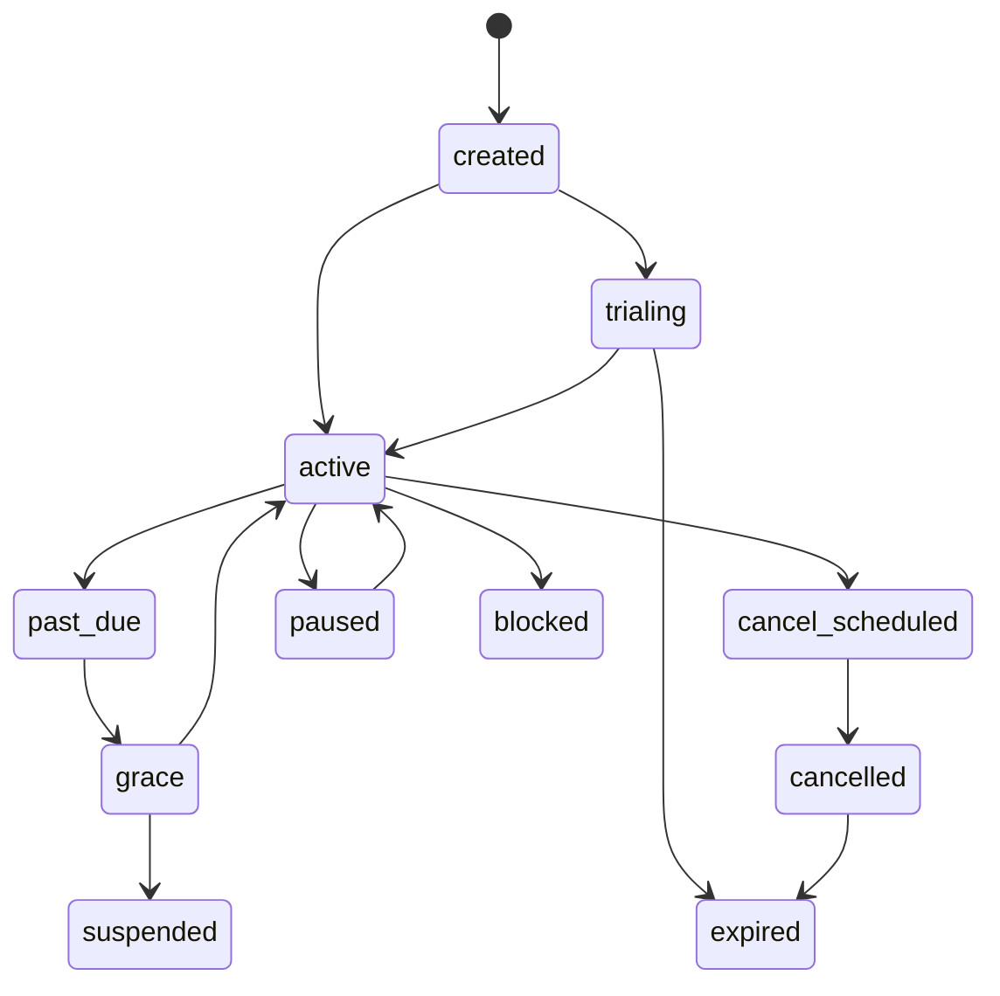

# API Quiz Bank — Billing Model

**Документ:** `docs/11_billing_model.md`  
**Назва проєкту:** API Quiz Bank  
**Внутрішня історична назва:** QuizBank / German QuizBank Platform  
**Версія:** 1.0.0  
**Статус:** foundational billing, entitlement and monetization control model; subordinate to `CONSTITUTION.md`; aligned with `00_vision.md`–`10_operations.md`  
**Дата:** 2026-04-30  
**Мова:** українська з канонічними технічними термінами англійською  
**Власник:** project owner / authorized product maintainer  
**Керівні документи:** `CONSTITUTION.md`, `docs/00_vision.md`, `docs/01_product_charter.md`, `docs/02_requirements_srs.md`, `docs/03_use_cases.md`, `docs/04_domain_model.md`, `docs/05_architecture.md`, `docs/06_data_standard.md`, `docs/07_api_standard.md`, `docs/08_security_threat_model.md`, `docs/09_quality_assurance.md`, `docs/10_operations.md`  
**Наступні документи:** `12_analytics_model.md`, `13_stanford_presentation_outline.md`, `14_roadmap.md`, `15_repository_governance.md`, `16_source_onboarding_playbook.md`, `17_admin_workflow.md`, `18_telegram_delivery_playbook.md`, `19_privacy_compliance.md`

---

## 0. Executive Summary

`11_billing_model.md` визначає, як **API Quiz Bank** перетворює governed German quiz content на monetizable product без руйнування довіри, source governance, API-first архітектури, security або operational discipline.

Головна теза документа:

```text
Payment is a signal.
Entitlement is the internal access truth.
Quota is the enforceable limit.
Usage is the audit evidence.
API decision is the product boundary.
```

API Quiz Bank не повинен продавати “папку з CSV”. Він повинен монетизувати **controlled access** до перевіреного, нормалізованого, status-gated, API-delivered quiz content.

Правильний monetization flow:

```text
customer / organization
  → plan / contract / subscription
  → internal entitlements
  → quota policies
  → consumer rules
  → API authorization decision
  → selection engine
  → governed quiz delivery
  → delivery + usage record
  → analytics / invoice support / dispute evidence
```

Неправильний flow:

```text
paid=true
  → full access
  → no quotas
  → no usage records
  → no audit trail
  → billing chaos
```

Поточний operational baseline проєкту:

```text
115 active bank files
30,974 active rows/items
CEFR levels: A1, A2, B1, B2, C1, C2
18 canonical themes
all active items currently in draft operational status
local constitution check: violations=0 for 30,974 rows
```

Цей baseline є стартовим asset, але не автоматично sellable production inventory. Комерційний доступ може видавати лише ті quiz items, які пройшли production workflow і мають allowed delivery status: `approved` або `published`.

Billing model має підтримувати як перший ручний/pilot запуск, так і майбутню автоматизацію:

```text
Manual MVP
  → internal plan + entitlement + quota + usage + audit

Provider-assisted Pilot
  → payment provider webhooks update internal entitlements

Public Beta
  → self-service checkout / invoice flow / portal / quotas / analytics

Production
  → provider-neutral billing core, tax/legal review, support, incident runbooks, reporting
```

Ключове правило:

```text
API Quiz Bank may accept payment only for access that the platform can enforce, measure, revoke, audit and explain.
```

---

## 1. Role of This Document

### 1.1. Мета документа

`11_billing_model.md` задає повну billing and entitlement model для API Quiz Bank.

Документ відповідає на питання:

```text
Що саме ми монетизуємо?
Хто є customer, consumer, user, organization?
Що таке plan, subscription, entitlement, quota, usage?
Чому payment provider не є source of truth для доступу?
Як Free / Student / Teacher / Channel / School / API Pro пакети відрізняються?
Як система вирішує, чи можна видати quiz item?
Як працюють quota windows, renewals, cancellations, trials, grace periods?
Як обробляються webhooks, refunds, disputes and manual overrides?
Які дані потрібні для billing analytics and support?
Які P0 rules блокують paid launch?
Як показати billing model у Stanford-style demo?
```

### 1.2. Місце в документаційній ієрархії

```text
CONSTITUTION.md
  ↓
docs/00_vision.md
  ↓
docs/01_product_charter.md
  ↓
docs/02_requirements_srs.md
  ↓
docs/03_use_cases.md
  ↓
docs/04_domain_model.md
  ↓
docs/05_architecture.md
  ↓
docs/06_data_standard.md
  ↓
docs/07_api_standard.md
  ↓
docs/08_security_threat_model.md
  ↓
docs/09_quality_assurance.md
  ↓
docs/10_operations.md
  ↓
docs/11_billing_model.md
  ↓
implementation / tests / billing-worker / admin / provider integration / analytics
```

Якщо цей документ суперечить Конституції, пріоритет має `CONSTITUTION.md`. Якщо implementation суперечить цьому Billing Model, implementation має бути виправлена або Billing Model має бути оновлений через change control.

### 1.3. Що цей документ робить

Цей документ визначає:

```text
billing thesis
monetization boundaries
customer/consumer distinction
plan model
subscription/contract model
entitlement model
quota model
usage model
billing events
provider-neutral integration
webhook handling
manual override rules
invoice/refund/dispute posture
security and privacy controls
billing API/admin requirements
QA and launch gates
risk register
Stanford-style demo evidence
```

### 1.4. Що цей документ не робить

Цей документ НЕ є:

```text
юридичною консультацією;
податковою консультацією;
остаточним price list;
остаточним Stripe/LiqPay/WayForPay integration guide;
фінальним Terms of Service;
фінальним Refund Policy;
фінальним Privacy Policy;
фінальною SQL migration;
заміною API стандарту;
заміною security threat model;
дозволом продавати draft content.
```

Public paid launch потребує окремого legal/tax/privacy review залежно від юрисдикції, payment provider, customer geography and business model.

---

## 2. Stanford-Style Billing Discipline

У межах API Quiz Bank “Stanford-style billing” означає не бренд і не формальне схвалення Stanford. Це означає інженерну зрілість monetization layer:

```text
business goal
  → product packaging
  → billing requirements
  → entitlement model
  → API enforcement
  → usage evidence
  → test coverage
  → operational runbooks
  → demo proof
```

### 2.1. Billing quality attributes

Billing model має бути:

| Attribute | Meaning |
|---|---|
| Traceable | Кожне access decision можна пояснити через entitlement, quota, consumer and plan. |
| Testable | Quota, webhook, override, cancellation and denial cases мають automated/manual tests. |
| Provider-neutral | Internal access rules не залежать від одного payment provider. |
| Revocable | Доступ можна призупинити, downgrade, revoke або expire. |
| Auditable | Billing-relevant actions мають audit trail. |
| Secure | Payment webhooks, admin overrides, API keys and consumer data захищені. |
| Measurable | Usage and quota events підтримують analytics and dispute resolution. |
| Honest | Demo and sales claims не перевищують implemented capabilities. |

### 2.2. Billing verification rule

Будь-яке billing твердження має бути перевірюваним.

Bad requirement:

```text
Paid users get access.
```

Good requirement:

```text
A consumer with active entitlement `quiz.delivery` scoped to level A1-A2 and quota 20/day may receive at most 20 approved/published quiz deliveries per quota window through the API; the 21st delivery request returns a quota-exceeded Problem Details response and records a denied usage event.
```

### 2.3. Billing is not separate from product trust

Billing controls не можуть бути окремими від data/API/security/operations. Якщо billing не enforce-иться на API boundary, то monetization exists only as a spreadsheet.

---

## 3. Core Billing Thesis

### 3.1. Product monetization statement

```text
API Quiz Bank monetizes reliable, traceable, CEFR-aware, API-delivered access to German quiz content.
```

Монетизація базується не на “володінні файлами”, а на керованому доступі до value layer:

```text
content governance
canonical schema
status-gated publication
selection intelligence
consumer-specific delivery
anti-repeat policy
attempt and usage tracking
analytics
support and operational trust
```

### 3.2. Payment signal vs access truth

Payment provider може сказати:

```text
customer paid
subscription renewed
invoice failed
refund issued
subscription canceled
```

Але API Quiz Bank має сам вирішувати:

```text
which consumer may access which feature,
for which level/theme/scope,
for how long,
under which quota,
with which support tier,
and with which audit trail.
```

### 3.3. Internal entitlement truth

The system of record for access is:

```text
internal entitlement state + quota usage + consumer status + item status + API authorization
```

Не:

```text
raw provider event
payment_status boolean
Telegram chat membership
manual note in spreadsheet
```

### 3.4. Commercial inventory rule

Commercially sellable content must be derived from production-eligible items only.

```text
draft/imported/normalized/needs_review/retired/blocked items
  ≠ sellable delivery inventory
```

Allowed paid delivery inventory:

```text
approved
published
```

---

## 4. Non-Negotiable Billing Rules

```text
BILL-RULE-001  Payment status alone MUST NOT grant access.
BILL-RULE-002  Access MUST be controlled by internal entitlements.
BILL-RULE-003  Quota usage MUST be recorded for protected delivery.
BILL-RULE-004  Manual overrides MUST have actor, reason, scope and expiry.
BILL-RULE-005  Payment webhooks MUST be verified and idempotent.
BILL-RULE-006  Provider events MUST update internal records, not bypass them.
BILL-RULE-007  Billing logic MUST NOT live only inside Telegram bot.
BILL-RULE-008  API delivery MUST enforce entitlement and quota before protected content is served.
BILL-RULE-009  Draft/blocked/retired items MUST NOT become available because a user paid.
BILL-RULE-010  Billing launch MUST NOT happen without support and revocation paths.
BILL-RULE-011  Cardholder data MUST NOT be stored by API Quiz Bank unless a formal PCI scope decision is made.
BILL-RULE-012  Public pricing claims MUST match implemented entitlements.
BILL-RULE-013  Usage analytics MUST be derived from system events, not manual estimates.
BILL-RULE-014  Every paid access decision MUST be explainable after the fact.
BILL-RULE-015  Billing failures MUST fail closed for premium access unless an explicit grace policy applies.
```

---

## 5. Billing Scope

### 5.1. In scope

Billing model covers:

```text
customers
organizations
consumers
plans
plan versions
subscriptions
manual contracts
trial access
entitlements
quotas
usage events
quota windows
billing events
provider mappings
webhook processing
manual overrides
refund/dispute posture
checkout/customer portal posture
admin billing workflow
billing analytics
billing support evidence
security controls
launch gates
```

### 5.2. Out of scope for MVP

MVP does not require:

```text
all payment providers integrated;
complex revenue recognition;
full dunning automation;
advanced sales CRM;
marketplace payouts;
multi-currency tax automation in all jurisdictions;
enterprise procurement workflow;
formal SOC 2;
real-time fraud engine;
usage-based overage billing with money capture;
public self-service upgrade/downgrade UI;
full school contract automation.
```

### 5.3. MVP billing scope

Billing MVP may be manual/provider-light, але він обовʼязково має:

```text
internal customer/account model
consumer mapping
plan definition
entitlement records
quota policy
usage events
quota enforcement in API/selection path
manual override with audit
quota-exceeded error path
billing evidence for demo
```

### 5.4. Public beta billing scope

Public beta should add:

```text
payment provider integration
webhook signature verification
idempotent event processing
subscription lifecycle mapping
checkout or invoice initiation
customer support flow
refund/cancellation handling
billing analytics
admin billing dashboard
```

### 5.5. Production billing scope

Production requires:

```text
clear pricing and terms
legal/tax review
privacy review
support playbooks
billing incident response
provider outage plan
backup/restore coverage for billing records
billing reconciliation report
billing QA suite
changelog for plan/entitlement changes
```

---

## 6. Actors and Stakeholders

| Actor | Role in billing |
|---|---|
| Customer | Person or organization that pays or receives an invoice. |
| User | Human using quizzes; may or may not be the payer. |
| Consumer | Technical/product delivery context: API client, Telegram channel, web app, school account, teacher tool. |
| Organization | School/company/team owning users and consumers. |
| Billing Admin | Manages plans, entitlements, overrides, refunds, unresolved events. |
| Product Owner | Approves pricing, packaging, launch gates, monetization policy. |
| Finance/Legal Reviewer | Reviews tax, invoicing, terms, refund, jurisdictional obligations. |
| API Service | Enforces entitlement and quota decisions. |
| Selection Engine | Receives eligibility constraints and avoids premium bypass. |
| Billing Worker | Processes provider events and internal billing jobs. |
| Payment Provider | External payment/subscription/invoice signal source. |
| Operations Owner | Monitors billing jobs, webhooks, incidents and restore drills. |
| Security Owner | Protects webhooks, secrets, admin access and billing data. |
| Demo Owner | Shows monetization evidence without overclaiming production status. |

---

## 7. Core Billing Vocabulary

| Term | Definition |
|---|---|
| `customer` | Payer or billing account. May be individual or organization. |
| `organization` | School, company, course provider or team that may own multiple users/consumers. |
| `consumer` | API/Telegram/web/school context that receives quiz content. |
| `plan` | Product package definition such as Free, Student, Teacher, Channel, School, API Pro. |
| `plan_version` | Versioned plan definition to preserve historical pricing/features. |
| `subscription` | Time-bound recurring access relationship between customer and plan/contract. |
| `contract` | Manual or institutional agreement not necessarily managed by provider subscription. |
| `entitlement` | Internal access right that grants feature/scope/limit/validity. |
| `quota_policy` | Rule describing maximum usage per feature/scope/window. |
| `quota_window` | Period for quota reset: day, month, billing period, rolling window, custom. |
| `usage_event` | Immutable record that a billable/protected action happened or was denied. |
| `billing_event` | External or internal billing signal such as webhook, invoice, payment, refund, cancellation. |
| `manual_override` | Admin-created entitlement or quota change with reason and expiry. |
| `provider_mapping` | Link between internal customer/subscription and external provider identifiers. |
| `grace_period` | Temporary access state after failed payment or renewal delay. |
| `access_decision` | Allow/deny result produced by API entitlement/quota check. |

---

## 8. Customer, User, Consumer and Organization Model

### 8.1. Why distinction matters

Billing breaks when the system treats “payer”, “learner”, “API key” and “Telegram channel” as the same thing.

API Quiz Bank must distinguish:

```text
Customer   = who pays or receives invoice.
User       = human account using or answering quizzes.
Consumer   = delivery context that receives quiz content.
Organization = umbrella entity for schools, teams, institutions.
```

### 8.2. Example relationships

```text
Individual Student:
  customer = Anna
  user = Anna
  consumer = personal web/app session

Teacher:
  customer = Herr Müller
  user = Herr Müller
  consumer = teacher dashboard + classroom quiz packs

Telegram Channel:
  customer = channel owner
  user = channel owner/admin
  consumer = Telegram channel consumer

School:
  customer = school organization
  users = teachers + learners
  consumers = school dashboard + class groups + API integration

API Partner:
  customer = partner company
  users = developer/admin users
  consumer = external_api_client with API key(s)
```

### 8.3. Ownership rules

```text
A customer MAY own multiple consumers.
An organization MAY own multiple customers, users and consumers depending on model.
A subscription MAY grant entitlements to one or more consumers.
A user MUST NOT access another consumerʼs billing or usage data without authorization.
A consumer MUST NOT inherit all customer access automatically; entitlements must scope access explicitly.
```

### 8.4. Billing account states

Allowed customer/account states:

```text
prospect
trial
active
past_due
grace
suspended
cancelled
blocked
archived
```

State meaning:

| State | Access meaning |
|---|---|
| `prospect` | No paid access; may access public/demo features. |
| `trial` | Trial entitlements active until expiry. |
| `active` | Entitlements active according to plan/contract. |
| `past_due` | Payment issue; access depends on grace policy. |
| `grace` | Temporary limited access, explicitly time-bound. |
| `suspended` | Premium access disabled. |
| `cancelled` | Subscription ended; entitlements expire/revoke. |
| `blocked` | Access blocked due to abuse, fraud, legal or security reason. |
| `archived` | Historical account, no active access. |

---

## 9. Product Packaging Strategy

### 9.1. Packaging principle

API Quiz Bank should package **access to governed capabilities**, not raw files.

Possible packaging dimensions:

```text
CEFR level access
Theme access
Objective/pattern access
Daily/monthly quiz delivery quota
API request quota
Telegram scheduled delivery quota
Teacher quiz pack generation
School group count
Student seat count
Analytics access level
Export access
Webhook access
Support tier
SLA-like response expectation
```

### 9.2. Avoid bad packaging

Avoid making the only offer:

```text
Pay once and get all content forever.
```

Why this is weak:

```text
reduces future tiering;
complicates new content packs;
undervalues API/analytics/operations;
creates support obligations without recurring revenue;
weakens B2B negotiation;
makes entitlements harder to express.
```

### 9.3. Good packaging logic

Better packaging:

```text
Learners buy practice access.
Teachers buy preparation and group workflows.
Telegram owners buy scheduled delivery.
Schools buy managed multi-user/group access.
Developers buy API quota and integration rights.
Partners buy content infrastructure.
```

### 9.4. Commercial inventory rule

Any plan claiming access to levels/themes must be backed by coverage report:

```text
Plan says: A1-A2 grammar practice.
System must show: approved/published A1-A2 items in relevant themes/objectives/patterns.
```

A plan must not promise delivery in a coverage cell where no production-eligible content exists unless clearly marked as roadmap/manual/custom.

---

## 10. Plan Catalog

Plans below are **model definitions**, not final public pricing.

### 10.1. Free / Demo Plan

| Field | Value |
|---|---|
| Plan ID | `plan_free_demo` |
| Target | Learners, reviewers, demo users |
| Goal | Show product value with limited access |
| Typical access | Limited daily quizzes, limited levels/themes, no premium analytics |
| Billing mode | No payment required |
| Risk | Abuse if too generous; must have rate limits |

Possible entitlements:

```yaml
entitlements:
  - feature: quiz.delivery
    scope: personal_consumer
    levels: [A1, A2]
    themes: [sample]
    quota: 5/day
  - feature: analytics.personal_basic
    enabled: true
  - feature: api.external_access
    enabled: false
  - feature: telegram.scheduled_delivery
    enabled: false
```

### 10.2. Student Plan

| Field | Value |
|---|---|
| Plan ID | `plan_student` |
| Target | Individual German learners |
| Goal | Daily personalized practice by level/topic |
| Typical access | More levels/themes, attempts, progress, explanations |
| Billing mode | Monthly/annual subscription or manual pilot |

Possible entitlements:

```yaml
entitlements:
  - feature: quiz.delivery
    levels: [A1, A2, B1, B2]
    quota: 50/day
  - feature: attempts.record
    enabled: true
  - feature: explanations.view
    enabled: true
  - feature: analytics.personal_progress
    enabled: true
```

### 10.3. Teacher Plan

| Field | Value |
|---|---|
| Plan ID | `plan_teacher` |
| Target | Educators and tutors |
| Goal | Create/assign quiz packs and track learning gaps |
| Typical access | Quiz packs, group/class tools, reporting |
| Billing mode | Subscription or invoice |

Possible entitlements:

```yaml
entitlements:
  - feature: quiz_pack.generate
    levels: [A1, A2, B1, B2, C1]
    quota: 200/items_per_month
  - feature: group.manage
    limit: 5/groups
  - feature: learner.seats
    limit: 100/seats
  - feature: analytics.classroom
    enabled: true
```

### 10.4. Channel Plan

| Field | Value |
|---|---|
| Plan ID | `plan_channel` |
| Target | Telegram channel owners |
| Goal | Scheduled high-quality quiz delivery |
| Typical access | Scheduled quiz posts, no-repeat policy, channel reporting |
| Billing mode | Subscription or manual invoice |

Possible entitlements:

```yaml
entitlements:
  - feature: telegram.scheduled_delivery
    enabled: true
  - feature: quiz.delivery
    channel_quota: 3/posts_per_day
  - feature: repeat_policy.customize
    enabled: true
  - feature: analytics.channel_delivery
    enabled: true
```

### 10.5. School Plan

| Field | Value |
|---|---|
| Plan ID | `plan_school` |
| Target | Language schools, courses, institutions |
| Goal | Managed multi-user access and reporting |
| Typical access | Multiple teachers/groups, dashboards, seat quotas |
| Billing mode | Annual contract, invoice, subscription |

Possible entitlements:

```yaml
entitlements:
  - feature: organization.manage
    enabled: true
  - feature: learner.seats
    limit: 500/seats
  - feature: teacher.seats
    limit: 20/seats
  - feature: group.manage
    limit: 50/groups
  - feature: analytics.organization
    enabled: true
  - feature: api.internal_school_access
    enabled: true
```

### 10.6. API Pro Plan

| Field | Value |
|---|---|
| Plan ID | `plan_api_pro` |
| Target | Developers, apps, partners |
| Goal | External integration with German quiz content |
| Typical access | API quota, webhooks, docs, integration support |
| Billing mode | Subscription, usage-based, or custom contract |

Possible entitlements:

```yaml
entitlements:
  - feature: api.next_quiz
    quota: 10000/month
  - feature: api.attempts
    quota: 50000/month
  - feature: api.webhooks
    enabled: true
  - feature: api.support
    tier: standard
  - feature: analytics.api_usage
    enabled: true
```

### 10.7. Enterprise / Partner Plan

| Field | Value |
|---|---|
| Plan ID | `plan_enterprise_partner` |
| Target | Larger schools, apps, B2B partners |
| Goal | Custom licensing and integration |
| Typical access | Custom quotas, SLAs, content packs, dedicated support |
| Billing mode | Manual contract |

Possible entitlements:

```yaml
entitlements:
  - feature: api.next_quiz
    quota: custom
  - feature: content_pack.access
    packs: custom
  - feature: analytics.export
    enabled: true
  - feature: support.tier
    value: premium
  - feature: data_processing_terms
    status: required_before_launch
```

---

## 11. Plan Versioning

### 11.1. Why plan versioning is required

Plans will change. Pricing, quotas, features and limits will evolve. Historical customers must remain explainable.

Bad:

```text
plan_student overwritten in-place; old customers silently changed.
```

Good:

```text
plan_student
  plan_version = 2026-05-01
  quota = 50/day

plan_student
  plan_version = 2026-09-01
  quota = 75/day
```

### 11.2. Plan version fields

Required:

```text
plan_id
plan_version_id
name
status
currency
billing_interval
price_display
internal_price_reference
features_json
quota_policy_ids
created_at
effective_from
effective_until
created_by
change_reason
```

### 11.3. Plan statuses

```text
draft
active
legacy
retired
blocked
```

Rules:

```text
Only active plan versions may be sold to new customers.
Legacy plan versions may remain active for existing customers.
Retired plan versions cannot be sold or renewed unless explicitly grandfathered.
Blocked plan versions are disabled due to error, legal/security risk or product decision.
```

---

## 12. Entitlement Model

### 12.1. Entitlement principle

Entitlements answer the question:

```text
What exactly is this customer/consumer allowed to do?
```

Not:

```text
Did this customer pay something?
```

### 12.2. Entitlement fields

Required fields:

| Field | Required | Meaning |
|---|---:|---|
| `entitlement_id` | yes | Stable entitlement ID. |
| `customer_id` | conditional | Payer/account scope. |
| `organization_id` | conditional | Organization scope. |
| `consumer_id` | conditional | Consumer-specific scope. |
| `user_id` | conditional | User-specific scope. |
| `feature_key` | yes | Feature being granted. |
| `scope_type` | yes | `customer`, `organization`, `consumer`, `user`, `api_key`, `channel`. |
| `scope_id` | yes | Entity receiving access. |
| `value_type` | yes | `boolean`, `number`, `list`, `json`, `tier`, `quota_reference`. |
| `value` | yes | Grant value. |
| `valid_from` | yes | Start timestamp. |
| `valid_until` | conditional | Expiry timestamp or null for contract-managed. |
| `status` | yes | Active/pending/revoked/expired/etc. |
| `source_type` | yes | `plan`, `subscription`, `contract`, `manual_override`, `promo`, `trial`, `admin_fix`. |
| `source_id` | conditional | Related plan/subscription/contract/event ID. |
| `priority` | recommended | Conflict resolution order. |
| `created_by` | yes | System/provider/admin actor. |
| `created_at` | yes | Timestamp. |
| `revoked_at` | conditional | Revocation timestamp. |
| `revocation_reason` | conditional | Reason code. |

### 12.3. Entitlement statuses

```text
pending
active
scheduled
paused
grace
expired
revoked
superseded
blocked
```

Status meaning:

| Status | Access effect |
|---|---|
| `pending` | Not usable yet. |
| `active` | Usable if within validity and quota. |
| `scheduled` | Will become active later. |
| `paused` | Temporarily not usable. |
| `grace` | Usable under grace policy. |
| `expired` | Not usable after validity. |
| `revoked` | Not usable due to cancellation/refund/admin. |
| `superseded` | Replaced by newer entitlement. |
| `blocked` | Not usable due to risk/security/legal issue. |

### 12.4. Entitlement dimensions

Entitlements may control:

```text
feature access
CEFR levels
themes
objectives/patterns
content packs
quiz delivery quota
API request quota
Telegram scheduling
teacher dashboard
group count
seat count
analytics access
export access
webhook access
support tier
admin permissions for billing operators
```

### 12.5. Entitlement examples

```json
{
  "entitlement_id": "ent_01H_example",
  "scope_type": "consumer",
  "scope_id": "cons_telegram_channel_001",
  "feature_key": "telegram.scheduled_delivery",
  "value_type": "boolean",
  "value": true,
  "valid_from": "2026-05-01T00:00:00Z",
  "valid_until": "2026-06-01T00:00:00Z",
  "status": "active",
  "source_type": "subscription",
  "source_id": "sub_internal_001"
}
```

```json
{
  "entitlement_id": "ent_01H_levels",
  "scope_type": "consumer",
  "scope_id": "cons_api_partner_001",
  "feature_key": "content.level_access",
  "value_type": "list",
  "value": ["A1", "A2", "B1", "B2"],
  "status": "active"
}
```

```json
{
  "entitlement_id": "ent_01H_quota",
  "scope_type": "consumer",
  "scope_id": "cons_api_partner_001",
  "feature_key": "quota.api.next_quiz",
  "value_type": "quota_reference",
  "value": "qp_api_pro_10000_monthly",
  "status": "active"
}
```

---

## 13. Entitlement Catalog

### 13.1. Feature key naming

Feature keys should be stable, lowercase and dot-separated:

```text
area.capability.qualifier
```

Examples:

```text
quiz.delivery
api.next_quiz
api.submit_attempt
telegram.scheduled_delivery
teacher.quiz_pack_generate
school.group_manage
analytics.basic
analytics.consumer
analytics.organization
content.level_access
content.theme_access
content.pack_access
export.quiz_pack
support.tier
```

### 13.2. Core entitlement keys

| Feature key | Meaning | MVP/Pilot |
|---|---|---|
| `quiz.delivery` | Can receive quiz deliveries. | MVP |
| `api.next_quiz` | Can call delivery-producing next quiz endpoint. | MVP |
| `api.submit_attempt` | Can submit attempts. | Pilot |
| `content.level_access` | Allowed CEFR levels. | MVP |
| `content.theme_access` | Allowed themes/content areas. | MVP |
| `content.pack_access` | Access to named content packs. | Pilot |
| `telegram.scheduled_delivery` | Can schedule Telegram quiz posts. | Pilot |
| `teacher.quiz_pack_generate` | Can create teacher quiz packs. | Pilot |
| `school.group_manage` | Can manage school groups. | Beta |
| `analytics.basic` | Basic personal/consumer analytics. | Pilot |
| `analytics.consumer` | Consumer-level delivery analytics. | Pilot |
| `analytics.organization` | Organization reports. | Beta |
| `api.webhooks` | Outbound webhook integrations. | Beta |
| `export.quiz_pack` | Export generated quiz packs. | Beta |
| `support.tier` | Support level. | Beta/Production |

### 13.3. Content-level entitlement policy

Entitlement must never override item status.

```text
User has A1 access + item is draft = no delivery.
User has all-level access + item is blocked = no delivery.
User has premium plan + source is candidate = no delivery.
```

Access formula:

```text
item eligible only if:
  item.status in [approved, published]
  AND item level/theme fits consumer rules
  AND entitlement allows scope
  AND quota permits delivery
  AND security authorization permits consumer access
```

---

## 14. Quota Model

### 14.1. Quota principle

Quota is an enforceable limit, not a marketing description.

Quota must answer:

```text
What action?
For whom?
How many?
During which window?
What counts?
What happens at limit?
```

### 14.2. Quota types

| Quota type | Example |
|---|---|
| Delivery quota | 50 quizzes/day for Student. |
| API request quota | 10,000 next-quiz requests/month for API Pro. |
| Telegram post quota | 3 scheduled posts/day/channel. |
| Attempt quota | 50,000 attempt submissions/month. |
| Group quota | 5 groups for Teacher. |
| Seat quota | 500 learners for School. |
| Export quota | 20 quiz pack exports/month. |
| Webhook quota | 100,000 outbound events/month. |

### 14.3. Quota policy fields

```text
quota_policy_id
feature_key
scope_type
unit
limit_value
window_type
window_size
reset_rule
overage_policy
hard_limit
soft_warning_threshold
status
created_at
updated_at
```

Example:

```json
{
  "quota_policy_id": "qp_student_quiz_50_daily",
  "feature_key": "quiz.delivery",
  "unit": "delivery",
  "limit_value": 50,
  "window_type": "calendar_day",
  "reset_rule": "consumer_timezone_or_UTC_policy",
  "overage_policy": "deny",
  "hard_limit": true,
  "soft_warning_threshold": 0.8
}
```

### 14.4. Quota window types

```text
calendar_day
calendar_month
billing_period
rolling_24h
rolling_30d
custom_contract_period
unlimited_with_fair_use
```

MVP recommendation:

```text
Use UTC calendar windows for API/server enforcement.
Document display timezone separately.
Avoid ambiguous local-time quota logic until user/consumer timezone model is stable.
```

### 14.5. What counts as usage

Usage event should count only when policy says it counts.

Examples:

| Action | Count? | Notes |
|---|---:|---|
| Successful next-quiz delivery | yes | Core delivery usage. |
| Reserved but not delivered | maybe | Depends on reservation timeout policy. |
| No eligible item error | no | Usually should not consume quota. |
| Unauthorized request | no | Count abuse metrics, not paid usage. |
| Quota exceeded request | no | Count denied event, not usage. |
| Telegram send failure after selection | maybe | Policy-specific; may count delivery attempt separately. |
| Attempt submission | yes for attempt quota | If attempt quota exists. |
| Admin preview | no | Unless preview plan explicitly bills previews. |
| Demo dry-run | no | Must be marked demo/test. |

### 14.6. Quota denial

When quota is exceeded, API must return machine-readable error.

Example Problem Details:

```json
{
  "type": "https://api.quizbank.example/problems/quota-exceeded",
  "title": "Quota exceeded",
  "status": 429,
  "detail": "This consumer has reached the quiz.delivery quota for the current window.",
  "reason_code": "BILL_QUOTA_EXCEEDED",
  "feature_key": "quiz.delivery",
  "quota_policy_id": "qp_student_quiz_50_daily",
  "window_reset_at": "2026-05-01T00:00:00Z"
}
```

### 14.7. Quota integrity rules

```text
Quota increments MUST be atomic enough to avoid concurrent overdelivery.
Usage events MUST be idempotent where retries are possible.
Quota resets MUST be deterministic.
Quota usage MUST be auditable.
Denied delivery MUST be logged as denied event, not successful usage.
Manual quota adjustments MUST be audited.
```

---

## 15. Usage Event Model

### 15.1. Usage event principle

Billing analytics and dispute support must come from system records, not reconstructed guesses.

### 15.2. Usage event fields

Required fields:

```text
usage_event_id
idempotency_key
customer_id
organization_id
consumer_id
user_id
feature_key
action
unit
quantity
status
quota_policy_id
quota_window_id
delivery_id
attempt_id
request_id
occurred_at
recorded_at
source_service
reason_code
metadata_json
```

### 15.3. Usage statuses

```text
counted
denied
reserved
released
adjusted
voided
replayed
ignored_test
```

### 15.4. Usage event actions

```text
quiz_delivery_succeeded
quiz_delivery_reserved
quiz_delivery_failed
quiz_delivery_denied_quota
quiz_delivery_denied_entitlement
api_request_counted
attempt_submission_counted
telegram_post_succeeded
telegram_post_failed
quiz_pack_generated
export_generated
manual_adjustment
```

### 15.5. Usage immutability

Usage events should be append-only.

If correction is required:

```text
Do not edit historical usage event silently.
Create adjustment event with reason.
```

### 15.6. Idempotency

Usage event idempotency key should include:

```text
consumer_id
action
request_id or delivery_id
feature_key
quota_window_id
```

This prevents duplicate quota consumption on retries, webhook replays or worker failures.

---

## 16. Access Decision Algorithm

### 16.1. Access decision principle

Billing/access check must happen before protected delivery.

### 16.2. Decision inputs

```text
request identity
consumer_id
customer/organization/user context
consumer status
requested feature
requested level/theme/objective/pattern filters
active entitlements
quota policies
quota usage
API auth and object-level authorization
item status constraints
rate limits/security controls
```

### 16.3. Decision flow

```text
1. Authenticate caller.
2. Authorize caller for consumer/account scope.
3. Load consumer status and rules.
4. Confirm requested feature is entitlement-gated or public.
5. Evaluate active entitlements for feature and scope.
6. Intersect requested level/theme filters with entitlement and consumer rules.
7. Check quota availability for the feature/action.
8. Reserve or increment quota according to delivery policy.
9. Pass constraints to selection engine.
10. Selection engine returns approved/published eligible item.
11. Create delivery record.
12. Record usage event.
13. Return public-safe API response.
```

### 16.4. Pseudocode

```python
def authorize_quiz_delivery(request):
    actor = authenticate(request)
    consumer = load_consumer(request.consumer_id)

    assert_object_authorized(actor, consumer)

    if consumer.status not in ["active", "trial", "grace"]:
        return deny("CONSUMER_INACTIVE")

    entitlements = load_active_entitlements(scope=consumer)

    if not entitlements.allow("quiz.delivery"):
        return deny("BILL_ENTITLEMENT_MISSING")

    allowed_levels = intersect(
        request.levels,
        consumer.rules.allowed_levels,
        entitlements.value("content.level_access")
    )

    allowed_themes = intersect(
        request.themes,
        consumer.rules.allowed_themes,
        entitlements.value("content.theme_access")
    )

    quota = quota_service.check(
        consumer_id=consumer.id,
        feature_key="quiz.delivery",
        action="quiz_delivery_succeeded"
    )

    if not quota.allowed:
        record_denial(reason="BILL_QUOTA_EXCEEDED")
        return deny("BILL_QUOTA_EXCEEDED", reset_at=quota.reset_at)

    selection = selection_engine.next_item(
        consumer=consumer,
        levels=allowed_levels,
        themes=allowed_themes,
        status_allowlist=["approved", "published"]
    )

    if not selection.item:
        return deny("NO_ELIGIBLE_ITEM")

    delivery = delivery_service.create(selection)
    quota_service.count(delivery)
    usage_service.record(delivery)

    return allow(delivery)
```

### 16.5. Decision output

```text
access_decision_id
allowed: true/false
reason_code
consumer_id
feature_key
entitlement_ids_used
quota_policy_id
quota_remaining
quota_reset_at
request_constraints
selection_constraints
created_at
```

---

## 17. Subscription and Contract Lifecycle

### 17.1. Subscription lifecycle states

```text
created
trialing
active
past_due
grace
paused
cancel_scheduled
cancelled
expired
failed
blocked
```

### 17.2. Lifecycle flow



### 17.3. Contract lifecycle states

Manual/B2B contracts may use:

```text
draft
sent
signed
active
renewal_pending
expired
terminated
blocked
```

### 17.4. Entitlement timing rules

```text
Subscription active/trialing/grace MAY grant entitlements.
Subscription past_due MAY grant or restrict access depending on grace policy.
Subscription cancelled MUST expire or revoke entitlements according to cancellation terms.
Refund or chargeback MAY revoke entitlement or create negative account status.
Manual contract active MAY grant entitlements without provider subscription.
```

### 17.5. Upgrade/downgrade rules

Upgrade:

```text
New entitlements may become active immediately.
Old lower-limit entitlements become superseded.
Quota may increase immediately or at next billing period depending on policy.
```

Downgrade:

```text
New lower entitlements may start immediately or next period.
Existing over-quota state must be handled explicitly.
Do not delete usage history.
```

### 17.6. Cancellation rules

Possible policies:

```text
cancel_immediately
cancel_at_period_end
cancel_after_contract_end
manual_review_required
```

The product must document which policy applies to each plan.

---

## 18. Manual Billing MVP

### 18.1. Why manual MVP is acceptable

Manual/provider-light MVP is acceptable if it proves the core billing thesis:

```text
internal entitlements exist;
API enforces them;
quota is tracked;
manual grants are audited;
access can be revoked;
usage evidence exists.
```

It is better to have a correct manual entitlement model than a rushed payment integration with broken access control.

### 18.2. Manual entitlement grant flow

```text
1. Admin selects customer/consumer.
2. Admin selects plan or entitlement template.
3. Admin sets validity period.
4. Admin sets quota policy.
5. Admin records reason.
6. System validates required fields.
7. System creates entitlement records.
8. System logs audit event.
9. API begins enforcing entitlement.
10. Usage events begin accumulating.
```

### 18.3. Manual override required fields

```text
override_id
actor_id
customer_id / consumer_id
feature_key
value
valid_from
valid_until
reason_code
reason_text
approved_by if required
created_at
revoked_at
```

### 18.4. Manual override guardrails

```text
Manual override MUST expire.
Manual override MUST be scoped.
Manual override MUST be auditable.
Manual override MUST NOT grant all access by default.
Manual override SHOULD require approval for high-value/long-duration access.
Manual override SHOULD be listed in admin billing report.
```

### 18.5. Manual pilot examples

```text
Stanford demo consumer:
  feature=api.next_quiz
  quota=100/day
  valid_until=demo_end_date
  source=manual_override

Pilot Telegram channel:
  feature=telegram.scheduled_delivery
  quota=1/day
  valid_until=pilot_end_date
  source=manual_contract

School trial:
  feature=school.group_manage
  groups=3
  seats=50
  valid_until=trial_end_date
```

---

## 19. Payment Provider Neutrality

### 19.1. Core principle

Payment provider is optional infrastructure. It must not define core product access logic.

Internal model:

```text
customer
subscription/contract
plan_version
entitlement
quota_policy
usage_event
billing_event
```

Provider model:

```text
external_customer_id
external_subscription_id
external_invoice_id
external_payment_id
external_event_id
```

### 19.2. Provider-neutral fields

```text
provider_code              -- stripe, liqpay, wayforpay, manual, school_invoice, other
external_customer_id
external_subscription_id
external_invoice_id
external_payment_intent_id
external_event_id
external_status
external_payload_hash
received_at
processed_at
processing_status
```

### 19.3. Provider candidates

Possible providers/integration modes:

```text
manual
school_invoice
Stripe
LiqPay
WayForPay
bank transfer
partner contract
```

The first provider is an open implementation decision. The billing model must support switching providers or running multiple providers without changing entitlement semantics.

### 19.4. Provider mapping rule

Provider object must map to internal object before access can change.

```text
provider customer → internal customer
provider subscription → internal subscription/contract
provider product/price → internal plan_version or entitlement template
provider event → internal billing_event
```

If mapping fails:

```text
event stored as unresolved;
no entitlement granted;
admin review required.
```

### 19.5. Provider event storage

Provider payloads should be stored carefully:

```text
store event ID, type, timestamps, normalized fields, payload hash;
store full payload only if privacy/security policy allows;
never log secrets;
redact payment method details;
```

---

## 20. Stripe-Compatible Mapping Example

This section is an example mapping, not a provider lock-in decision.

### 20.1. Stripe concepts to internal model

| Stripe concept | Internal model |
|---|---|
| Customer | `customer` / `provider_customer_mapping` |
| Product | `plan` or product family |
| Price | `plan_version` / price reference |
| Subscription | `subscription` |
| Invoice | `invoice_record` / `billing_event` |
| PaymentIntent | `payment_event` / provider payment reference |
| Entitlement / ProductFeature | `entitlement` mapping source or template |
| Webhook Event | `billing_event` |

### 20.2. Stripe event examples to handle

```text
customer.created
customer.updated
customer.subscription.created
customer.subscription.updated
customer.subscription.deleted
invoice.paid
invoice.payment_failed
entitlements.active_entitlement_summary.updated
checkout.session.completed
payment_intent.succeeded
payment_intent.payment_failed
refund.created
charge.dispute.created
```

Only events required by the selected integration mode need to be implemented first.

### 20.3. Stripe-compatible access rule

Even if Stripe reports an active subscription or active entitlements, API Quiz Bank should still use internal records for access:

```text
Stripe event received
  → verified
  → idempotently stored
  → mapped to customer/subscription
  → internal entitlement updated
  → API uses internal entitlement
```

### 20.4. Provider webhook security rule

Stripe or any provider webhook must be:

```text
signature-verified;
idempotent;
logged;
mapped;
processed through entitlement update logic;
never trusted as direct API access token.
```

---

## 21. Webhook Processing Model

### 21.1. Webhook principle

A webhook is an external signal, not an entitlement by itself.

### 21.2. Webhook lifecycle

```text
received
signature_verified
signature_failed
parsed
mapped
unresolved
processing
processed
ignored_duplicate
failed
manual_review_required
replayed
```

### 21.3. Webhook flow

```text
1. Receive raw webhook request.
2. Verify provider signature using raw body and provider secret.
3. Extract provider event ID and event type.
4. Check idempotency: has this event already been processed?
5. Store normalized billing_event.
6. Map external customer/subscription/product/price to internal records.
7. Determine entitlement changes.
8. Apply changes transactionally.
9. Record audit log.
10. Return provider-appropriate success response.
```

### 21.4. Webhook idempotency rule

Provider events may be retried. Processing must be idempotent.

```text
same provider_code + external_event_id
  → only one entitlement effect
```

### 21.5. Webhook failure cases

| Failure | Required behavior |
|---|---|
| Invalid signature | Reject, log security event, no entitlement change. |
| Duplicate event | Return success or idempotent result, no double effect. |
| Unknown customer | Store unresolved, no access grant. |
| Unknown plan/product | Store unresolved, admin review. |
| Processing error | Mark failed, allow replay. |
| Provider outage | Preserve current entitlements according to grace policy. |
| Event ordering issue | Use timestamps and provider object retrieval if needed. |

### 21.6. Billing event fields

```text
billing_event_id
provider_code
external_event_id
event_type
event_status
customer_id
subscription_id
provider_customer_id
provider_subscription_id
payload_hash
received_at
verified_at
processed_at
idempotency_key
processing_attempts
last_error_code
last_error_message
entitlement_changes_json
audit_log_id
```

---

## 22. Invoice, Refund, Credit and Dispute Model

### 22.1. Invoice posture

Invoice records support:

```text
customer support;
accounting export;
billing reconciliation;
subscription status;
entitlement explanation;
dispute handling.
```

MVP may store only provider invoice references and internal status.

### 22.2. Invoice fields

```text
invoice_id
customer_id
provider_code
external_invoice_id
invoice_number
status
currency
amount_due
amount_paid
amount_refunded
period_start
period_end
issued_at
paid_at
due_at
hosted_invoice_url_reference
pdf_reference
metadata_json
```

### 22.3. Refund policy posture

Refund behavior must be decided by product/legal policy. Billing model supports:

```text
refund_requested
refund_approved
refund_rejected
refund_processed
refund_failed
entitlement_revoked_after_refund
entitlement_kept_after_refund
```

Rules:

```text
Refund MUST NOT delete historical usage.
Refund MAY revoke or shorten entitlement based on policy.
Refund MUST be auditable.
Refund MUST be visible in support/account history.
```

### 22.4. Credits

Credits may be used for:

```text
service incident compensation;
manual billing correction;
sales promotion;
school contract adjustment;
refund alternative.
```

Credit fields:

```text
credit_id
customer_id
amount_or_quota_value
currency_or_unit
reason_code
valid_until
created_by
created_at
applied_to_invoice_id
applied_to_quota_policy_id
```

### 22.5. Disputes / chargebacks

Dispute policy:

```text
record provider dispute event;
preserve invoice and usage evidence;
optionally suspend customer or put account into review;
do not delete usage/delivery history;
resolve with final provider outcome;
apply entitlement action based on decision.
```

---

## 23. Tax, VAT and Legal Compliance Boundary

### 23.1. Compliance principle

Billing architecture must not assume that taxes, invoicing and consumer rights are “just provider settings”. Public paid launch requires legal/tax review.

### 23.2. Required legal/tax decisions before public paid launch

```text
business entity and jurisdiction
customer countries supported
B2C vs B2B sales
VAT/GST/sales tax treatment
digital service classification
invoicing obligations
refund/cancellation policy
terms of service
privacy policy
data processing terms for schools/B2B
consumer protection obligations
record retention obligations
```

### 23.3. EU/Europe note

For EU customers, VAT/OSS considerations may apply depending on seller location, customer type and product classification. The system should store enough billing profile data to support tax determination without over-collecting personal data.

Possible fields:

```text
customer_country
billing_country
vat_id / tax_id where applicable
customer_type: individual / business / school / organization
provider_tax_reference
invoice_tax_amount
invoice_tax_rate
```

### 23.4. Legal review gate

Public paid launch should be blocked until:

```text
pricing page reviewed;
checkout terms reviewed;
refund/cancellation policy reviewed;
invoice/tax setup reviewed;
privacy notice reviewed;
payment provider settings reviewed;
customer support contact path exists.
```

This document does not provide legal advice. It defines data and operational readiness needed for legal/tax validation.

---

## 24. PCI and Payment Data Minimization

### 24.1. Payment data minimization rule

API Quiz Bank should avoid storing cardholder data.

Recommended posture:

```text
Use hosted checkout / provider-managed payment method collection.
Store provider customer/subscription/payment references.
Do not store full card numbers, CVV, raw payment method secrets or bank credentials.
Do not log payment method data.
```

### 24.2. Payment data classes

| Data | Store internally? | Notes |
|---|---:|---|
| Provider customer ID | yes | Needed for mapping. |
| Provider subscription ID | yes | Needed for lifecycle. |
| Provider invoice ID | yes | Needed for support. |
| Last 4 card digits | optional | Only if provider supplies and privacy policy allows. |
| Card brand | optional | Not needed for MVP. |
| Full card number | no | Avoid PCI scope expansion. |
| CVV/CVC | no | Never store. |
| Raw payment token secret | no | Store only safe references if needed. |
| Webhook signing secret | secret store only | Never in repository/logs. |

### 24.3. PCI readiness statement

If API Quiz Bank uses a hosted provider checkout and does not store/process cardholder data directly, PCI scope can be reduced, but PCI responsibilities do not disappear automatically. Production payment launch requires provider-specific PCI/compliance review.

---

## 25. Security Controls for Billing

### 25.1. Billing security objectives

```text
prevent unauthorized premium access;
prevent cross-consumer billing data access;
prevent webhook spoofing;
prevent quota bypass;
protect provider secrets;
audit admin overrides;
prevent accidental public exposure of invoices or personal data;
allow safe revocation.
```

### 25.2. Required controls

```text
admin authentication
role-based admin authorization
object-level authorization
provider webhook signature verification
idempotent webhook processing
hashed/sealed API keys
secrets outside repository
least-privilege provider API keys
structured audit logs
rate limiting
quota enforcement
safe error responses
no raw secret logging
manual override review
billing event monitoring
```

### 25.3. Admin roles

| Role | Allowed billing actions |
|---|---|
| `billing_viewer` | View customers, plans, usage, invoices. |
| `billing_operator` | Create limited manual grants, resolve events. |
| `billing_admin` | Manage plans, subscriptions, overrides, revocations. |
| `security_admin` | View security-relevant billing events and secrets metadata, not secret values. |
| `owner` | Approve pricing/plan changes and high-risk overrides. |

### 25.4. High-risk actions requiring audit

```text
manual entitlement grant
manual entitlement revoke
quota increase
plan price change
plan feature change
customer suspension
refund-triggered access change
provider mapping edit
webhook replay
billing data export
```

### 25.5. Billing audit log fields

```text
audit_log_id
actor_id
actor_role
action
target_type
target_id
before_state
after_state
reason_code
reason_text
request_id
ip_hash or admin session reference
created_at
```

---

## 26. Privacy and Data Retention

### 26.1. Privacy principle

Store only billing data needed for:

```text
access control
payment/subscription mapping
invoicing/support
tax/legal obligations
abuse prevention
usage analytics
billing dispute resolution
```

### 26.2. Personal data categories

Potential billing-related data:

```text
name
email
organization name
billing country
tax ID / VAT ID
provider customer ID
invoice references
subscription status
payment status references
usage records
support notes
admin audit logs
```

### 26.3. Data minimization rules

```text
Do not store full payment method details.
Do not expose billing email to unrelated consumers.
Do not expose organization usage to unauthorized teacher/user.
Do not include payment data in normal analytics exports.
Do not log provider payloads without redaction policy.
```

### 26.4. Retention categories

| Data | Suggested retention posture |
|---|---|
| Billing events | Retain for support/accounting/legal period; define exact policy later. |
| Usage events | Retain while needed for quota, analytics and disputes; aggregate/anonymize later where possible. |
| Webhook payloads | Minimize; retain normalized data and hash; full payload only if necessary. |
| Invoices | Retain according to legal/accounting obligations. |
| Admin audit logs | Retain long enough for security and dispute investigation. |
| Demo/test billing data | Delete or reset regularly. |

### 26.5. Privacy launch gate

Before public paid access:

```text
privacy policy exists;
billing data categories documented;
data retention policy documented;
user support/delete/export path considered;
admin access to billing data restricted;
analytics aggregation rules defined.
```

---

## 27. Billing API and Admin Surface

### 27.1. Public / consumer-facing endpoints

Possible endpoints:

```text
GET  /v1/plans
GET  /v1/me/entitlements
GET  /v1/me/usage
POST /v1/billing/checkout-sessions
GET  /v1/billing/portal
GET  /v1/billing/invoices
```

MVP may implement fewer endpoints or admin-only manual flows.

### 27.2. Webhook endpoints

```text
POST /v1/billing/webhooks/{provider_code}
```

Rules:

```text
Must verify signature.
Must use raw request body where provider requires it.
Must be idempotent.
Must not require user session auth; provider signature is auth mechanism.
Must not grant access directly before internal mapping and entitlement update.
```

### 27.3. Admin billing endpoints

```text
GET  /v1/admin/billing/customers
GET  /v1/admin/billing/customers/{customer_id}
GET  /v1/admin/billing/consumers/{consumer_id}/entitlements
POST /v1/admin/billing/manual-overrides
POST /v1/admin/billing/entitlements/{entitlement_id}/revoke
GET  /v1/admin/billing/usage
GET  /v1/admin/billing/events
POST /v1/admin/billing/events/{billing_event_id}/replay
GET  /v1/admin/billing/reconciliation
```

### 27.4. Billing API response safety

Normal users should see only their own billing/usage records.

Admin views may show broader data only with object-level authorization.

### 27.5. Error reason codes

```text
BILL_ENTITLEMENT_MISSING
BILL_ENTITLEMENT_EXPIRED
BILL_ENTITLEMENT_REVOKED
BILL_QUOTA_EXCEEDED
BILL_CONSUMER_INACTIVE
BILL_ACCOUNT_PAST_DUE
BILL_ACCOUNT_SUSPENDED
BILL_PLAN_NOT_AVAILABLE
BILL_WEBHOOK_SIGNATURE_INVALID
BILL_WEBHOOK_DUPLICATE
BILL_WEBHOOK_MAPPING_MISSING
BILL_PROVIDER_OUTAGE
BILL_MANUAL_OVERRIDE_EXPIRED
BILL_TAX_PROFILE_REQUIRED
```

---

## 28. Billing Data Model

### 28.1. Core entities

```text
customer
organization
subscription
contract
plan
plan_version
entitlement
quota_policy
quota_usage
usage_event
billing_event
invoice_record
payment_provider_mapping
manual_override
billing_audit_log
```

### 28.2. Logical table sketch

```sql
customers
  id
  public_id
  type                  -- individual, organization, school, partner
  name
  email
  status
  billing_country
  tax_profile_id
  created_at
  updated_at

organizations
  id
  public_id
  name
  status
  created_at
  updated_at

plans
  id
  plan_key
  name
  status
  created_at
  updated_at

plan_versions
  id
  plan_id
  version_key
  status
  currency
  billing_interval
  price_display
  feature_template_json
  quota_template_json
  effective_from
  effective_until
  created_at

subscriptions
  id
  public_id
  customer_id
  plan_version_id
  status
  current_period_start
  current_period_end
  cancel_at
  cancelled_at
  provider_code
  external_subscription_id
  created_at
  updated_at

contracts
  id
  customer_id
  organization_id
  status
  contract_type
  starts_at
  ends_at
  terms_reference
  created_at
  updated_at

entitlements
  id
  public_id
  scope_type
  scope_id
  customer_id
  organization_id
  consumer_id
  user_id
  feature_key
  value_type
  value_json
  status
  valid_from
  valid_until
  source_type
  source_id
  priority
  created_by
  created_at
  revoked_at
  revocation_reason

quota_policies
  id
  quota_policy_key
  feature_key
  unit
  limit_value
  window_type
  reset_rule
  overage_policy
  hard_limit
  status
  created_at
  updated_at

quota_usage
  id
  quota_policy_id
  scope_type
  scope_id
  window_start
  window_end
  used_quantity
  reserved_quantity
  denied_count
  updated_at

usage_events
  id
  public_id
  idempotency_key
  customer_id
  organization_id
  consumer_id
  user_id
  feature_key
  action
  unit
  quantity
  status
  quota_policy_id
  quota_window_id
  delivery_id
  attempt_id
  request_id
  reason_code
  occurred_at
  recorded_at
  metadata_json

billing_events
  id
  provider_code
  external_event_id
  event_type
  event_status
  customer_id
  subscription_id
  payload_hash
  received_at
  verified_at
  processed_at
  processing_attempts
  last_error_code
  entitlement_changes_json

invoice_records
  id
  customer_id
  provider_code
  external_invoice_id
  invoice_number
  status
  currency
  amount_due
  amount_paid
  amount_refunded
  period_start
  period_end
  issued_at
  paid_at
  due_at
  metadata_json

manual_overrides
  id
  customer_id
  consumer_id
  entitlement_id
  override_type
  reason_code
  reason_text
  valid_from
  valid_until
  created_by
  approved_by
  created_at
  revoked_at
```

### 28.3. Required indexes

```sql
-- Entitlement lookup for API access decisions
INDEX entitlements(scope_type, scope_id, feature_key, status, valid_from, valid_until)

-- Quota lookup
INDEX quota_usage(scope_type, scope_id, quota_policy_id, window_start, window_end)

-- Usage idempotency
UNIQUE usage_events(idempotency_key)

-- Webhook idempotency
UNIQUE billing_events(provider_code, external_event_id)

-- Provider mapping
INDEX subscriptions(provider_code, external_subscription_id)
INDEX customers(public_id)
INDEX invoice_records(provider_code, external_invoice_id)
```

### 28.4. Data integrity constraints

```text
Entitlement must have exactly one effective scope.
Active entitlement must have valid feature_key.
Quota usage window must not overlap ambiguously for same scope/policy.
Billing event external ID must be unique per provider.
Manual override must have expiry and reason.
Provider event must not update entitlement if signature verification failed.
```

---

## 29. Billing and Selection Integration

### 29.1. Integration principle

Selection engine must not choose premium content before entitlement and quota constraints are evaluated.

### 29.2. Constraint flow

```text
API request
  → auth/object authorization
  → consumer rules
  → entitlement scope
  → quota availability
  → selection constraints
  → approved/published item
  → delivery/usage records
```

### 29.3. Selection constraints from entitlements

Billing can constrain:

```text
allowed CEFR levels
allowed themes
allowed content packs
max daily deliveries
max scheduled posts
allow/disallow answer explanations
allow/disallow analytics
demo-only deterministic selection
```

### 29.4. No eligible item vs no entitlement

The system must distinguish:

```text
No entitlement = access denied.
Quota exceeded = access denied due to usage limit.
No eligible item = content availability issue after access is allowed.
```

This distinction matters for support, analytics and product packaging.

### 29.5. Draft protection

Billing must never relax item status filters.

```text
entitled consumer + draft item = no delivery
```

---

## 30. Telegram Billing Model

### 30.1. Telegram consumer model

Telegram channel is a `consumer` with:

```text
consumer_type = telegram_channel
owner_customer_id
telegram_chat_id
schedule
allowed_levels
allowed_themes
repeat_policy
plan/entitlement scope
quota policy
status
```

### 30.2. Telegram billing dimensions

```text
scheduled posts per day/month
number of channels
levels/themes allowed
custom schedule support
repeat policy customization
analytics access
support tier
```

### 30.3. Telegram worker billing rule

Telegram worker must ask platform core for allowed delivery.

```text
scheduler
  → consumer rules
  → entitlement/quota check
  → selection engine
  → Telegram adapter
  → delivery + usage log
```

Forbidden:

```text
Telegram worker checks payment itself.
Telegram worker reads CSV.
Telegram worker posts premium content if entitlement expired.
Telegram worker silently skips logging usage.
```

### 30.4. Telegram quota examples

```text
Free/demo channel: 0 scheduled posts/day.
Pilot channel: 1 scheduled post/day.
Channel plan: 3 scheduled posts/day.
School/community plan: custom schedule by contract.
```

### 30.5. Telegram failure accounting

Policy must define whether a failed Telegram send counts.

Recommended:

```text
If selection occurred but Telegram send failed before message is posted:
  record delivery_failed and usage_event status=reserved/released depending policy.
  do not count as successful paid delivery unless message was actually sent.
```

---

## 31. API Pro Billing Model

### 31.1. API Pro dimensions

```text
monthly API request quota
quiz delivery quota
attempt submission quota
rate limits
allowed levels/themes/content packs
webhook access
support tier
documentation/developer portal access
sandbox access
```

### 31.2. API key relationship

API key is credential, not plan.

```text
API key → consumer → customer/subscription → entitlements → quota → access decision
```

Revoking an API key should not delete billing history.

### 31.3. API request vs delivery quota

The model should distinguish:

```text
request quota = calls made to endpoint
successful delivery quota = quiz items delivered
attempt quota = attempts recorded
```

For MVP, a simple model may count successful delivery only.

For API Pro scale, request quotas and rate limits should be separate from successful content delivery quota.

### 31.4. API overage policy

Possible policies:

```text
deny at limit
allow soft overage and notify
bill overage after threshold
manual review for enterprise
```

MVP recommendation:

```text
hard deny at quota limit;
no monetary overage billing until reconciliation and customer communication are mature.
```

---

## 32. Teacher and School Billing Model

### 32.1. Teacher plan dimensions

```text
teacher account
quiz pack generation quota
group/class count
student seat count
allowed levels/themes
classroom analytics
export rights
```

### 32.2. School plan dimensions

```text
organization account
teacher seats
learner seats
groups/classes
school dashboard
organization analytics
API/internal integration
support tier
contract period
```

### 32.3. Seat model

Seat states:

```text
invited
active
inactive
removed
archived
```

Seat rules:

```text
Active seats count toward quota.
Removed/archived seats do not count unless policy says otherwise.
Seat changes must be auditable.
Student personal data should be minimized.
```

### 32.4. School trial

School trial should be represented as:

```text
contract/trial record
organization scope
seat quota
group quota
valid_until
manual_override source
```

Not:

```text
temporary admin note with no expiry.
```

---

## 33. Content Pack and Source Expansion Billing

### 33.1. Content pack concept

As corpus grows, content may be packaged by:

```text
CEFR level
canonical theme
objective/pattern
grammar/vocabulary pack
exam-prep pack
professional domain pack
new source pack
school-specific pack
```

### 33.2. New source onboarding billing rule

New files are onboarded, not dropped. Billing must respect this.

A new source file may become monetizable only after:

```text
source registered
checksum recorded
manifest exists
parser assigned
dry-run import completed
canonical validation passed
conflicts resolved
items imported
items approved/published
coverage report updated
plan/content pack mapping updated
```

### 33.3. Content pack entitlement

```json
{
  "feature_key": "content.pack_access",
  "value_type": "list",
  "value": ["pack_a1_a2_grammar", "pack_b2_workplace"],
  "scope_type": "consumer",
  "scope_id": "cons_teacher_001"
}
```

### 33.4. Commercial claim integrity

A paid plan must not claim access to a new content pack until the coverage and production eligibility reports support it.

---

## 34. Billing Analytics

### 34.1. Analytics principle

Billing analytics should explain product value and revenue risk without exposing unauthorized private data.

### 34.2. Core billing metrics

```text
active customers
active consumers by plan
active entitlements by feature
quota usage by plan
quota denials
usage by level/theme/consumer type
trial conversions
past_due accounts
cancellations
refunds
manual overrides
webhook failures
unresolved billing events
```

### 34.3. Business metrics

Potential metrics:

```text
MRR / recurring revenue
ARR
ARPU
conversion rate
churn
retention
plan utilization
support load by plan
API quota utilization
Telegram scheduled delivery utilization
school seat utilization
```

These require a mature production billing system and should not be overclaimed during MVP.

### 34.4. Stanford-ready billing analytics

For demo, show:

```text
plan catalog
one active demo entitlement
quota check result
successful governed delivery
usage event recorded
quota exceeded denial
manual override audit trail
webhook event example or simulated provider event
billing risk register
```

### 34.5. Billing analytics safety

Analytics must not expose:

```text
full payment details
private invoices without authorization
other consumer usage
student personal data beyond permission
provider secrets
raw webhook secrets
```

---

## 35. Billing Operations

### 35.1. Billing operational objectives

```text
webhooks processed reliably;
entitlements updated correctly;
quota counts accurate;
manual overrides reviewed;
provider outages handled;
customers supported;
billing incidents tracked;
paid access can be revoked safely;
usage evidence available for disputes.
```

### 35.2. Billing jobs

Possible recurring jobs:

```text
expire_entitlements_job
reset_quota_windows_job
reconcile_provider_events_job
sync_subscription_status_job
generate_billing_usage_report_job
detect_stale_grace_accounts_job
manual_override_expiry_job
unresolved_billing_events_alert_job
```

### 35.3. Billing runbooks

Required runbooks:

```text
RUN-BILL-001  Webhook signature failure
RUN-BILL-002  Duplicate webhook event
RUN-BILL-003  Unknown customer mapping
RUN-BILL-004  Provider outage
RUN-BILL-005  Quota mismatch
RUN-BILL-006  Customer says access missing after payment
RUN-BILL-007  Customer says quota consumed incorrectly
RUN-BILL-008  Manual entitlement grant
RUN-BILL-009  Manual entitlement revoke
RUN-BILL-010  Refund/chargeback access change
RUN-BILL-011  Pricing/plan misconfiguration rollback
RUN-BILL-012  Billing database restore verification
```

### 35.4. Provider outage policy

During provider outage:

```text
Do not grant new paid access from unverifiable events.
Preserve already active entitlements until normal expiry unless risk requires suspension.
Queue/retry webhook processing.
Show admin warning.
Do not delete unresolved events.
```

### 35.5. Billing incident severity

| Severity | Example | Response |
|---|---|---|
| SEV-1 | Unauthorized premium access broadly granted. | Immediate containment, revoke bad entitlements, incident report. |
| SEV-2 | Paid customers cannot access content. | Restore entitlements or apply temporary audited grants. |
| SEV-3 | Webhook processing delayed. | Retry, reconcile, notify if customer impact. |
| SEV-4 | Admin report mismatch. | Investigate and correct with adjustment events. |

---

## 36. Billing QA and Test Strategy

### 36.1. P0 billing tests

```text
BILL-TC-001  Consumer without entitlement cannot receive protected quiz.
BILL-TC-002  Consumer with active entitlement can receive approved/published quiz.
BILL-TC-003  Draft item is not delivered even with active entitlement.
BILL-TC-004  Quota increments after successful delivery.
BILL-TC-005  Quota-exceeded request returns machine-readable error.
BILL-TC-006  Manual entitlement override requires reason and expiry.
BILL-TC-007  Manual override is audited.
BILL-TC-008  Revoked entitlement blocks access.
BILL-TC-009  Expired entitlement blocks access.
BILL-TC-010  Object-level authorization prevents seeing another consumerʼs billing data.
```

### 36.2. Webhook tests

```text
BILL-TC-011  Valid provider webhook updates internal entitlement.
BILL-TC-012  Invalid webhook signature does not update entitlement.
BILL-TC-013  Duplicate webhook has no double effect.
BILL-TC-014  Unknown provider customer creates unresolved event and no access.
BILL-TC-015  Subscription cancellation revokes or expires entitlement according to policy.
BILL-TC-016  Payment failure enters past_due/grace/suspended state according to policy.
```

### 36.3. Usage/quota tests

```text
BILL-TC-017  Concurrent requests do not exceed hard quota.
BILL-TC-018  Failed delivery does not count as successful usage unless policy says so.
BILL-TC-019  Denied request records denied event without consuming quota.
BILL-TC-020  Usage report matches delivery logs.
BILL-TC-021  Quota window reset works deterministically.
```

### 36.4. Admin/security tests

```text
BILL-TC-022  Unauthorized admin cannot grant entitlement.
BILL-TC-023  Billing viewer cannot modify plan or entitlement.
BILL-TC-024  Secret values are not exposed in logs.
BILL-TC-025  Billing export requires permission.
BILL-TC-026  High-risk override requires owner approval if configured.
```

### 36.5. Demo tests

```text
BILL-TC-027  Demo consumer receives entitlement and quota.
BILL-TC-028  Demo API delivery shows entitlement IDs used.
BILL-TC-029  Demo reaches quota and receives quota-exceeded error.
BILL-TC-030  Demo manual override extends access and audit log records it.
```

---

## 37. Billing Launch Gates

### 37.1. MVP billing gate

MVP billing is accepted when:

```text
internal plan model exists;
entitlement model exists;
quota model exists;
manual override exists;
API checks entitlement/quota before protected delivery;
usage events are recorded;
quota exceeded path works;
audit log exists for manual grants/revocations;
Stanford demo can show billing proof.
```

### 37.2. Closed pilot billing gate

Closed pilot requires:

```text
pilot plan definitions;
limited real customers/consumers;
manual or provider-assisted subscription tracking;
support path;
quota reports;
manual override review;
revocation path;
billing QA passed;
security review of admin billing permissions.
```

### 37.3. Public beta billing gate

Public beta requires:

```text
provider integration or documented manual invoice flow;
webhook signature verification;
idempotent webhook processing;
customer support path;
refund/cancellation policy draft;
privacy/legal review;
tax setup decision;
plan/pricing page aligned with entitlements;
monitoring alerts for billing failures;
backup/restore verification includes billing tables.
```

### 37.4. Production billing gate

Production requires:

```text
terms/pricing/refund/privacy approved;
tax/VAT/invoice posture approved;
provider credentials secured;
webhook logs and reconciliation active;
admin roles enforced;
billing incidents runbooks ready;
support trained;
billing reports available;
risk register reviewed;
known limitations documented.
```

---

## 38. Billing Requirements

### 38.1. Requirement ID format

```text
BILL-REQ-001
```

### 38.2. Core requirements

| ID | Requirement | Priority | Verification |
|---|---|---:|---|
| BILL-REQ-001 | The system SHALL use internal entitlements as access truth. | P0 | T, I |
| BILL-REQ-002 | Payment provider status SHALL NOT directly bypass entitlement checks. | P0 | T, I |
| BILL-REQ-003 | The system SHALL support manual entitlements for MVP/pilot. | P0 | T, D |
| BILL-REQ-004 | Manual entitlement grants SHALL include actor, reason, scope and expiry. | P0 | T, I |
| BILL-REQ-005 | API protected delivery SHALL enforce entitlement before selection/delivery. | P0 | T, D |
| BILL-REQ-006 | API protected delivery SHALL enforce quota before successful delivery. | P0 | T, D |
| BILL-REQ-007 | Quota usage SHALL be recorded for successful protected delivery. | P0 | T, A |
| BILL-REQ-008 | Quota denial SHALL return machine-readable reason. | P0 | T |
| BILL-REQ-009 | Entitlements SHALL support feature, scope, value and validity period. | P0 | T |
| BILL-REQ-010 | Billing model SHALL be provider-neutral internally. | P0 | I |
| BILL-REQ-011 | Provider webhooks, when implemented, SHALL be signature-verified. | P0 for provider | T, I |
| BILL-REQ-012 | Provider webhooks SHALL be processed idempotently. | P0 for provider | T |
| BILL-REQ-013 | Unknown provider customer mapping SHALL NOT grant access. | P0 for provider | T |
| BILL-REQ-014 | Billing events SHALL be stored for audit/reconciliation. | P1 | T, A |
| BILL-REQ-015 | Billing admin actions SHALL be audited. | P0 | T, I |
| BILL-REQ-016 | The system SHALL support plan definitions and plan versions. | P1 | I, T |
| BILL-REQ-017 | The system SHOULD support Free, Student, Teacher, Channel, School and API Pro tiers or equivalent. | P2 | I |
| BILL-REQ-018 | Billing analytics SHALL include quota usage by consumer/plan for pilot. | P1 | A |
| BILL-REQ-019 | Billing data SHALL be protected by object-level authorization. | P0 | T |
| BILL-REQ-020 | Billing launch SHALL have support and revocation paths. | P1 | I, D |

### 38.3. Advanced requirements

| ID | Requirement | Priority | Verification |
|---|---|---:|---|
| BILL-REQ-021 | The system SHOULD support trial and grace states. | P2 | T |
| BILL-REQ-022 | The system SHOULD support refunds and access consequences. | P2 | I, T |
| BILL-REQ-023 | The system SHOULD support invoice references. | P2 | T |
| BILL-REQ-024 | The system SHOULD support school/B2B contracts. | P2 | I, D |
| BILL-REQ-025 | The system MAY support usage-based overage billing after reconciliation maturity. | P3 | A |
| BILL-REQ-026 | The system SHOULD support content pack entitlements. | P2 | T |
| BILL-REQ-027 | The system SHOULD support billing reconciliation reports. | P2 | A |
| BILL-REQ-028 | The system SHOULD support customer-visible usage dashboard. | P2 | D |
| BILL-REQ-029 | The system SHOULD support billing incident runbooks. | P1 | O, I |
| BILL-REQ-030 | The system SHALL not store full card data unless formal PCI scope decision exists. | P0 | I, T |

---

## 39. Traceability Matrix

### 39.1. SRS mapping

| Billing Model Area | SRS / Prior Doc Mapping |
|---|---|
| Entitlements | SRS-BILL-001..010, SRS-API-010, SRS-SEC, Product Charter 23 |
| Quotas | SRS-BILL, SRS-API-010, UC-008 |
| Provider-neutral model | SRS-BILL-007, Product Charter 23.4 |
| Webhooks | UC-013, SRS-BILL-008, Security Threat Model billing risks |
| Manual override | UC-023, SRS-BILL-006 |
| Usage analytics | SRS-AN-002, SRS-BILL-009, Product Charter 24 |
| Object-level authorization | SRS-API-009, Security Threat Model |
| Operations | `10_operations.md` billing runbooks and restore gates |
| Stanford demo | Vision 33, Product Charter 31, QA demo tests |

### 39.2. Use case mapping

| Use Case | Billing relevance |
|---|---|
| UC-005 API consumer requests next quiz | Entitlement/quota check before delivery. |
| UC-007 Telegram channel receives scheduled quiz | Channel plan and scheduled-delivery entitlement. |
| UC-008 Consumer exceeds quota | Deny delivery with machine-readable error. |
| UC-013 Billing webhook updates entitlement | Provider event → internal entitlement. |
| UC-015 Demo owner executes Stanford-style demo | Show monetization evidence. |
| UC-023 Admin grants manual entitlement override | Manual pilot/demo/school trial access. |
| UC-024 Security owner audits object-level authorization | Protect billing and consumer data. |
| UC-029 Product owner reviews delivery and usage analytics | Billing/usage analytics. |

### 39.3. Product goal mapping

| Product Goal | Billing contribution |
|---|---|
| Govern the corpus | Billing sells only governed production-eligible content. |
| Serve through API | Billing enforcement happens at API boundary. |
| Control delivery | Quotas and entitlements constrain delivery. |
| Enable channels | Channel plan and Telegram scheduled delivery. |
| Monetize responsibly | Internal entitlements, support, audit, legal/tax gates. |
| Measure outcomes | Usage events and billing analytics. |
| Prove readiness | Demo shows entitlement, quota, usage, denial and audit. |

---

## 40. Risk Register

| Risk ID | Risk | Severity | Control |
|---|---|---:|---|
| BILL-RISK-001 | `paid=true` grants all access. | Critical | Internal entitlements only. |
| BILL-RISK-002 | Draft content sold/delivered. | Critical | Status gate before selection. |
| BILL-RISK-003 | Webhook spoofing grants access. | Critical | Signature verification + idempotency. |
| BILL-RISK-004 | Provider event mapping wrong customer. | High | Mapping review, unresolved event state. |
| BILL-RISK-005 | Quota double-counted on retry. | High | Usage idempotency keys. |
| BILL-RISK-006 | Quota bypass through Telegram worker. | Critical | Worker uses core API/selection path. |
| BILL-RISK-007 | Manual override never expires. | High | Required expiry and report. |
| BILL-RISK-008 | Customer support cannot explain access denial. | Medium | Access decision records and reason codes. |
| BILL-RISK-009 | Legal/tax obligations ignored. | High | Public paid launch legal/tax gate. |
| BILL-RISK-010 | Card data stored accidentally. | Critical | Provider-hosted checkout and payment data minimization. |
| BILL-RISK-011 | Billing analytics leaks private data. | High | Aggregation and object-level authorization. |
| BILL-RISK-012 | Pricing claims exceed implemented features. | High | Plan-entitlement traceability. |
| BILL-RISK-013 | Provider outage blocks all active customers. | Medium | Grace/provider outage runbook. |
| BILL-RISK-014 | Refund does not change access correctly. | Medium | Refund entitlement policy. |
| BILL-RISK-015 | B2B contract scope unclear. | Medium | Contract entity and scoped entitlements. |

---

## 41. Stanford-Style Billing Demo

### 41.1. Demo goal

Show that API Quiz Bank can monetize responsibly because access is enforceable, measurable and auditable.

### 41.2. Demo sequence

```text
1. Show plan catalog: Free / Student / Channel / API Pro.
2. Show demo consumer with no entitlement.
3. Call protected next-quiz endpoint and show entitlement-missing denial.
4. Grant manual demo entitlement with reason and expiry.
5. Call next-quiz endpoint again.
6. Show approved/published item returned through API.
7. Show delivery record.
8. Show usage event and quota remaining.
9. Repeat until quota exceeded or simulate quota boundary.
10. Show quota-exceeded Problem Details response.
11. Show manual override audit log.
12. Show simulated provider webhook or webhook event record.
13. Show that API uses internal entitlement, not provider raw status.
14. Show billing risk register and launch gates.
```

### 41.3. Demo evidence artifacts

```text
plan catalog screenshot/report
consumer record
entitlement record
quota policy
API request/response
quota-exceeded response
delivery log
usage event
manual override audit log
webhook event example
billing launch checklist
```

### 41.4. Demo must not claim

Do not claim:

```text
production payments live if only manual MVP exists;
full tax compliance before review;
all providers integrated;
all content sellable while current items remain draft;
enterprise SLA without operations/legal contract;
fully automated dunning/refund processing if not implemented.
```

---

## 42. Billing Acceptance Criteria

This document is accepted when:

```text
BILL-AC-001  It defines payment signal vs internal entitlement truth.
BILL-AC-002  It defines customer/user/consumer/organization distinctions.
BILL-AC-003  It defines plan, subscription, entitlement, quota and usage models.
BILL-AC-004  It supports Free, Student, Teacher, Channel, School and API Pro packaging.
BILL-AC-005  It defines manual MVP billing path.
BILL-AC-006  It defines provider-neutral payment integration.
BILL-AC-007  It defines webhook security and idempotency.
BILL-AC-008  It defines quota usage and quota denial behavior.
BILL-AC-009  It defines billing data model seeds for implementation.
BILL-AC-010  It defines billing API/admin surfaces.
BILL-AC-011  It defines security, privacy, PCI and legal/tax boundaries.
BILL-AC-012  It defines QA tests and launch gates.
BILL-AC-013  It maps billing to SRS and use cases.
BILL-AC-014  It includes Stanford-style billing demo evidence.
BILL-AC-015  It does not allow paid access to bypass status, source governance, API or security rules.
```

---

## 43. Open Billing Questions

These questions must be resolved before public paid launch or before the relevant feature is implemented.

```text
OQ-BILL-001  Which payment provider is first: Stripe, LiqPay, WayForPay, manual invoice, or mixed?
OQ-BILL-002  Which countries will be supported for first paid launch?
OQ-BILL-003  What legal entity issues invoices/receipts?
OQ-BILL-004  What VAT/tax treatment applies to B2C learners, B2B schools and API customers?
OQ-BILL-005  What exact public prices launch first?
OQ-BILL-006  Which plans are monthly vs annual vs manual contract?
OQ-BILL-007  What is the trial duration for learners/teachers/schools/channels?
OQ-BILL-008  What grace period applies after failed payment?
OQ-BILL-009  Do failed Telegram sends count toward quota?
OQ-BILL-010  Do API preview requests count toward quota?
OQ-BILL-011  Will API Pro support usage overages or hard quota only?
OQ-BILL-012  What refund policy applies by customer type and jurisdiction?
OQ-BILL-013  What customer portal is used for self-service cancellation/update?
OQ-BILL-014  What invoice fields are required for schools?
OQ-BILL-015  What support response expectations attach to each plan?
OQ-BILL-016  How are grandfathered legacy plans handled?
OQ-BILL-017  What data retention period applies to billing events and usage?
OQ-BILL-018  What exact event types are implemented for first provider integration?
OQ-BILL-019  Which billing metrics are shown in Stanford/demo vs production dashboards?
OQ-BILL-020  What is the approval threshold for high-value manual overrides?
```

---

## 44. Implementation Roadmap

### 44.1. Phase 0 — Billing foundation

```text
Create 11_billing_model.md.
Define plan catalog seeds.
Define entitlement catalog.
Define quota policies.
Define usage event model.
Add billing-related reason codes.
Add billing QA tests to plan.
```

### 44.2. Phase 1 — Manual MVP

```text
Implement customer/consumer/entitlement/quota tables.
Implement manual entitlement grant/revoke.
Implement API entitlement check.
Implement quota check and usage event.
Implement quota-exceeded response.
Implement billing admin audit log.
Demo one manual entitlement and quota denial.
```

### 44.3. Phase 2 — Pilot billing

```text
Add plan versions.
Add subscription/contract records.
Add billing analytics report.
Add manual invoice/school trial support.
Add manual override review.
Add billing runbooks.
```

### 44.4. Phase 3 — Provider integration

```text
Choose first provider.
Implement provider mapping.
Implement webhook signature verification.
Implement idempotent billing_event processing.
Map subscription/payment events to internal entitlements.
Add unresolved event admin queue.
Add reconciliation report.
```

### 44.5. Phase 4 — Public beta

```text
Add checkout/portal or invoice workflow.
Publish pricing/terms after legal review.
Enable real paid users with limited scope.
Monitor quota/usage/support.
Add refund/cancellation flows.
Run billing incident drills.
```

### 44.6. Phase 5 — Production scale

```text
Multi-plan public pricing.
School/B2B contract workflow.
API Pro quota dashboards.
Billing analytics exports.
Advanced tax/provider automation.
Automated dunning if needed.
Provider outage/resilience maturity.
```

---

## 45. Reference Standards and Alignment

This document aligns with:

```text
Project standards:
- CONSTITUTION.md
- docs/00_vision.md
- docs/01_product_charter.md
- docs/02_requirements_srs.md
- docs/03_use_cases.md
- docs/04_domain_model.md
- docs/05_architecture.md
- docs/06_data_standard.md
- docs/07_api_standard.md
- docs/08_security_threat_model.md
- docs/09_quality_assurance.md
- docs/10_operations.md

External standards/concepts:
- Stanford/SLAC-style requirements discipline: traceability, testability, change control
- OpenAPI for API contract alignment
- RFC 9457 Problem Details for machine-readable API errors
- OWASP API Security for authorization and abuse risk awareness
- PCI DSS v4.0.1 for payment account data security considerations
- Payment provider webhook signature verification practices
- EU VAT/OSS awareness for European digital commerce context
```

Provider reference links to maintain in implementation planning:

```text
Stripe subscriptions overview:
https://docs.stripe.com/billing/subscriptions/overview

Stripe webhook signature verification:
https://docs.stripe.com/webhooks/signature

Stripe webhooks:
https://docs.stripe.com/webhooks

Stripe entitlements / active entitlement summary event references:
https://docs.stripe.com/api/events/types

PCI SSC document library:
https://www.pcisecuritystandards.org/document_library/

European Commission VAT OSS information:
https://vat-one-stop-shop.ec.europa.eu/one-stop-shop_en
```

---

## 46. Final Billing Rule

API Quiz Bank is not billing-ready because a payment button exists.

API Quiz Bank becomes billing-ready when the system can answer and prove:

```text
who paid or is contracted,
which customer/account owns which consumer,
which plan or contract applies,
which entitlements were granted,
which quotas are active,
which usage has been consumed,
why a delivery was allowed or denied,
which provider event or manual override changed access,
which admin action was taken,
which audit log proves it,
which support path can resolve disputes,
which legal/tax/privacy gates are satisfied,
and how access can be revoked safely.
```

Final rule:

```text
No quiz delivery may be treated as monetized product usage unless it passes status control,
consumer authorization, entitlement validation, quota enforcement, delivery logging,
usage recording, privacy controls and operational auditability.
```
